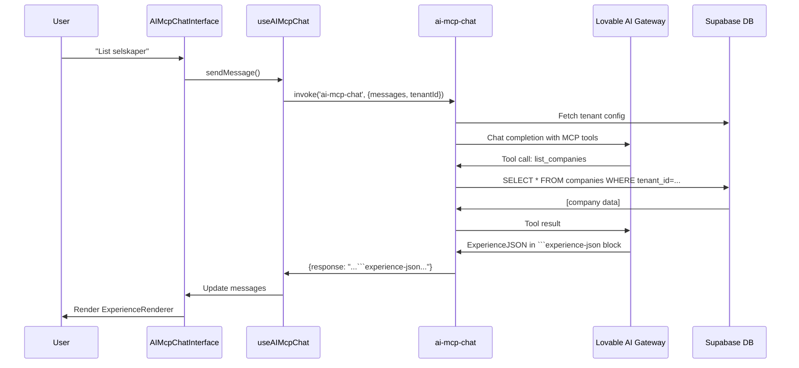
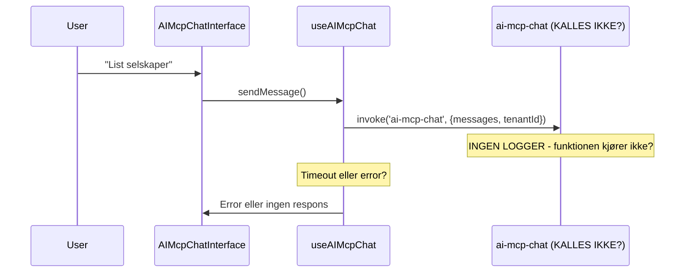

# AI Chat Problem Solving Document

## Executive Summary
AI-chatten i Lovenest returnerer ren tekst i stedet for ExperienceJSON, og Edge Function `ai-mcp-chat` logger ingenting (indikerer at den ikke kalles i det hele tatt).

**Kritiske funn:**
1. Ingen Edge Function logs fra `ai-mcp-chat` (funksjonen kjører ikke)
2. System prompt er for svak (AI tror den kan velge format)
3. Tenant-data mangler i noen queries (delvis fikset)

---

## Arkitektur

### Komponenter
- **Frontend**: `AIChatApp.tsx` → `AIMcpChatInterface.tsx` → `useAIMcpChat.ts`
- **Backend**: `supabase/functions/ai-mcp-chat/index.ts`
- **Database**: `tenants`, `companies`, `projects`, `ai_app_content_library`
- **AI Gateway**: Lovable AI (Google Gemini 2.5 Flash)

### Dataflyt: Forventet vs Faktisk



**Faktisk oppførsel (antagelse):**


---

## Kritiske Funn

### Fund #1: Ingen Edge Function Logs
- Ingen `🔍 AI-MCP-CHAT DEBUG` logs i Supabase
- Indikerer at `ai-mcp-chat/index.ts` ikke blir kalt
- Mulige årsaker:
  - Deployment issue (funksjonen ikke deployet riktig)
  - CORS-problem (request blir blokkert)
  - Auth-problem (ingen tilgang)
  - Frontend kaller feil funksjon navn

### Fund #2: Svak System Prompt
**Nåværende** (linje 803 i `supabase/functions/ai-mcp-chat/index.ts`):
```
"Hvis du genererer en visuell opplevelse, returner ALLTID ExperienceJSON..."
```

**Problem**: AI tror den kan velge om den vil bruke ExperienceJSON eller ikke.

**Forventet**:
```
"Du MÅ ALLTID returnere ExperienceJSON for ALLE svar, uansett spørsmål..."
```

### Fund #3: Tenant-Data Mangler (DELVIS FIKSET)
- `list_companies` mangler `.eq('tenant_id', tenantId)` ✅ FIKSET
- `list_projects` bruker feil felt `title` i stedet for `name` ✅ FIKSET
- Andre queries kan ha samme problem (må sjekkes)

---

## Forventet vs Faktisk Oppførsel

| Aspekt | Forventet | Faktisk |
|--------|-----------|---------|
| **AI Response Format** | Alltid ExperienceJSON | Ren tekst |
| **UI Presentation** | ExperienceRenderer (branded) | Bare tekst i chat-boble |
| **Tool Usage** | `generate_experience` fra `ai_app_content_library` | Tool blir aldri kalt |
| **Edge Function Logs** | Logger alle requests med debug-info | Ingen logs i Supabase |
| **Tenant Isolation** | Alle queries filtrer på tenant_id | Noen queries mangler tenant-filter |

---

## Hypoteser

### Hypotese A: Edge Function Deployment Issue
**Symptom**: Ingen logs i Supabase Edge Function logger  
**Mulig årsak**: 
- Funksjonen er ikke deployet til Lovable Cloud
- Syntax error i `index.ts` forhindrer startup
- `supabase/config.toml` mangler `ai-mcp-chat` entry

**Debugging**:
1. Sjekk at `supabase/config.toml` inneholder:
```toml
[functions.ai-mcp-chat]
verify_jwt = false  # eller true hvis auth er påkrevd
```
2. Sjekk Lovable Cloud deployment status
3. Kjør lokal test: `deno run --allow-all supabase/functions/ai-mcp-chat/index.ts`

### Hypotese B: Frontend Kaller Feil Funksjon
**Symptom**: Ingen logs + ingen error i frontend  
**Mulig årsak**: 
- `useAIMcpChat.ts` bruker feil funksjon-navn
- `supabase.functions.invoke()` peker på gammel/feil funksjon
- TenantId sendes ikke korrekt

**Debugging**:
1. Legg til `console.log()` i `useAIMcpChat.ts` før `invoke()`:
```typescript
console.log('🔍 Calling ai-mcp-chat with:', { tenantId, messageCount: messages.length });
const { data, error } = await supabase.functions.invoke('ai-mcp-chat', ...
console.log('📥 Response:', { data, error });
```
2. Sjekk browser DevTools Network tab for POST til `/functions/v1/ai-mcp-chat`

### Hypotese C: CORS eller Auth Blokkerer
**Symptom**: Request når aldri frem  
**Mulig årsak**: 
- CORS headers mangler i Edge Function
- Auth token mangler eller ugyldig
- Supabase client ikke initialisert

**Debugging**:
1. Sjekk at Edge Function har CORS headers:
```typescript
const corsHeaders = {
  'Access-Control-Allow-Origin': '*',
  'Access-Control-Allow-Headers': 'authorization, x-client-info, apikey, content-type',
};
```
2. Verifiser `OPTIONS` request handler returnerer CORS headers

### Hypotese D: System Prompt For Svak
**Symptom**: AI returnerer tekst i stedet for ExperienceJSON  
**Mulig årsak**: Nåværende prompt (linje 803) sier "Hvis du genererer..." → AI tror det er valgfritt

**Debugging**:
1. Kjør test med hardkodet prompt i Edge Function
2. Sjekk om AI faktisk kaller `format_response` tool

---

## Foreslåtte Løsninger

### Løsning A: Fiks System Prompt (KRITISK)
**Fil**: `supabase/functions/ai-mcp-chat/index.ts`, linje 803  
**Endring**:
```typescript
const defaultSystemPrompt = `Du er en intelligent AI-assistent for ${tenantId}.

**ABSOLUTTE KRAV:**
1. Du MÅ ALLTID returnere svar i ExperienceJSON-format inni en \`\`\`experience-json kodeblokk
2. Dette gjelder ALLE svar - enkle og komplekse
3. Velg beste presentasjon basert på spørsmålet (card, table, cards.list, flow)
4. Bruk generate_experience for å hente markdown fra ai_app_content_library når relevant
5. Inkluder alltid branding (primary color, logo fra tenant theme)

**Tilgjengelige blokk-typer:**
- card: Enkel tekstboks med headline, body, actions
- cards.list: Liste av kort (f.eks. selskaper, prosjekter)
- table: Tabell med kolonner og rader (f.eks. data fra database)
- flow: Prosessflyt med steg

**Eksempel på enkel respons:**
\`\`\`experience-json
{
  "version": "1.0",
  "theme": {"primary": "${theme?.primary || '#000'}", "accent": "${theme?.accent || '#666'}"},
  "layout": {"type": "stack", "gap": "md"},
  "blocks": [
    {"type": "card", "headline": "Svar", "body": "Her er svaret..."}
  ]
}
\`\`\`

**Eksempel på liste-respons (selskaper):**
\`\`\`experience-json
{
  "version": "1.0",
  "theme": {"primary": "${theme?.primary || '#000'}"},
  "layout": {"type": "stack"},
  "blocks": [
    {
      "type": "cards.list",
      "headline": "Selskaper",
      "items": [
        {"title": "Selskap A", "subtitle": "100 ansatte", "metadata": {"role": "Kunde"}},
        {"title": "Selskap B", "subtitle": "50 ansatte", "metadata": {"role": "Partner"}}
      ]
    }
  ]
}
\`\`\`
`;
```

### Løsning B: Backend Fallback (SIKKERHETSNETT)
**Fil**: `supabase/functions/ai-mcp-chat/index.ts`, etter AI-respons  
**Endring**:
```typescript
// Etter AI har generert svar, sjekk om det er ExperienceJSON
let finalResponse = aiResponse.content;

if (!finalResponse.includes('```experience-json')) {
  console.warn('⚠️ AI returnerte ikke ExperienceJSON - wrapping in fallback card');
  
  const simpleExperience = {
    version: "1.0",
    theme: { 
      primary: theme?.primary || "#000", 
      accent: theme?.accent || "#666" 
    },
    layout: { type: "stack", gap: "md" },
    blocks: [
      {
        type: "card",
        headline: "Svar fra AI",
        body: finalResponse.trim(),
        actions: []
      }
    ]
  };
  
  finalResponse = '```experience-json\n' + JSON.stringify(simpleExperience, null, 2) + '\n```';
}

return finalResponse;
```

### Løsning C: Nytt MCP Tool `format_response`
**Fil**: `supabase/functions/ai-mcp-chat/index.ts`, i tools array  
**Endring**: Legg til nytt tool som tvinger AI til å strukturere svar:
```typescript
{
  name: 'format_response',
  description: 'Format your response as ExperienceJSON before returning to user. REQUIRED for all responses.',
  parameters: {
    type: 'object',
    properties: {
      blocks: { 
        type: 'array', 
        description: 'Array of UI blocks (card, table, cards.list, flow)',
        items: {
          type: 'object',
          properties: {
            type: { type: 'string', enum: ['card', 'table', 'cards.list', 'flow'] },
            headline: { type: 'string' },
            body: { type: 'string' }
          }
        }
      },
      theme: { 
        type: 'object', 
        description: 'Optional theme overrides',
        properties: {
          primary: { type: 'string' },
          accent: { type: 'string' }
        }
      }
    },
    required: ['blocks']
  }
}
```

**Handler**:
```typescript
case 'format_response': {
  const { blocks, theme: customTheme } = params;
  const experience = {
    version: "1.0",
    theme: customTheme || theme,
    layout: { type: "stack", gap: "md" },
    blocks: blocks
  };
  return {
    success: true,
    formatted: '```experience-json\n' + JSON.stringify(experience, null, 2) + '\n```'
  };
}
```

---

## Debugging-steg for Claude

### Steg 1: Verifiser Edge Function Deployment
```bash
# Sjekk at funksjonen eksisterer i supabase/config.toml
cat supabase/config.toml | grep -A 3 "ai-mcp-chat"

# Sjekk at index.ts ikke har syntax errors
deno check supabase/functions/ai-mcp-chat/index.ts
```

### Steg 2: Test Frontend Hook
Legg til logging i `src/modules/core/ai/hooks/useAIMcpChat.ts`:
```typescript
const sendMessage = async (userMessage: string) => {
  console.log('🔍 [useAIMcpChat] Sending message:', { tenantId, userMessage });
  
  const { data, error } = await supabase.functions.invoke('ai-mcp-chat', {
    body: { messages: [...messages, newMsg], tenantId }
  });
  
  console.log('📥 [useAIMcpChat] Response:', { data, error });
  // ...
};
```

### Steg 3: Sjekk Browser Network Logs
1. Åpne DevTools → Network
2. Send melding i AI Chat
3. Se etter POST til `/functions/v1/ai-mcp-chat`
4. Sjekk Status Code:
   - 200: Funksjonen kjører (se response body)
   - 404: Funksjonen finnes ikke
   - 403: Auth-problem
   - 500: Server error (sjekk Supabase logs)

### Steg 4: Sjekk Supabase Edge Function Logs
```bash
# I Lovable backend UI eller via Supabase CLI
supabase functions logs ai-mcp-chat --limit 50
```

Forventet output:
```
🔍 AI-MCP-CHAT DEBUG: Request received
🔍 AI-MCP-CHAT DEBUG: Tenant ID: innowin-as
🔍 AI-MCP-CHAT DEBUG: Message count: 3
...
```

Hvis INGEN logs vises → Funksjonen kalles ikke.

### Steg 5: Test System Prompt
Hardkod en test i Edge Function:
```typescript
// Midlertidig test - bytt ut system prompt
const testPrompt = `You MUST ALWAYS return ExperienceJSON. Test: respond to "${userMessage}" as a simple card.`;
```

Hvis dette fungerer → System prompt er problemet.

---

## Teknisk Kontekst

### Tenant Information
- **Tenant ID**: `innowin-as` (eller hent fra database)
- **Tenant Name**: INNOWIN AS
- **Theme**: `{ primary: "#...", accent: "#..." }` (hent fra `tenants` tabell)

### Eksempel-spørsmål
```
"List alle selskaper"
"Vis prosjekter"
"Hva er NACE-koden for byggebransjen?"
"Generer en rapport om våre leverandører"
```

### Forventet ExperienceJSON Output (for "List alle selskaper")
```json
{
  "version": "1.0",
  "theme": {
    "primary": "#0066CC",
    "accent": "#FF6B00"
  },
  "layout": {
    "type": "stack",
    "gap": "md"
  },
  "blocks": [
    {
      "type": "cards.list",
      "headline": "Selskaper i INNOWIN AS",
      "subtitle": "5 selskaper funnet",
      "items": [
        {
          "title": "Acme Corp",
          "subtitle": "500 ansatte • Oslo",
          "metadata": {
            "roles": ["Kunde", "Partner"],
            "status": "Aktiv"
          },
          "actions": [
            {
              "label": "Se detaljer",
              "href": "/companies/[id]"
            }
          ]
        }
      ]
    }
  ]
}
```

---

## Neste Steg

1. **Umiddelbart**: Fiks system prompt (Løsning A)
2. **Backup**: Legg til backend fallback (Løsning B)
3. **Testing**: Verifiser at Edge Function faktisk kalles (Debugging Steg 1-4)
4. **Optimalisering**: Vurder å legge til `format_response` tool (Løsning C)
5. **Monitoring**: Legg til bedre logging i både frontend og backend

---

## Relaterte Filer

### Frontend
- `src/pages/AIChatApp.tsx` - Main chat page
- `src/modules/core/ai/components/AIMcpChatInterface.tsx` - Chat UI
- `src/modules/core/ai/hooks/useAIMcpChat.ts` - API hook
- `src/modules/core/ai/components/ExperienceRenderer.tsx` - JSON→UI renderer

### Backend
- `supabase/functions/ai-mcp-chat/index.ts` - Main Edge Function
- `supabase/config.toml` - Deployment config

### Database
- `ai_app_content_library` - Markdown content for `generate_experience`
- `tenants` - Tenant config and theme
- `companies` - Company data
- `projects` - Project data

---

## Konklusjon

Hovedproblemet er **kombinasjonen** av:
1. Edge Function som ikke logger (indikerer at den ikke kjøres)
2. System prompt som ikke tvinger ExperienceJSON

**Anbefalt aksjon**: Fiks system prompt først (Løsning A), deretter debug Edge Function deployment (Debugging Steg 1-4).
