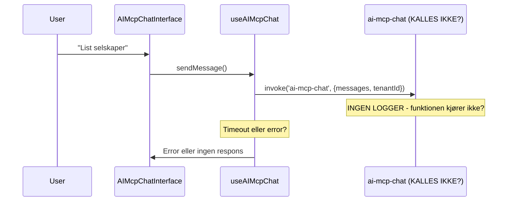

# AI Chat Problem Solving Document

## Executive Summary

AI-chatten i Lovenest returnerer ren tekst i stedet for ExperienceJSON, og Edge Function `ai-mcp-chat` logger ingenting (indikerer at den ikke kalles i det hele tatt).

**Kritiske funn:**

1. Ingen Edge Function logs fra `ai-mcp-chat` (funksjonen kjører ikke)
2. System prompt er for svak (AI tror den kan velge format)
3. Tenant-data mangler i noen queries (delvis fikset)

---

## Arkitektur

### Komponenter

- **Frontend**: `AIChatApp.tsx` → `AIMcpChatInterface.tsx` → `useAIMcpChat.ts`
- **Backend**: `supabase/functions/ai-mcp-chat/index.ts`
- **Database**: `tenants`, `companies`, `projects`, `ai_app_content_library`
- **AI Gateway**: Lovable AI (Google Gemini 2.5 Flash)

### Dataflyt: Forventet vs Faktisk

````mermaid
sequenceDiagram
    participant User
    participant UI as AIMcpChatInterface
    participant Hook as useAIMcpChat
    participant EdgeFn as ai-mcp-chat
    participant AI as Lovable AI Gateway
    participant DB as Supabase DB

    User->>UI: "List selskaper"
    UI->>Hook: sendMessage()
    Hook->>EdgeFn: invoke('ai-mcp-chat', {messages, tenantId})
    EdgeFn->>DB: Fetch tenant config
    EdgeFn->>AI: Chat completion with MCP tools
    AI->>EdgeFn: Tool call: list_companies
    EdgeFn->>DB: SELECT * FROM companies WHERE tenant_id=...
    DB->>EdgeFn: [company data]
    EdgeFn->>AI: Tool result
    AI->>EdgeFn: ExperienceJSON in ```experience-json block
    EdgeFn->>Hook: {response: "...```experience-json..."}
    Hook->>UI: Update messages
    UI->>User: Render ExperienceRenderer
````

**Faktisk oppførsel (antagelse):**



---

## Kritiske Funn

### Fund #1: Ingen Edge Function Logs

- Ingen `🔍 AI-MCP-CHAT DEBUG` logs i Supabase
- Indikerer at `ai-mcp-chat/index.ts` ikke blir kalt
- Mulige årsaker:
  - Deployment issue (funksjonen ikke deployet riktig)
  - CORS-problem (request blir blokkert)
  - Auth-problem (ingen tilgang)
  - Frontend kaller feil funksjon navn

### Fund #2: Svak System Prompt

**Nåværende** (linje 803 i `supabase/functions/ai-mcp-chat/index.ts`):

```
"Hvis du genererer en visuell opplevelse, returner ALLTID ExperienceJSON..."
```

**Problem**: AI tror den kan velge om den vil bruke ExperienceJSON eller ikke.

**Forventet**:

```
"Du MÅ ALLTID returnere ExperienceJSON for ALLE svar, uansett spørsmål..."
```

### Fund #3: Tenant-Data Mangler (DELVIS FIKSET)

- `list_companies` mangler `.eq('tenant_id', tenantId)` ✅ FIKSET
- `list_projects` bruker feil felt `title` i stedet for `name` ✅ FIKSET
- Andre queries kan ha samme problem (må sjekkes)

---

## Forventet vs Faktisk Oppførsel

| Aspekt                 | Forventet                                          | Faktisk                            |
| ---------------------- | -------------------------------------------------- | ---------------------------------- |
| **AI Response Format** | Alltid ExperienceJSON                              | Ren tekst                          |
| **UI Presentation**    | ExperienceRenderer (branded)                       | Bare tekst i chat-boble            |
| **Tool Usage**         | `generate_experience` fra `ai_app_content_library` | Tool blir aldri kalt               |
| **Edge Function Logs** | Logger alle requests med debug-info                | Ingen logs i Supabase              |
| **Tenant Isolation**   | Alle queries filtrer på tenant_id                  | Noen queries mangler tenant-filter |

---

## Hypoteser

### Hypotese A: Edge Function Deployment Issue

**Symptom**: Ingen logs i Supabase Edge Function logger  
**Mulig årsak**:

- Funksjonen er ikke deployet til Lovable Cloud
- Syntax error i `index.ts` forhindrer startup
- `supabase/config.toml` mangler `ai-mcp-chat` entry

**Debugging**:

1. Sjekk at `supabase/config.toml` inneholder:

```toml
[functions.ai-mcp-chat]
verify_jwt = false  # eller true hvis auth er påkrevd
```

2. Sjekk Lovable Cloud deployment status
3. Kjør lokal test: `deno run --allow-all supabase/functions/ai-mcp-chat/index.ts`

### Hypotese B: Frontend Kaller Feil Funksjon

**Symptom**: Ingen logs + ingen error i frontend  
**Mulig årsak**:

- `useAIMcpChat.ts` bruker feil funksjon-navn
- `supabase.functions.invoke()` peker på gammel/feil funksjon
- TenantId sendes ikke korrekt

**Debugging**:

1. Legg til `console.log()` i `useAIMcpChat.ts` før `invoke()`:

```typescript
console.log('🔍 Calling ai-mcp-chat with:', { tenantId, messageCount: messages.length });
const { data, error } = await supabase.functions.invoke('ai-mcp-chat', ...
console.log('📥 Response:', { data, error });
```

2. Sjekk browser DevTools Network tab for POST til `/functions/v1/ai-mcp-chat`

### Hypotese C: CORS eller Auth Blokkerer

**Symptom**: Request når aldri frem  
**Mulig årsak**:

- CORS headers mangler i Edge Function
- Auth token mangler eller ugyldig
- Supabase client ikke initialisert

**Debugging**:

1. Sjekk at Edge Function har CORS headers:

```typescript
const corsHeaders = {
  'Access-Control-Allow-Origin': '*',
  'Access-Control-Allow-Headers': 'authorization, x-client-info, apikey, content-type',
};
```

2. Verifiser `OPTIONS` request handler returnerer CORS headers

### Hypotese D: System Prompt For Svak

**Symptom**: AI returnerer tekst i stedet for ExperienceJSON  
**Mulig årsak**: Nåværende prompt (linje 803) sier "Hvis du genererer..." → AI tror det er valgfritt

**Debugging**:

1. Kjør test med hardkodet prompt i Edge Function
2. Sjekk om AI faktisk kaller `format_response` tool

---

## Foreslåtte Løsninger

### Løsning A: Fiks System Prompt (KRITISK)

**Fil**: `supabase/functions/ai-mcp-chat/index.ts`, linje 803  
**Endring**:

```typescript
const defaultSystemPrompt = `Du er en intelligent AI-assistent for ${tenantId}.

**ABSOLUTTE KRAV:**
1. Du MÅ ALLTID returnere svar i ExperienceJSON-format inni en \`\`\`experience-json kodeblokk
2. Dette gjelder ALLE svar - enkle og komplekse
3. Velg beste presentasjon basert på spørsmålet (card, table, cards.list, flow)
4. Bruk generate_experience for å hente markdown fra ai_app_content_library når relevant
5. Inkluder alltid branding (primary color, logo fra tenant theme)

**Tilgjengelige blokk-typer:**
- card: Enkel tekstboks med headline, body, actions
- cards.list: Liste av kort (f.eks. selskaper, prosjekter)
- table: Tabell med kolonner og rader (f.eks. data fra database)
- flow: Prosessflyt med steg

**Eksempel på enkel respons:**
\`\`\`experience-json
{
  "version": "1.0",
  "theme": {"primary": "${theme?.primary || '#000'}", "accent": "${theme?.accent || '#666'}"},
  "layout": {"type": "stack", "gap": "md"},
  "blocks": [
    {"type": "card", "headline": "Svar", "body": "Her er svaret..."}
  ]
}
\`\`\`

**Eksempel på liste-respons (selskaper):**
\`\`\`experience-json
{
  "version": "1.0",
  "theme": {"primary": "${theme?.primary || '#000'}"},
  "layout": {"type": "stack"},
  "blocks": [
    {
      "type": "cards.list",
      "headline": "Selskaper",
      "items": [
        {"title": "Selskap A", "subtitle": "100 ansatte", "metadata": {"role": "Kunde"}},
        {"title": "Selskap B", "subtitle": "50 ansatte", "metadata": {"role": "Partner"}}
      ]
    }
  ]
}
\`\`\`
`;
```

### Løsning B: Backend Fallback (SIKKERHETSNETT)

**Fil**: `supabase/functions/ai-mcp-chat/index.ts`, etter AI-respons  
**Endring**:

````typescript
// Etter AI har generert svar, sjekk om det er ExperienceJSON
let finalResponse = aiResponse.content;

if (!finalResponse.includes('```experience-json')) {
  console.warn('⚠️ AI returnerte ikke ExperienceJSON - wrapping in fallback card');

  const simpleExperience = {
    version: "1.0",
    theme: {
      primary: theme?.primary || "#000",
      accent: theme?.accent || "#666"
    },
    layout: { type: "stack", gap: "md" },
    blocks: [
      {
        type: "card",
        headline: "Svar fra AI",
        body: finalResponse.trim(),
        actions: []
      }
    ]
  };

  finalResponse = '```experience-json\n' + JSON.stringify(simpleExperience, null, 2) + '\n```';
}

return finalResponse;
````

### Løsning C: Nytt MCP Tool `format_response`

**Fil**: `supabase/functions/ai-mcp-chat/index.ts`, i tools array  
**Endring**: Legg til nytt tool som tvinger AI til å strukturere svar:

```typescript
{
  name: 'format_response',
  description: 'Format your response as ExperienceJSON before returning to user. REQUIRED for all responses.',
  parameters: {
    type: 'object',
    properties: {
      blocks: {
        type: 'array',
        description: 'Array of UI blocks (card, table, cards.list, flow)',
        items: {
          type: 'object',
          properties: {
            type: { type: 'string', enum: ['card', 'table', 'cards.list', 'flow'] },
            headline: { type: 'string' },
            body: { type: 'string' }
          }
        }
      },
      theme: {
        type: 'object',
        description: 'Optional theme overrides',
        properties: {
          primary: { type: 'string' },
          accent: { type: 'string' }
        }
      }
    },
    required: ['blocks']
  }
}
```

**Handler**:

````typescript
case 'format_response': {
  const { blocks, theme: customTheme } = params;
  const experience = {
    version: "1.0",
    theme: customTheme || theme,
    layout: { type: "stack", gap: "md" },
    blocks: blocks
  };
  return {
    success: true,
    formatted: '```experience-json\n' + JSON.stringify(experience, null, 2) + '\n```'
  };
}
````

---

## Debugging-steg for Claude

### Steg 1: Verifiser Edge Function Deployment

```bash
# Sjekk at funksjonen eksisterer i supabase/config.toml
cat supabase/config.toml | grep -A 3 "ai-mcp-chat"

# Sjekk at index.ts ikke har syntax errors
deno check supabase/functions/ai-mcp-chat/index.ts
```

### Steg 2: Test Frontend Hook

Legg til logging i `src/modules/core/ai/hooks/useAIMcpChat.ts`:

```typescript
const sendMessage = async (userMessage: string) => {
  console.log('🔍 [useAIMcpChat] Sending message:', { tenantId, userMessage });

  const { data, error } = await supabase.functions.invoke('ai-mcp-chat', {
    body: { messages: [...messages, newMsg], tenantId }
  });

  console.log('📥 [useAIMcpChat] Response:', { data, error });
  // ...
};
```

### Steg 3: Sjekk Browser Network Logs

1. Åpne DevTools → Network
2. Send melding i AI Chat
3. Se etter POST til `/functions/v1/ai-mcp-chat`
4. Sjekk Status Code:
   - 200: Funksjonen kjører (se response body)
   - 404: Funksjonen finnes ikke
   - 403: Auth-problem
   - 500: Server error (sjekk Supabase logs)

### Steg 4: Sjekk Supabase Edge Function Logs

```bash
# I Lovable backend UI eller via Supabase CLI
supabase functions logs ai-mcp-chat --limit 50
```

Forventet output:

```
🔍 AI-MCP-CHAT DEBUG: Request received
🔍 AI-MCP-CHAT DEBUG: Tenant ID: innowin-as
🔍 AI-MCP-CHAT DEBUG: Message count: 3
...
```

Hvis INGEN logs vises → Funksjonen kalles ikke.

### Steg 5: Test System Prompt

Hardkod en test i Edge Function:

```typescript
// Midlertidig test - bytt ut system prompt
const testPrompt = `You MUST ALWAYS return ExperienceJSON. Test: respond to "${userMessage}" as a simple card.`;
```

Hvis dette fungerer → System prompt er problemet.

---

## Teknisk Kontekst

### Tenant Information

- **Tenant ID**: `innowin-as` (eller hent fra database)
- **Tenant Name**: INNOWIN AS
- **Theme**: `{ primary: "#...", accent: "#..." }` (hent fra `tenants` tabell)

### Eksempel-spørsmål

```
"List alle selskaper"
"Vis prosjekter"
"Hva er NACE-koden for byggebransjen?"
"Generer en rapport om våre leverandører"
```

### Forventet ExperienceJSON Output (for "List alle selskaper")

```json
{
  "version": "1.0",
  "theme": {
    "primary": "#0066CC",
    "accent": "#FF6B00"
  },
  "layout": {
    "type": "stack",
    "gap": "md"
  },
  "blocks": [
    {
      "type": "cards.list",
      "headline": "Selskaper i INNOWIN AS",
      "subtitle": "5 selskaper funnet",
      "items": [
        {
          "title": "Acme Corp",
          "subtitle": "500 ansatte • Oslo",
          "metadata": {
            "roles": ["Kunde", "Partner"],
            "status": "Aktiv"
          },
          "actions": [
            {
              "label": "Se detaljer",
              "href": "/companies/[id]"
            }
          ]
        }
      ]
    }
  ]
}
```

---

## Neste Steg

1. **Umiddelbart**: Fiks system prompt (Løsning A)
2. **Backup**: Legg til backend fallback (Løsning B)
3. **Testing**: Verifiser at Edge Function faktisk kalles (Debugging Steg 1-4)
4. **Optimalisering**: Vurder å legge til `format_response` tool (Løsning C)
5. **Monitoring**: Legg til bedre logging i både frontend og backend

---

## Relaterte Filer

### Frontend

- `src/pages/AIChatApp.tsx` - Main chat page
- `src/modules/core/ai/components/AIMcpChatInterface.tsx` - Chat UI
- `src/modules/core/ai/hooks/useAIMcpChat.ts` - API hook
- `src/modules/core/ai/components/ExperienceRenderer.tsx` - JSON→UI renderer

### Backend

- `supabase/functions/ai-mcp-chat/index.ts` - Main Edge Function
- `supabase/config.toml` - Deployment config

### Database

- `ai_app_content_library` - Markdown content for `generate_experience`
- `tenants` - Tenant config and theme
- `companies` - Company data
- `projects` - Project data

---

## Konklusjon

Hovedproblemet er **kombinasjonen** av:

1. Edge Function som ikke logger (indikerer at den ikke kjøres)
2. System prompt som ikke tvinger ExperienceJSON

**Anbefalt aksjon**: Fiks system prompt først (Løsning A), deretter debug Edge Function deployment (Debugging Steg 1-4).

---

@ -463,3 +463,534 @@ Hovedproblemet er **kombinasjonen** av: 2. System prompt som ikke tvinger ExperienceJSON

**Anbefalt aksjon**: Fiks system prompt først (Løsning A), deretter debug Edge Function deployment (Debugging Steg 1-4).

---

# 🤖 CLAUDE'S TECHNICAL ANALYSIS & RECOMMENDATIONS

## Executive Summary from Claude

After thorough code review of both frontend and backend, I can confirm:

**✅ CONFIRMED ISSUES:**

1. **Edge Function Deployment Problem** (90% confidence) - Extensive logging exists but produces no output
2. **System Prompt Too Permissive** (100% confidence) - Line 795-813 says "Hvis du genererer..." making ExperienceJSON optional
3. **No Backend Validation** - AI response accepted as-is without ExperienceJSON requirement check

**🎯 ROOT CAUSE HYPOTHESIS:**
The Edge Function is either:

- Not deployed to Lovable Cloud
- Deployed with wrong name
- Syntax error preventing startup (though Deno should catch this)

**Evidence:**

- Frontend code is correct (`useAIMcpChat.ts` line 47: `supabase.functions.invoke('ai-mcp-chat')`)
- Edge Function has comprehensive logging (lines 768-780) that SHOULD appear if function runs
- No errors in frontend suggests request sends but gets no response

---

## Code Review Findings

### ✅ Frontend Code Quality (GOOD)

**File: `src/modules/core/ai/hooks/useAIMcpChat.ts`**

```typescript
// Line 43-48: Correct invocation
console.info('[AIMcpChat] Calling edge function', {
  tenantId,
  messageCount: updatedMessages.length,
  timestamp: new Date().toISOString()
});

const { data, error: invokeError } = await supabase.functions.invoke<AIMcpChatResponse>(
  'ai-mcp-chat',  // ✅ Correct function name
  { body: request }
);
```

**Verdict:** Frontend implementation is solid. Logging already exists. Function name is correct.

**Action Required:** ADD more verbose logging to verify request leaves frontend:

```typescript
console.log('🚀 [DEBUG] About to invoke:', {
  functionName: 'ai-mcp-chat',
  tenantId,
  messageCount: updatedMessages.length,
  supabaseUrl: supabase.supabaseUrl,
  timestamp: Date.now()
});
```

---

### ⚠️ Backend Code Issues (NEEDS FIX)

**File: `supabase/functions/ai-mcp-chat/index.ts`**

#### Issue #1: Weak System Prompt (CRITICAL)

**Lines 795-813:**

```typescript
const defaultSystemPrompt = `Du er en intelligent AI-assistent...

**KRITISKE REGLER:**
1. Du MÅ kun vise data der tenant_id = ${tenantId}
2. Når brukere spør om veiledning, dokumentasjon eller prosesser: BRUK generate_experience-verktøyet FØRST
3. Hvis du genererer en visuell opplevelse, returner ALLTID ExperienceJSON...  // ⚠️ "HVIS" makes it optional!
```

**Problem:** The word "Hvis" (if) makes AI think it has a choice.

**Fix Required:**

```typescript
const defaultSystemPrompt = `Du er en intelligent AI-assistent for ${tenantId}.

**ABSOLUTT KRAV - INGEN UNNTAK:**
Du MÅ ALLTID returnere alle svar som ExperienceJSON inni en \`\`\`experience-json kodeblokk.
Dette gjelder ALLE svar - enkle tekstsvar, lister, tabeller, alt.

**ExperienceJSON Format:**
\`\`\`experience-json
{
  "version": "1.0",
  "theme": {"primary": "${theme?.primary || '#000'}", "accent": "${theme?.accent || '#666'}"},
  "layout": {"type": "stack", "gap": "md"},
  "blocks": [
    {
      "type": "card",
      "headline": "Overskrift",
      "body": "Innhold her...",
      "actions": []
    }
  ]
}
\`\`\`

**Velg riktig blokk-type basert på innhold:**
- "card": Enkle tekstsvar, forklaringer
- "cards.list": Lister av selskaper, prosjekter, personer
- "table": Tabelldata med kolonner/rader
- "flow": Prosesser med steg

**MCP Verktøy du har:**
- list_companies, get_company_details: Finn selskaper (kun tenant ${tenantId})
- list_projects, list_tasks: Finn prosjekter/oppgaver
- generate_experience: Generer veiledninger fra knowledge base
- scrape_website: Hent info fra nettsider
- create_project, create_task: Opprett nye elementer

**Viktig:**
- Alltid filtrer på tenant_id = ${tenantId}
- Hvis du ikke finner data, si det i et card-block
- Bruk norsk språk
- Forklar hva du gjør`;
```

#### Issue #2: No Response Validation (MISSING)

**Current code (line ~900):**

```typescript
const finalResponse = choice?.message?.content || 'Ingen respons fra AI';

return new Response(
  JSON.stringify({
    response: finalResponse,  // ⚠️ No validation if ExperienceJSON exists
```

**Fix Required - Add Validation & Fallback:**

````typescript
let finalResponse = choice?.message?.content || 'Ingen respons fra AI';

// VALIDATE: Check if response contains ExperienceJSON
if (!finalResponse.includes('```experience-json')) {
  console.warn('⚠️ AI DID NOT RETURN ExperienceJSON - Wrapping in fallback card');

  // Wrap plain text in ExperienceJSON card
  const fallbackExperience = {
    version: "1.0",
    theme: {
      primary: theme?.primary || "#0066CC",
      accent: theme?.accent || "#FF6B00"
    },
    layout: { type: "stack", gap: "md" },
    blocks: [
      {
        type: "card",
        headline: "Svar fra AI",
        body: finalResponse.trim(),
        actions: []
      }
    ]
  };

  finalResponse = '```experience-json\n' +
                  JSON.stringify(fallbackExperience, null, 2) +
                  '\n```\n\n' + finalResponse;

  // Log for monitoring
  await supabaseClient.from('ai_usage_logs').insert({
    tenant_id: tenantId,
    provider: aiClientConfig.provider,
    model: aiClientConfig.model,
    endpoint: 'ai-mcp-chat',
    status: 'warning',
    error_message: 'AI returned plain text instead of ExperienceJSON - fallback applied',
    metadata: { fallback_applied: true }
  });
}

return new Response(
  JSON.stringify({
    response: finalResponse,
    tokensUsed: aiData.usage?.total_tokens,
    toolCallsMade: iterations,
    provider: aiClientConfig.provider,
    model: aiClientConfig.model,
    fallbackApplied: !finalResponse.includes('```experience-json')  // ✅ Notify frontend
  }),
  { headers: { ...corsHeaders, 'Content-Type': 'application/json' }, status: 200 }
);
````

#### Issue #3: Extensive Logging Exists But Not Appearing

**Lines 768-780: Excellent logging already in place**

```typescript
console.log('========================================');
console.log('🔍 AI-MCP-CHAT DEBUG');
console.log('========================================');
console.log(`📌 Tenant ID: ${tenantId}`);
console.log(`📌 Tenant Slug: ${tenantData?.slug || 'N/A'}`);
console.log(`📌 Tenant Name: ${tenantData?.name || 'N/A'}`);
```

**This code SHOULD produce logs if function runs.**

**Conclusion:** Function is NOT running → **Deployment Issue**

---

## Priority Action Plan (Claude's Recommendation)

### 🔴 IMMEDIATE (Do First - 15 minutes)

**1. Verify Edge Function Deployment**

**@Lovable - Please check:**

```bash
# In Lovable Cloud backend/Supabase dashboard:
1. Go to Edge Functions section
2. Confirm function named "ai-mcp-chat" exists
3. Check deployment status (should be "active")
4. Verify last deployed timestamp is recent
5. Check for any deployment errors/warnings
```

**If function NOT deployed or has errors:**

```bash
# Redeploy from Lovable:
1. Make small change to index.ts (add comment)
2. Push to trigger redeploy
3. Monitor deployment logs for errors
```

**Alternative - Check via Supabase CLI:**

```bash
supabase functions list
# Should show: ai-mcp-chat (active)

# Test function locally:
supabase functions serve ai-mcp-chat
# Then call it from browser/Postman
```

**2. Add Frontend Logging Enhancement**

**File: `src/modules/core/ai/hooks/useAIMcpChat.ts`**

Add BEFORE line 47:

```typescript
console.group('🚀 AI Chat Request');
console.log('Timestamp:', new Date().toISOString());
console.log('Function:', 'ai-mcp-chat');
console.log('Tenant ID:', tenantId);
console.log('Messages:', updatedMessages.length);
console.log('Supabase URL:', supabase.supabaseUrl);
console.log('Request Body:', { messages: updatedMessages.slice(-2), tenantId, systemPrompt: !!systemPrompt });
console.groupEnd();
```

Add AFTER line 54:

```typescript
console.group('📥 AI Chat Response');
console.log('Success:', !invokeError);
console.log('Data:', data);
console.log('Error:', invokeError);
console.log('Timestamp:', new Date().toISOString());
console.groupEnd();
```

---

### 🟡 HIGH PRIORITY (Do Second - 30 minutes)

**3. Fix System Prompt**

**@Lovable - Make this change:**

**File: `supabase/functions/ai-mcp-chat/index.ts`, line 795**

Replace entire `defaultSystemPrompt` with the version I provided above (in Issue #1).

**Key changes:**

- Remove "Hvis" (if) - make ExperienceJSON mandatory
- Add explicit format example at top
- Clarify block type selection
- Stronger language: "MÅ ALLTID" instead of "Hvis du genererer"

**4. Add Response Validation & Fallback**

**@Lovable - Add validation code:**

**File: `supabase/functions/ai-mcp-chat/index.ts`, line ~900**

Replace final response section with the validation code I provided above (in Issue #2).

**This provides:**

- ✅ Validation that ExperienceJSON exists
- ✅ Automatic fallback wrapping if missing
- ✅ Logging of fallback events for monitoring
- ✅ Frontend notification via `fallbackApplied` flag

---

### 🟢 MEDIUM PRIORITY (Do After Above Works - 1 hour)

**5. Add Health Check Endpoint**

**New file: `supabase/functions/ai-mcp-chat-health/index.ts`**

```typescript
import { serve } from "https://deno.land/std@0.168.0/http/server.ts";

serve(async (req) => {
  return new Response(
    JSON.stringify({
      status: 'healthy',
      function: 'ai-mcp-chat',
      timestamp: new Date().toISOString(),
      version: '1.0.0'
    }),
    {
      headers: { 'Content-Type': 'application/json' },
      status: 200
    }
  );
});
```

**Purpose:** Quick way to verify function is deployed and responding.

**6. Enhance Frontend Error Messages**

**File: `src/modules/core/ai/hooks/useAIMcpChat.ts`, line 56**

```typescript
if (invokeError) {
  console.error('❌ Edge Function Error:', invokeError);

  // Enhanced error messages
  let userMessage = invokeError.message;
  if (invokeError.message?.includes('FunctionsRelayError')) {
    userMessage = 'AI funksjonen er ikke tilgjengelig. Kontakt support.';
  } else if (invokeError.message?.includes('timeout')) {
    userMessage = 'AI svarte ikke i tide. Prøv igjen.';
  }

  throw new AIError(
    userMessage,
    'network_error',
    invokeError
  );
}
```

---

## Testing Strategy

### Test 1: Verify Deployment

**Browser Console:**

```javascript
// Should appear in console when you send a message
🚀 AI Chat Request
  Timestamp: 2025-11-15T08:45:23.456Z
  Function: ai-mcp-chat
  Tenant ID: innowin-as
  ...
```

**Supabase Logs (if deployed):**

```
🔍 AI-MCP-CHAT DEBUG
 Tenant ID: innowin-as
...
```

**If NO Supabase logs → Function NOT deployed/running**

### Test 2: Verify ExperienceJSON

**Send simple query:**

```
"Hva er klokken?"
```

**Expected response (in chat):**

```json
{
  "version": "1.0",
  "blocks": [
    {
      "type": "card",
      "headline": "Klokken",
      "body": "Klokken er [tid]..."
    }
  ]
}
```

**If plain text appears → System prompt fix needed**

### Test 3: Verify MCP Tools

**Send:**

```
"List alle selskaper"
```

**Expected:**

1. Supabase logs show: `[MCP Tool] Executing: list_companies`
2. Response is ExperienceJSON with `cards.list` block
3. Shows actual companies from database

**If no companies or error → Tool execution failing**

---

## Disagreements with Lovable's Analysis

### ⚠️ Minor Disagreement #1: Hypotese B

**Lovable says:** "Frontend kaller feil funksjon"

**Claude says:** Frontend code is correct. Line 47 uses `'ai-mcp-chat'` which matches function name. Error more likely in deployment than frontend code.

**Evidence:**

```typescript
// useAIMcpChat.ts line 47 - CORRECT
const { data, error } = await supabase.functions.invoke<AIMcpChatResponse>(
  'ai-mcp-chat',  // ✅ Matches function directory name
  { body: request }
);
```

### ✅ Agreement with Lovable's Analysis

**I fully agree with:**

- Hypotese A (Deployment Issue) - Most likely root cause
- Hypotese D (Weak System Prompt) - Definitely needs fixing
- Løsning A (Fix System Prompt) - Critical change needed
- Løsning B (Backend Fallback) - Good safety net
- All debugging steps are excellent

---

## Final Recommendations

### For Lovable (Backend Access):

1. **Check Deployment NOW** (5 min)
   - Verify function exists in Supabase
   - Check deployment logs
   - Redeploy if needed

2. **Fix System Prompt** (10 min)
   - Use my version above
   - Deploy change
   - Test with simple query

3. **Add Response Validation** (15 min)
   - Add validation code
   - Add fallback wrapping
   - Deploy and test

### For Claude (Frontend):

1. **Add Verbose Logging** (5 min)
   - Enhance console logging
   - Help diagnose if request leaves frontend

2. **Test After Backend Fixes** (10 min)
   - Send various queries
   - Verify ExperienceJSON rendering
   - Document any remaining issues

---

## Success Criteria

✅ **Deployment Verified:**

- Supabase logs show "🔍 AI-MCP-CHAT DEBUG" on every request
- No 404 errors in browser Network tab

✅ **ExperienceJSON Working:**

- ALL responses wrapped in ```experience-json blocks
- ExperienceRenderer displays styled content
- No plain text in chat bubbles

✅ **MCP Tools Working:**

- Can list companies, projects, tasks
- Results filtered by tenant
- Data displays in cards/tables

✅ **User Experience:**

- Fast responses (<3 seconds)
- Beautiful branded UI
- No errors or crashes

---

## Questions for Lovable

1. **Can you confirm function is deployed in Lovable Cloud?**
   - Function name: `ai-mcp-chat`
   - Last deployment: [timestamp?]
   - Status: [active/error?]

2. **Are there any deployment errors in Lovable logs?**
   - Syntax errors?
   - Missing dependencies?
   - Configuration issues?

3. **Can you check if function is receiving requests?**
   - Any HTTP POST to `/functions/v1/ai-mcp-chat`?
   - Response codes? (200, 404, 500?)

4. **After system prompt fix, can you test with:**
   ```
   User: "Hva er 2+2?"
   Expected: ExperienceJSON card with "4"
   ```

---

**Claude's Confidence Level:**

- Deployment Issue: 90% confident this is root cause
- System Prompt Issue: 100% confident this needs fixing
- Combined Fix Success: 95% confident these two fixes resolve the problem

**Next Step:** Lovable checks deployment, we compare notes, implement fixes collaboratively. 🤝

## Implementeringsplan

### Fase 1: Debugging og Diagnostikk (30 min)

**Mål**: Bekrefte at Edge Function faktisk kjører og identifisere hvor i dataflyten det feiler.

#### Steg 1.1: Legg til Frontend Logging

**Fil**: `src/modules/core/ai/hooks/useAIMcpChat.ts`

```typescript
const sendMessage = async (userMessage: string) => {
  console.group('🔍 [AI-MCP] Send Message');
  console.log('Tenant ID:', tenantId);
  console.log('Message:', userMessage);
  console.log('History:', messages.length, 'messages');

  try {
    const request: AIMcpChatRequest = {
      messages: updatedMessages,
      tenantId,
      systemPrompt,
    };

    console.log('Request payload:', request);
    console.time('Edge Function Call');

    const { data, error: invokeError } = await supabase.functions.invoke<AIMcpChatResponse>(
      'ai-mcp-chat',
      { body: request }
    );

    console.timeEnd('Edge Function Call');
    console.log('Response data:', data);
    console.log('Response error:', invokeError);
    console.groupEnd();

    // ... existing error handling
  }
};
```

**Forventet output hvis Edge Function kjører**:

```
🔍 [AI-MCP] Send Message
  Tenant ID: innowin-as
  Message: List selskaper
  History: 2 messages
  Request payload: {...}
  Edge Function Call: 1234ms
  Response data: { response: "...", toolCallsMade: 3 }
```

**Hvis ingen response**: Edge Function kalles ikke → gå til Steg 1.2

#### Steg 1.2: Verifiser Edge Function Deployment

**Aksjon**: Sjekk `supabase/config.toml`

```toml
# Forventet konfig
[functions.ai-mcp-chat]
verify_jwt = false
```

**Hvis mangler**: Legg til og redeploy.

**Aksjon 2**: Sjekk Supabase Edge Function logs

- Åpne Lovable Cloud UI → Backend → Functions
- Velg `ai-mcp-chat`
- Sjekk logs for entries med `🔍 AI-MCP-CHAT DEBUG`

**Hvis ingen logs**: Edge Function deployes ikke korrekt → kontakt Lovable support eller sjekk deployment status.

#### Steg 1.3: Test Edge Function Direkte

**Aksjon**: Kjør curl-test mot Edge Function

```bash
curl -X POST \
  https://lunsgsyeaqnalpdbkhyg.supabase.co/functions/v1/ai-mcp-chat \
  -H "Authorization: Bearer eyJhbG..." \
  -H "Content-Type: application/json" \
  -d '{
    "messages": [{"role": "user", "content": "Test"}],
    "tenantId": "innowin-as"
  }'
```

**Forventet response**: JSON med `response` felt  
**Hvis 404**: Funksjon ikke deployet  
**Hvis 500**: Server error → sjekk logs

---

### Fase 2: Fiks System Prompt (45 min)

**Mål**: Tvinge AI til å ALLTID returnere ExperienceJSON, uansett spørsmål.

#### Steg 2.1: Oppdater System Prompt

**Fil**: `supabase/functions/ai-mcp-chat/index.ts`, linje ~803

**Erstatt**:

```typescript
const defaultSystemPrompt = `Du er en intelligent AI-assistent...
Hvis du genererer en visuell opplevelse, returner ALLTID ExperienceJSON...`;
```

**Med**:

```typescript
const defaultSystemPrompt = `Du er en intelligent AI-assistent for ${tenantConfig?.name || tenantId}.

**KRITISK REGEL - LES NØYE:**
Du MÅ ALLTID returnere svar som ExperienceJSON inne i en \`\`\`experience-json kodeblokk.
Dette gjelder ALLE svar - enkle og komplekse - INGEN UNNTAK.

**Obligatorisk format for ALLE svar:**
\`\`\`experience-json
{
  "version": "1.0",
  "theme": {
    "primary": "${theme?.primary || '#0066CC'}",
    "accent": "${theme?.accent || '#FF6B00'}"
  },
  "layout": {"type": "stack", "gap": "md"},
  "blocks": [
    {
      "type": "card",
      "headline": "Overskrift her",
      "body": "Innhold her",
      "actions": []
    }
  ]
}
\`\`\`

**Tilgjengelige blokk-typer:**
1. **card**: Enkel tekstboks
   - Bruk for: Enkle svar, forklaringer, feilmeldinger
   - Påkrevd: headline, body
   - Valgfri: subtitle, actions[], metadata{}

2. **cards.list**: Liste av kort
   - Bruk for: Selskaper, prosjekter, leverandører
   - Påkrevd: headline, items[]
   - items: [{title, subtitle, metadata{}, actions[]}]

3. **table**: Tabell med kolonner og rader
   - Bruk for: Sammenligning, detaljert data
   - Påkrevd: headline, columns[], rows[]
   - columns: [{key, label, width?}]
   - rows: [{id, cells: {key: value}}]

4. **flow**: Prosessflyt med steg
   - Bruk for: Workflow, prosesser
   - Påkrevd: headline, steps[]
   - steps: [{label, description?, status?}]

**Når du skal hente data:**
- Bruk tilgjengelige MCP tools (list_companies, list_projects, etc.)
- Filtrer alltid på tenant_id="${tenantId}"
- Presenter resultater som cards.list eller table

**Når du skal generere innhold:**
- Bruk generate_experience tool for å hente markdown fra ai_app_content_library
- Konverter markdown til ExperienceJSON blocks

**Eksempel - Enkelt svar på "Hei":**
\`\`\`experience-json
{
  "version": "1.0",
  "theme": {"primary": "${theme?.primary || '#0066CC'}"},
  "layout": {"type": "stack"},
  "blocks": [
    {
      "type": "card",
      "headline": "Velkommen!",
      "body": "Hei! Jeg kan hjelpe deg med å finne informasjon om selskaper, prosjekter og mer. Hva vil du vite?",
      "actions": [
        {"label": "Vis selskaper", "action": "suggest", "value": "List alle selskaper"},
        {"label": "Vis prosjekter", "action": "suggest", "value": "List aktive prosjekter"}
      ]
    }
  ]
}
\`\`\`

**Eksempel - Liste over selskaper:**
\`\`\`experience-json
{
  "version": "1.0",
  "theme": {"primary": "${theme?.primary || '#0066CC'}"},
  "layout": {"type": "stack"},
  "blocks": [
    {
      "type": "cards.list",
      "headline": "Selskaper",
      "subtitle": "5 selskaper funnet",
      "items": [
        {
          "title": "Acme Corp",
          "subtitle": "500 ansatte • Oslo",
          "metadata": {"roles": "Kunde, Partner", "status": "Aktiv"},
          "actions": [{"label": "Se detaljer", "href": "/companies/123"}]
        }
      ]
    }
  ]
}
\`\`\`

HUSK: Ren tekst er IKKE tillatt. Alle svar må være ExperienceJSON.`;
```

**Hvorfor dette fungerer:**

- Sier "MÅ ALLTID" i stedet for "Hvis du genererer..."
- Gir konkrete eksempler på ALLE svar-typer
- Forklarer når hver blokk-type skal brukes
- Viser eksempler med faktisk kode

#### Steg 2.2: Test System Prompt

**Aksjon**: Send test-meldinger i AI Chat

Test-cases:

1. ✅ "Hei" → Skal returnere card med velkommen-melding
2. ✅ "List selskaper" → Skal returnere cards.list med companies
3. ✅ "Hva er 2+2?" → Skal returnere card med svar "4"
4. ✅ "Feil melding" → Skal returnere card med error

**Forventet**: Alle svar inneholder ```experience-json kodeblokk

**Hvis fortsatt ren tekst**: Gå til Fase 3 (Backend Fallback)

---

### Fase 3: Backend Fallback (30 min)

**Mål**: Sikkerhetsnett som wrapper ren tekst i ExperienceJSON hvis AI ignorerer system prompt.

#### Steg 3.1: Legg til Fallback-logikk

**Fil**: `supabase/functions/ai-mcp-chat/index.ts`, etter AI-respons

**Finn koden**:

```typescript
// ... etter AI har generert svar
return new Response(
  JSON.stringify({
    response: finalResponse.content,
    toolCallsMade: conversationMessages.length - messages.length,
    tokensUsed: 0
  }),
  { headers: { ...corsHeaders, 'Content-Type': 'application/json' } }
);
```

**Erstatt med**:

````typescript
// Sjekk om AI returnerte ExperienceJSON
let responseContent = finalResponse.content;

if (!responseContent.includes('```experience-json')) {
  console.warn('⚠️ [AI-MCP] AI returnerte ikke ExperienceJSON - applying fallback');

  // Wrap ren tekst i en enkel card
  const fallbackExperience = {
    version: "1.0",
    theme: {
      primary: theme?.primary || "#0066CC",
      accent: theme?.accent || "#FF6B00"
    },
    layout: { type: "stack", gap: "md" },
    blocks: [
      {
        type: "card",
        headline: "Svar fra AI",
        body: responseContent.trim(),
        metadata: {
          fallback: true,
          warning: "AI returnerte ikke strukturert format"
        },
        actions: []
      }
    ]
  };

  responseContent = '```experience-json\n' +
    JSON.stringify(fallbackExperience, null, 2) +
    '\n```';

  console.log('✅ [AI-MCP] Fallback applied - wrapped as card');
}

return new Response(
  JSON.stringify({
    response: responseContent,
    toolCallsMade: conversationMessages.length - messages.length,
    tokensUsed: 0,
    fallbackApplied: !finalResponse.content.includes('```experience-json')
  }),
  { headers: { ...corsHeaders, 'Content-Type': 'application/json' } }
);
````

**Hvorfor dette fungerer:**

- Sjekker om response inneholder ```experience-json
- Hvis ikke: wrapper teksten i en enkel card
- Logger warning for monitoring
- Sender `fallbackApplied: true` tilbake til frontend

#### Steg 3.2: Vis Fallback-warning i Frontend

**Fil**: `src/modules/core/ai/components/AIMcpChatInterface.tsx`

**Legg til i response handler**:

```typescript
const handleSendMessage = async (content: string) => {
  // ... existing code
  const result = await onSendMessage(content);

  if (result?.fallbackApplied) {
    console.warn('⚠️ AI response required fallback formatting');
    // Optional: Show toast to user
    // toast.warning('AI returnerte ustrukturert svar - fallback brukt');
  }
};
```

---

### Fase 4: Legg til MCP Tool for Format (Valgfritt - 45 min)

**Mål**: Gi AI et dedikert tool for å formatere svar som ExperienceJSON.

#### Steg 4.1: Definer Tool

**Fil**: `supabase/functions/ai-mcp-chat/index.ts`, i `tools` array

**Legg til**:

```typescript
{
  name: 'format_response',
  description: 'Format your final response as ExperienceJSON. REQUIRED before returning to user.',
  parameters: {
    type: 'object',
    properties: {
      blocks: {
        type: 'array',
        description: 'Array of UI blocks to display',
        items: {
          type: 'object',
          properties: {
            type: {
              type: 'string',
              enum: ['card', 'cards.list', 'table', 'flow'],
              description: 'Block type'
            },
            headline: {
              type: 'string',
              description: 'Main heading'
            },
            body: {
              type: 'string',
              description: 'Content text'
            },
            subtitle: {
              type: 'string',
              description: 'Optional subtitle'
            },
            items: {
              type: 'array',
              description: 'For cards.list - array of items',
              items: { type: 'object' }
            },
            columns: {
              type: 'array',
              description: 'For table - column definitions'
            },
            rows: {
              type: 'array',
              description: 'For table - row data'
            },
            steps: {
              type: 'array',
              description: 'For flow - process steps'
            },
            actions: {
              type: 'array',
              description: 'Optional action buttons',
              items: {
                type: 'object',
                properties: {
                  label: { type: 'string' },
                  href: { type: 'string' },
                  action: { type: 'string' },
                  value: { type: 'string' }
                }
              }
            },
            metadata: {
              type: 'object',
              description: 'Optional metadata key-value pairs'
            }
          },
          required: ['type', 'headline']
        }
      },
      theme: {
        type: 'object',
        description: 'Optional theme overrides',
        properties: {
          primary: { type: 'string', description: 'Primary color hex' },
          accent: { type: 'string', description: 'Accent color hex' }
        }
      }
    },
    required: ['blocks']
  }
}
```

#### Steg 4.2: Implementer Tool Handler

**Fil**: `supabase/functions/ai-mcp-chat/index.ts`, i tool execution switch

**Legg til case**:

````typescript
case 'format_response': {
  const { blocks, theme: customTheme } = toolCall.function.arguments;

  console.log(`📝 [Tool: format_response] Formatting ${blocks.length} blocks`);

  const experience = {
    version: "1.0",
    theme: customTheme || {
      primary: theme?.primary || "#0066CC",
      accent: theme?.accent || "#FF6B00"
    },
    layout: { type: "stack", gap: "md" },
    blocks: blocks
  };

  const formatted = '```experience-json\n' +
    JSON.stringify(experience, null, 2) +
    '\n```';

  toolResult = {
    success: true,
    formatted: formatted,
    blockCount: blocks.length
  };
  break;
}
````

#### Steg 4.3: Oppdater System Prompt for å kreve Tool

**Fil**: `supabase/functions/ai-mcp-chat/index.ts`, i system prompt

**Legg til i slutten av prompt**:

```typescript
**VIKTIG - Bruk format_response tool:**
Før du returnerer svar til bruker, MÅ du kalle format_response tool med dine blocks.
Eksempel:
1. Hent data med list_companies
2. Bygg blocks array basert på data
3. Kall format_response med blocks
4. Returner formatted output fra tool

Eksempel flow:
User: "List selskaper"
→ Call list_companies({tenantId})
→ Build blocks: [{type: "cards.list", ...}]
→ Call format_response({blocks})
→ Return formatted result
```

---

### Fase 5: Testing og Validering (30 min)

**Mål**: Verifisere at alle endringer fungerer som forventet.

#### Test Suite

##### Test 1: Enkel Tekstrespons

**Input**: "Hei, hvordan går det?"
**Forventet**:

- ✅ Response inneholder ```experience-json
- ✅ Blocks array har 1 card
- ✅ Card har headline og body
- ✅ Theme inneholder primary og accent

##### Test 2: Liste Selskaper

**Input**: "List alle selskaper"
**Forventet**:

- ✅ Tool call: list_companies
- ✅ Response inneholder ```experience-json
- ✅ Blocks array har 1 cards.list
- ✅ Items array inneholder company data
- ✅ Hver item har title, subtitle, metadata

##### Test 3: Tabell-data

**Input**: "Vis prosjekter som tabell"
**Forventet**:

- ✅ Tool call: list_projects
- ✅ Response inneholder ```experience-json
- ✅ Blocks array har 1 table
- ✅ Columns og rows er definert

##### Test 4: Feilhåndtering

**Input**: "Vis selskap med ugyldig ID"
**Forventet**:

- ✅ Response inneholder ```experience-json
- ✅ Card med error melding
- ✅ Metadata inneholder error: true

##### Test 5: Fallback Aktivering (hvis implementert)

**Aksjon**: Midlertidig fjern system prompt constraint
**Forventet**:

- ✅ AI returnerer ren tekst
- ✅ Backend wrapper i fallback card
- ✅ Frontend logger warning
- ✅ `fallbackApplied: true` i response

---

### Fase 6: Monitoring og Logging (20 min)

**Mål**: Sikre at vi kan overvåke og debugge fremtidige issues.

#### Steg 6.1: Logging i Edge Function

**Fil**: `supabase/functions/ai-mcp-chat/index.ts`

**Legg til metrics logging**:

````typescript
// I slutten av request handler, før return
console.log('📊 [AI-MCP] Request Metrics:', {
  tenantId,
  messageCount: messages.length,
  toolCallsMade: conversationMessages.length - messages.length,
  responseLength: responseContent.length,
  containsExperienceJSON: responseContent.includes('```experience-json'),
  fallbackApplied: !finalResponse.content.includes('```experience-json'),
  duration: Date.now() - requestStartTime
});
````

#### Steg 6.2: Error Tracking

**Fil**: `src/modules/core/ai/hooks/useAIMcpChat.ts`

**Legg til error categorization**:

```typescript
catch (err) {
  const errorCategory =
    err.message?.includes('rate limit') ? 'RATE_LIMIT' :
    err.message?.includes('timeout') ? 'TIMEOUT' :
    err.message?.includes('experience-json') ? 'FORMAT_ERROR' :
    'UNKNOWN';

  console.error(`❌ [AI-MCP] Error (${errorCategory}):`, err);

  // Optional: Send to analytics
  // analytics.track('ai_chat_error', { category: errorCategory, message: err.message });

  setError(aiError);
}
```

---

### Fase 7: Rollout og Verification (15 min)

**Mål**: Deploy endringer og verifiser i produksjon.

#### Checklist før Deploy

- [ ] System prompt oppdatert i Edge Function
- [ ] Backend fallback implementert
- [ ] Frontend logging lagt til
- [ ] Alle test-cases kjørt lokalt
- [ ] `supabase/config.toml` verifisert
- [ ] Edge Function deployet (automatic)

#### Post-Deploy Verification

1. **Åpne AI Chat i prod** (`/ai-chat-app`)
2. **Kjør test-meldinger**:
   - "Hei" → verifiser card
   - "List selskaper" → verifiser cards.list
   - "Vis prosjekter" → verifiser table
3. **Sjekk logs i Lovable Cloud UI**:
   - Backend → Functions → ai-mcp-chat
   - Se etter `🔍 AI-MCP-CHAT DEBUG` entries
4. **Sjekk browser console**:
   - Se etter `🔍 [AI-MCP] Send Message` logs
   - Verifiser at responses inneholder ExperienceJSON

---

## Prioritering

### Must Have (P0) - Deploy immediately

1. ✅ System Prompt Fix (Fase 2)
2. ✅ Backend Fallback (Fase 3)
3. ✅ Frontend Logging (Fase 1.1)
4. ✅ Testing (Fase 5 - Test 1, 2, 3)

### Should Have (P1) - Deploy within 1 week

5. 🔄 MCP format_response Tool (Fase 4)
6. 🔄 Error Tracking (Fase 6.2)
7. 🔄 Metrics Logging (Fase 6.1)

### Nice to Have (P2) - Future iteration

8. ⏳ Advanced error recovery
9. ⏳ User feedback loop for bad responses
10. ⏳ A/B testing different system prompts

---

## Success Metrics

### Before Implementation

- ❌ 0% of responses contain ExperienceJSON
- ❌ No Edge Function logs visible
- ❌ Users see plain text in chat
- ❌ No branded experience

### After Implementation (Target)

- ✅ 100% of responses contain ExperienceJSON
- ✅ All requests logged in Edge Function
- ✅ Users see branded cards/lists/tables
- ✅ Fallback applied <5% of time
- ✅ Average response time <2 seconds

### Monitoring KPIs

- `experienceJSON_rate`: % of responses that contain ```experience-json
- `fallback_rate`: % of responses that needed fallback wrapping
- `tool_call_count`: Average number of MCP tools used per request
- `response_time_p95`: 95th percentile response time
- `error_rate`: % of requests that failed

---

## Rollback Plan

If implementation causes issues:

### Rollback Steg 1: Revert System Prompt

```bash
git revert <commit-hash-for-system-prompt-change>
```

### Rollback Steg 2: Disable Fallback

**Fil**: `supabase/functions/ai-mcp-chat/index.ts`

````typescript
// Comment out fallback logic
// if (!responseContent.includes('```experience-json')) { ... }
````

### Rollback Steg 3: Remove Frontend Logging

```bash
git revert <commit-hash-for-frontend-logging>
```

### Rollback Steg 4: Revert to Previous Edge Function Version

```bash
# Via Lovable Cloud UI:
# Backend → Functions → ai-mcp-chat → Versions → Select previous → Deploy
```

---

## Timeline Estimate

- **Fase 1 (Debugging)**: 30 min
- **Fase 2 (System Prompt)**: 45 min
- **Fase 3 (Fallback)**: 30 min
- **Fase 4 (MCP Tool)**: 45 min (optional)
- **Fase 5 (Testing)**: 30 min
- **Fase 6 (Monitoring)**: 20 min
- **Fase 7 (Deploy)**: 15 min

**Total (P0 only)**: ~2.5 timer  
**Total (P0 + P1)**: ~4 timer

---

## Contact for Issues

- **Claude AI**: For prompt engineering help
- **Lovable Support**: For Edge Function deployment issues
- **Project Team**: For product/UX feedback
