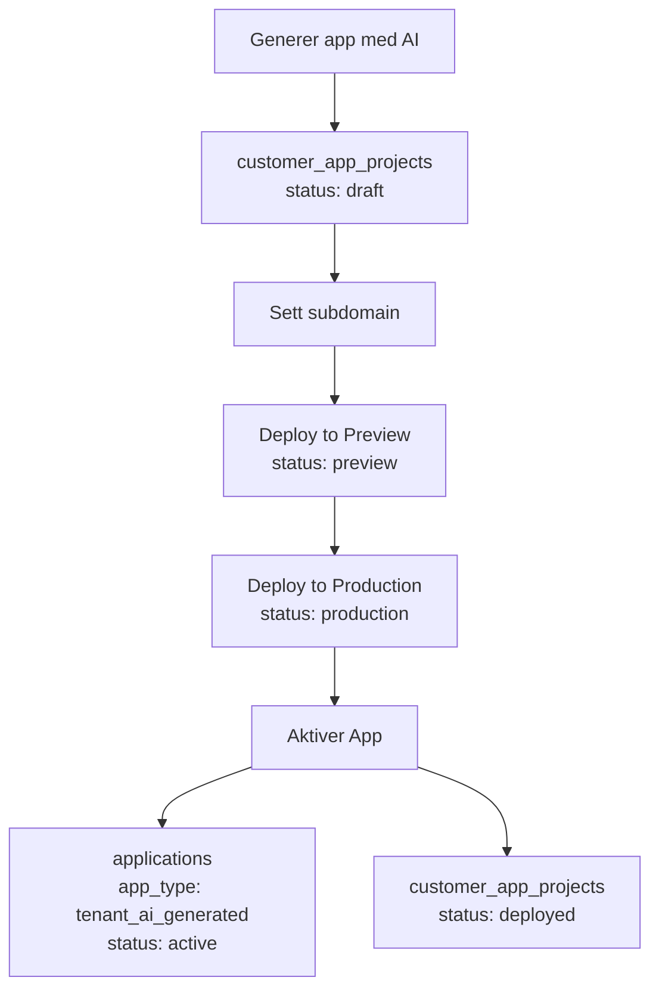

# Platform Apps vs External Systems

## Terminology

### External Systems
Tredjepartssystemer (ERP, CRM, etc.) som bedrifter bruker:
- **Eksempler**: Visma.net ERP, HubSpot CRM, Microsoft 365
- **Admin UI**: `/admin/applications` (for eksterne systemer)
- **Tabeller**: `app_products`, `app_vendors`, `company_apps`
- **Metadata**:
  - `capabilities`: ["accounting", "invoicing", "project_management"]
  - `use_cases`: [{"key": "financial_reporting", "description": "..."}]
  - `mcp_reference`: "mcp://visma-net-erp/v1" (for MCP integrasjon)
  - `integration_providers`: {"n8n": true, "pipedream": true}

### Platform Apps
Applikasjoner bygget PÅ plattformen:
- **Eksempler**: Jul25, Project Analyzer, Custom CRM Dashboard
- **Admin UI**: `/admin/apps` (App Catalog)
- **Tabeller**: `app_definitions`, `app_versions`, `applications` (tenant installs)
- **Metadata**:
  - `domain_tables`: ["jul25_families", "jul25_tasks"] (tabeller appen eier)
  - `shared_tables`: ["companies", "projects"] (delte tabeller)
  - `hooks`: [{"key": "onFamilyCreated", "type": "event"}]
  - `ui_components`: [{"key": "FamilyCalendar", "path": "/components/FamilyCalendar"}]
  - `capabilities`: ["family_management", "task_scheduling"]
  - `integration_requirements`: {"requires_email": true}

---

## Creating a Platform App

### Step 1: Define Manifest
```typescript
import type { AppManifest } from '@/modules/core/applications/types/manifest.types';

const jul25Manifest: AppManifest = {
  key: 'jul25',
  name: 'Jul25 Familie',
  version: '1.0.0',
  domain_tables: [
    'jul25_families',
    'jul25_family_members',
    'jul25_tasks',
    'jul25_family_periods'
  ],
  shared_tables: [], // Optional: read/write to shared tables
  hooks: [
    { key: 'onFamilyCreated', type: 'event', description: 'Triggered when family is created' },
    { key: 'onTaskCompleted', type: 'event', description: 'Triggered when task is completed' }
  ],
  ui_components: [
    { key: 'FamilyCalendar', path: '/pages/apps/Jul25App', type: 'page' }
  ],
  capabilities: ['family_management', 'task_scheduling', 'period_tracking'],
  integration_requirements: {
    requires_email: false,
    requires_calendar: false
  },
  migrations: [
    {
      version: '1.0.0',
      description: 'Initial schema',
      sql: 'CREATE TABLE jul25_families...'
    }
  ]
};
```

### Step 2: Register App from Manifest
```typescript
import { ManifestLoader } from '@/modules/core/applications/services/manifestLoader';

await ManifestLoader.registerFromManifest(jul25Manifest);
```

### Step 3: Publish Version
```typescript
import { AppRegistryService } from '@/modules/core/applications/services/appRegistryService';

await AppRegistryService.publishVersion('jul25', '1.0.0', {
  changelog: 'Initial release',
  breaking_changes: false
});
```

---

## Migration Handling

Når `domain_tables` endres i en ny versjon:

1. **Preflight check** detekterer endringer i `domain_tables`
2. `migration_status` settes til `'pending_migration'`
3. Admin må godkjenne migration før upgrade
4. Migrations kjøres (manuelt eller via edge function)
5. Status oppdateres til `'current'`

**Migration status values:**
- `current`: Ingen pending migrations
- `pending_migration`: Domain tables har endret seg, krever migration
- `migrating`: Migration pågår
- `failed`: Migration feilet (se `migration_error`)

---

## Extension Points

Apps kan deklarere extension points i `app_definitions.extension_points`.

Tenants kan implementere extensions via `tenant_app_extensions`.

---

## Observability

All app access logges i `app_usage_logs`:

```typescript
import { ObservabilityService } from '@/modules/core/applications/services/observabilityService';

await ObservabilityService.logAppAccess(tenantId, 'jul25', {
  version: '1.0.0',
  hook: 'onFamilyCreated',
  userId: auth.uid()
});
```

**Usage stats**:
```typescript
const stats = await ObservabilityService.getAppUsageStats(tenantId, 'jul25');
// { totalAccess: 450, uniqueUsers: 12, hooksUsed: ['onFamilyCreated'] }
```

---

## Metadata

### External Systems
- **capabilities**: Funksjonalitet systemet tilbyr
- **use_cases**: Bruksområder per industri
- **mcp_reference**: MCP protocol reference
- **integration_providers**: iPaaS-støtte (n8n, Pipedream)

### Platform Apps
- **domain_tables**: Tabeller appen eier
- **shared_tables**: Delte tabeller
- **hooks**: Event hooks
- **ui_components**: UI-komponenter
- **capabilities**: Funksjonalitet
- **integration_requirements**: Påkrevde integrasjoner

---

## Application Instance Types (`applications` table)

`applications`-tabellen er hovedtabellen for ALLE aktive app-instanser i systemet.

### App Types

#### 1. Platform Apps (`app_type = 'platform'`)
Globale apper installert fra `app_definitions`:
- **Eksempel**: jul25 installert hos Tenant A
- **Kjennetegn**: 
  - `app_definition_id` er satt (peker til app_definitions)
  - `source_project_id` er NULL
  - Samme app kan installeres hos flere tenants

#### 2. Tenant AI-Generated Apps (`app_type = 'tenant_ai_generated'`)
AI-genererte applikasjoner bygget spesifikt for én tenant:
- **Eksempel**: "SILDRE AS App", "INNOWIN AS App"
- **Kjennetegn**:
  - `app_definition_id` er NULL (ikke basert på global template)
  - `source_project_id` peker til opprinnelig prosjekt i `customer_app_projects`
  - Unik for én tenant

#### 3. Tenant Custom Apps (`app_type = 'tenant_custom'`)
Manuelt bygget applikasjoner for én tenant:
- **Kjennetegn**:
  - `app_definition_id` er NULL
  - `source_project_id` peker til opprinnelig prosjekt
  - Skreddersydd løsning

---

## Application Lifecycle: Fra Prosjekt til Aktiv App

### Workflow



### Status-flow i `customer_app_projects`

| Status | Beskrivelse | Neste steg |
|--------|-------------|------------|
| `draft` | Under planlegging/utvikling | Sett subdomain → Deploy to Preview |
| `planning` | I planleggingsfase | Fortsett utvikling |
| `building` | Under bygging | Fortsett utvikling |
| `preview` | Deployed til preview-miljø | Test → Deploy to Production |
| `production` | Deployed til produksjon | Aktiver app (migrer til `applications`) |
| `deployed` | Migrert til `applications` | Ferdig (arkivert i prosjekt-tabellen) |

### Tabeller i Lifecycle

#### `customer_app_projects` (Prosjekter under bygging)
- KUN prosjekter som er under utvikling eller testing
- Når status = 'deployed' → appen er flyttet til `applications`

#### `applications` (Aktive apper)
- ALLE apper som er tilgjengelige for brukere
- Inkluderer både platform-apper og tenant-spesifikke apper

---

## Database Queries

### Hente alle aktive apps for en tenant
```sql
SELECT 
  a.*,
  ad.name as definition_name,
  ad.key as definition_key,
  cap.name as project_name
FROM applications a
LEFT JOIN app_definitions ad ON a.app_definition_id = ad.id
LEFT JOIN customer_app_projects cap ON a.source_project_id = cap.id
WHERE a.tenant_id = '...' 
  AND a.is_active = true
  AND a.status = 'active'
ORDER BY a.installed_at DESC;
```

### Hente prosjekter under bygging
```sql
SELECT * FROM customer_app_projects
WHERE tenant_id = '...'
  AND status IN ('draft', 'planning', 'building', 'preview', 'production')
ORDER BY created_at DESC;
```

### Skille mellom app-typer
```sql
-- Platform apps
SELECT * FROM applications 
WHERE app_type = 'platform' AND app_definition_id IS NOT NULL;

-- Tenant-spesifikke apps
SELECT * FROM applications 
WHERE app_type IN ('tenant_ai_generated', 'tenant_custom') 
  AND app_definition_id IS NULL;
```

---

## UI-visning

### TenantDetails - Applications Tab

**Seksjon 1: Aktive Applikasjoner**
- Datakilde: `applications` table
- Filter: `is_active = true`, `status = 'active'`
- Viser: Alle apper tilgjengelige for brukere

**Seksjon 2: Prosjekter Under Bygging**
- Datakilde: `customer_app_projects` table
- Filter: `status != 'deployed'`
- Viser: Status-workflow-knapper (Deploy to Preview/Production/Aktiver)

### AppSelector (i rolle-administrasjon)
- Datakilde: `applications` table
- Formål: Velge app-scope for roller
- Filter: Kun aktive apper

---

## Migrering og Testing

### Verifisere migrering
```sql
-- Sjekk at apps er migrert korrekt
SELECT 
  'applications' as source,
  COUNT(*) as count,
  app_type,
  status
FROM applications
GROUP BY app_type, status
UNION ALL
SELECT 
  'customer_app_projects' as source,
  COUNT(*) as count,
  NULL as app_type,
  status
FROM customer_app_projects
GROUP BY status;
```

### Testing workflow
1. Gå til `/admin/tenants/:tenantId`
2. Klikk "Applikasjoner"-tab
3. Verifiser to seksjoner vises:
   - "Aktive Applikasjoner" (fra `applications`)
   - "Prosjekter Under Bygging" (fra `customer_app_projects`)
4. Test status-endringer:
   - Draft → Preview
   - Preview → Production
   - Production → Aktiver (migreres til `applications`)
5. Verifiser at AppSelector viser korrekte apper
