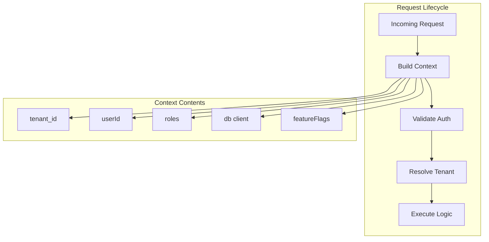
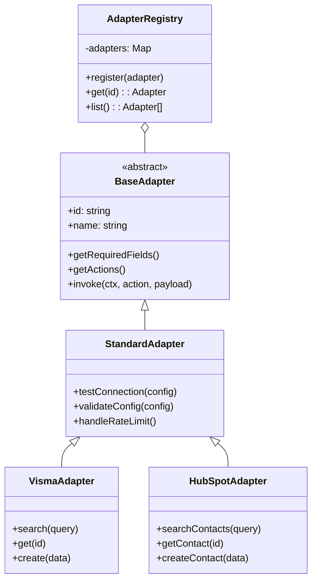
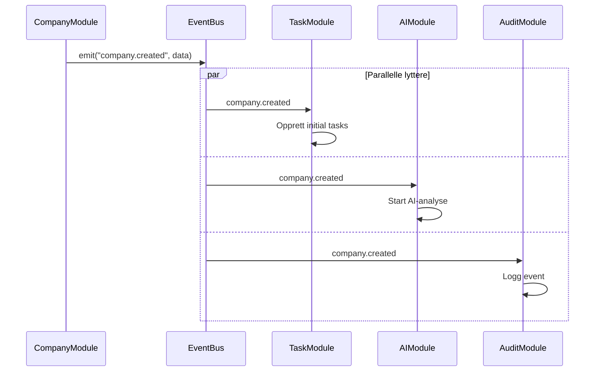
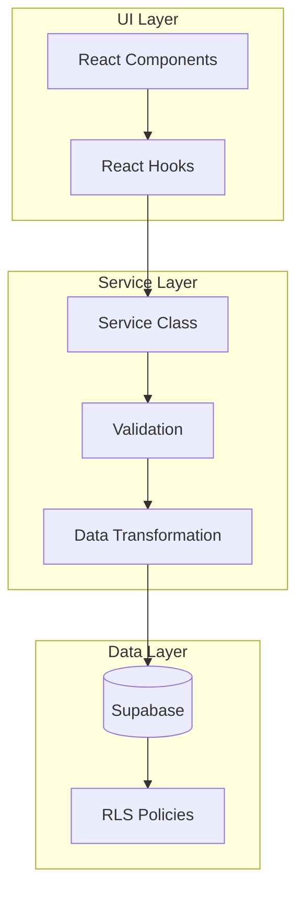
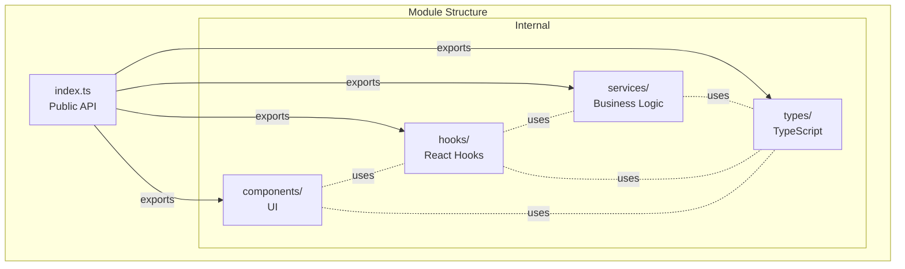
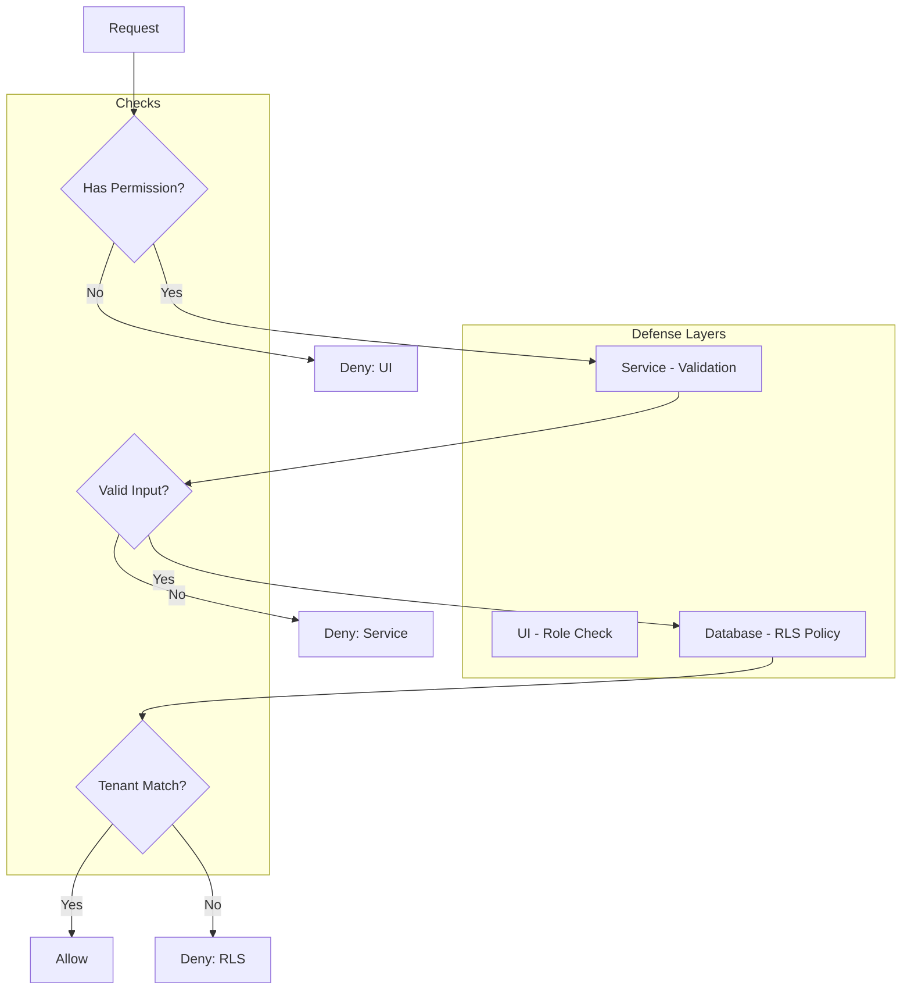
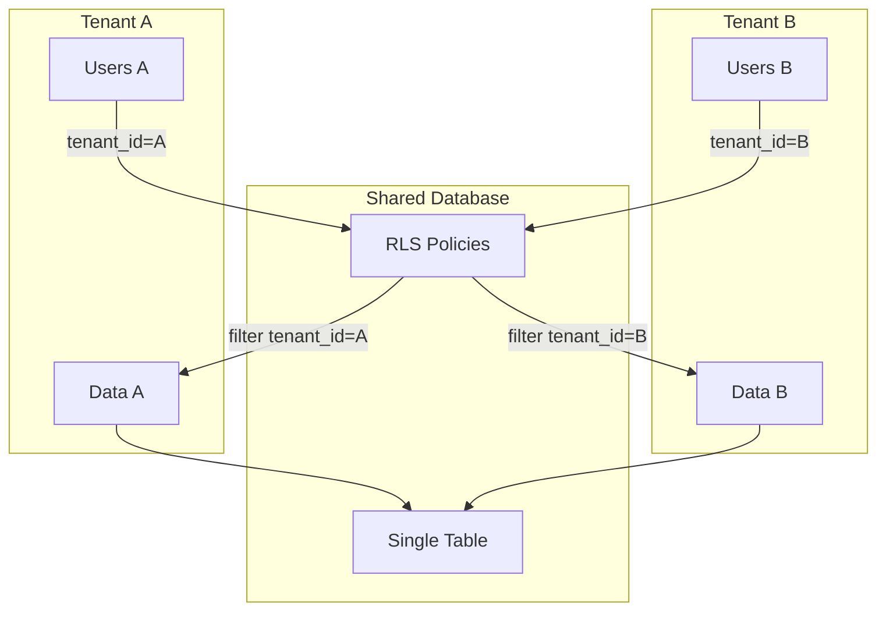

# Arkitekturmønstre

## 📝 Oversikt

Dette dokumentet beskriver sentrale arkitekturmønstre brukt i plattformen og hvordan de skal anvendes konsistent.

## 🏗️ Context Pattern (RequestContext)

### Prinsipp

All forretningslogikk mottar en `RequestContext` som første parameter. Dette sikrer tenant-isolasjon, autentisering og konsistent logging.



### Implementering

```typescript
// Context definition
interface RequestContext {
  tenant_id: string;
  tenant: TenantConfig;
  userId?: string;
  roles?: AppRole[];
  request_id: string;
  timestamp: string;
  db: SupabaseClient;
  featureFlags?: Record<string, boolean>;
}

// Service method signature
class MyService {
  static async getData(ctx: RequestContext, additionalParams: any) {
    // Validate tenant
    if (!ctx.tenant_id) throw new Error("Missing tenant");
    
    // Use ctx.db for queries
    const { data } = await ctx.db
      .from('my_table')
      .select('*')
      .eq('tenant_id', ctx.tenant_id);
    
    return data;
  }
}
```

### Best Practices

1. **Alltid først** - `ctx` er alltid første parameter
2. **Valider tidlig** - Sjekk tenant_id og roller tidlig i funksjonen
3. **Bruk ctx.db** - Ikke import supabase-client direkte i services
4. **Logg med context** - Inkluder request_id i logger

## 🎯 Adapter Pattern (Integrasjoner)

### Prinsipp

Alle eksterne integrasjoner implementeres som adaptere med felles interface. Dette gjør det enkelt å bytte eller legge til integrasjoner.



### Implementering

```typescript
// Base adapter interface
abstract class BaseAdapter {
  abstract id: string;
  abstract name: string;
  
  abstract getRequiredFields(): FieldDefinition[];
  abstract getActions(): ActionDefinition[];
  abstract invoke(ctx: RequestContext, action: string, payload: any): Promise<any>;
}

// Standard implementation
class StandardAdapter extends BaseAdapter {
  async testConnection(config: any): Promise<boolean> {
    // Common test logic
  }
  
  validateConfig(config: any): ValidationResult {
    // Common validation
  }
  
  protected async handleRateLimit() {
    // Common rate limiting
  }
}

// Specific adapter
class VismaAdapter extends StandardAdapter {
  id = "visma";
  name = "Visma.net";
  
  getRequiredFields() {
    return [
      { key: "api_key", label: "API Key", type: "password" },
      { key: "tenant_id", label: "Tenant ID", type: "text" }
    ];
  }
  
  async invoke(ctx: RequestContext, action: string, payload: any) {
    switch (action) {
      case "search":
        return this.search(payload.query);
      default:
        throw new Error(`Unknown action: ${action}`);
    }
  }
}
```

## 🔄 Event-Driven Pattern

### Prinsipp

Moduler kommuniserer via events i stedet for direkte koblinger. Dette reduserer avhengigheter og gjør systemet mer fleksibelt.



### Implementering

```typescript
// Event bus
class EventBus {
  private listeners = new Map<string, Function[]>();
  
  on(event: string, handler: Function) {
    if (!this.listeners.has(event)) {
      this.listeners.set(event, []);
    }
    this.listeners.get(event)!.push(handler);
  }
  
  emit(event: string, data: any) {
    const handlers = this.listeners.get(event) || [];
    handlers.forEach(handler => handler(data));
  }
}

// Module emitting events
class CompanyService {
  static async createCompany(ctx: RequestContext, data: CompanyInput) {
    const company = await ctx.db
      .from('companies')
      .insert(data)
      .select()
      .single();
    
    // Emit event
    EventBus.emit('company.created', {
      ctx,
      company
    });
    
    return company;
  }
}

// Module listening to events
EventBus.on('company.created', async ({ ctx, company }) => {
  // Auto-create initial tasks
  await TaskService.createTask(ctx, {
    title: "Complete company profile",
    context_type: "company",
    context_id: company.id
  });
});
```

## 🗄️ Repository Pattern

### Prinsipp

Database-tilgang abstraheres gjennom services som håndterer queries, validering og forretningslogikk.



### Implementering

```typescript
// Service with clear responsibility
class ProjectService {
  // Query methods
  static async getById(ctx: RequestContext, id: string): Promise<Project | null> {
    const { data, error } = await ctx.db
      .from('projects')
      .select('*')
      .eq('id', id)
      .single();
    
    if (error) throw error;
    return data;
  }
  
  // Command methods
  static async create(ctx: RequestContext, input: ProjectInput): Promise<Project> {
    // Validate
    this.validateProjectInput(input);
    
    // Transform
    const data = {
      ...input,
      tenant_id: ctx.tenant_id,
      created_by: ctx.userId
    };
    
    // Execute
    const { data: project, error } = await ctx.db
      .from('projects')
      .insert(data)
      .select()
      .single();
    
    if (error) throw error;
    
    // Emit event
    EventBus.emit('project.created', { ctx, project });
    
    return project;
  }
  
  // Business logic
  private static validateProjectInput(input: ProjectInput) {
    if (!input.title?.trim()) {
      throw new Error("Title is required");
    }
    // More validation...
  }
}
```

## 🎭 Module Pattern

### Prinsipp

Moduler organiseres med klar struktur og eksporterer kun det som trengs eksternt.



### Implementering

```typescript
// index.ts - Public API
export type { Project, ProjectInput } from "./types/project.types";
export { ProjectService } from "./services/projectService";
export { useProject, useProjects } from "./hooks/useProjects";
export { ProjectCard } from "./components/ProjectCard";

// Do NOT export:
// - Internal utilities
// - Private helpers
// - Implementation details

// Module metadata
export const PROJECT_MODULE = {
  name: "project",
  version: "1.0.0",
  description: "Project management",
  dependencies: ["user", "company"]
} as const;
```

## 🔐 Security Pattern (RLS + Validation)

### Prinsipp

Sikkerhet implementeres på flere nivåer: RLS i database, validering i services, og rolle-sjekker i UI.



### Implementering

```typescript
// UI - Role check
function ProjectSettings() {
  const { hasRole } = useUserRole();
  
  if (!hasRole('project_owner')) {
    return <AccessDenied />;
  }
  
  return <SettingsForm />;
}

// Service - Validation
class ProjectService {
  static async update(ctx: RequestContext, id: string, data: Partial<Project>) {
    // Check permission
    if (!ctx.roles?.includes('project_owner')) {
      throw new Error("Insufficient permissions");
    }
    
    // Validate input
    if (data.title && data.title.length < 3) {
      throw new Error("Title too short");
    }
    
    // Execute with RLS protection
    const { data: updated, error } = await ctx.db
      .from('projects')
      .update(data)
      .eq('id', id)
      .select()
      .single();
    
    if (error) throw error;
    return updated;
  }
}
```

```sql
-- RLS Policy - Database level
CREATE POLICY "Users can update own tenant projects"
ON projects FOR UPDATE
USING (
  tenant_id = auth.uid_tenant_id()
  AND EXISTS (
    SELECT 1 FROM user_roles
    WHERE user_id = auth.uid()
    AND scope_type = 'project'
    AND scope_id = projects.id
    AND role = 'project_owner'
  )
);
```

## 📊 Multi-tenant Pattern

### Prinsipp

Alle data filtreres automatisk på tenant_id, og RLS policies sikrer dataisolering.



### Best Practices

1. **Alltid tenant_id** - Alle hovedtabeller har tenant_id
2. **RLS på alt** - Alle tabeller har RLS enabled
3. **Valider i service** - Dobbelsjekk tenant_id i services
4. **Test isolering** - Skriv tester som verifiserer tenant-isolering

```typescript
// Service ensuring tenant isolation
class CompanyService {
  static async list(ctx: RequestContext): Promise<Company[]> {
    // RLS will filter, but we validate too
    if (!ctx.tenant_id) {
      throw new Error("Tenant context required");
    }
    
    const { data, error } = await ctx.db
      .from('companies')
      .select('*')
      // Explicit filter (redundant with RLS, but clear)
      .eq('tenant_id', ctx.tenant_id);
    
    if (error) throw error;
    return data || [];
  }
}
```

## 📝 Best Practices Sammendrag

### DO ✅

1. **Bruk RequestContext** - Alltid første parameter
2. **Følg adapter-pattern** - For alle integrasjoner
3. **Emit events** - For tverrgående logikk
4. **Separate concerns** - Services, hooks, components
5. **Valider på flere nivåer** - UI, service, RLS
6. **Eksporter gjennom index** - Aldri direkte imports
7. **Dokumenter patterns** - Skriv tydelige kommentarer

### DON'T ❌

1. **Ikke hardkod tenant_id** - Bruk ctx
2. **Ikke direkte DB-kall** - Gå via services
3. **Ikke tett kobling** - Bruk events
4. **Ikke eksponer internals** - Kun via index.ts
5. **Ikke skip validering** - Stol ikke kun på RLS
6. **Ikke bland concerns** - Hold services rene
7. **Ikke anonym logikk** - Navngi og dokumenter

---
*Del av Lovable Platform • Sist oppdatert: 2025-01-13*
