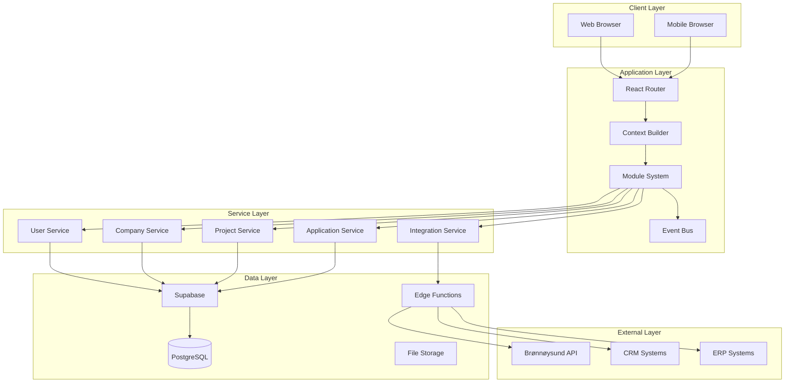
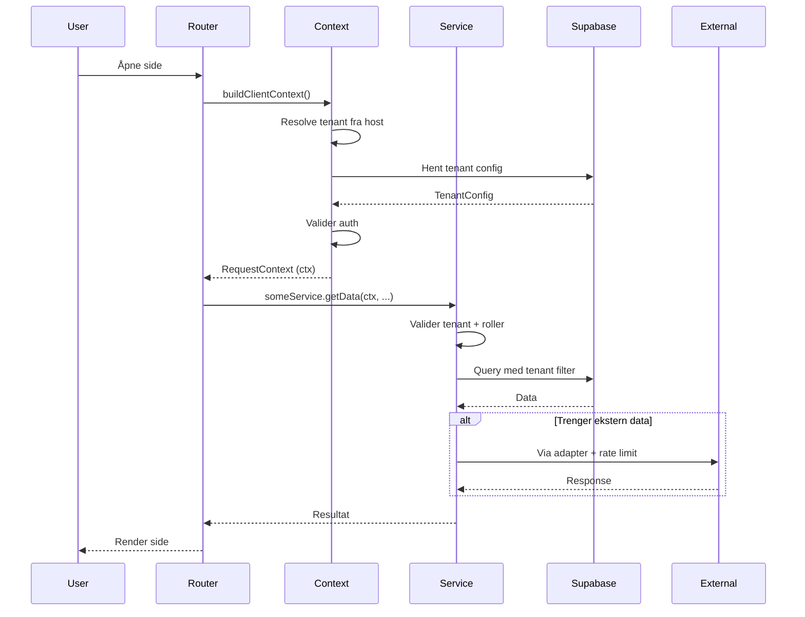
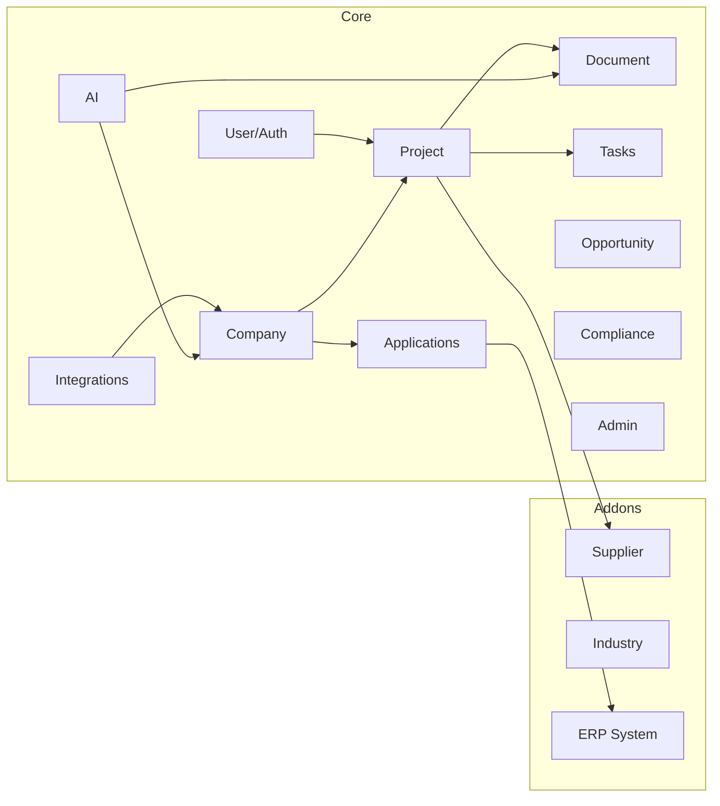
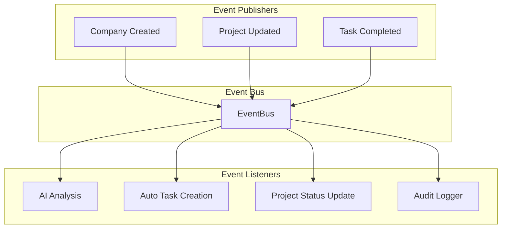
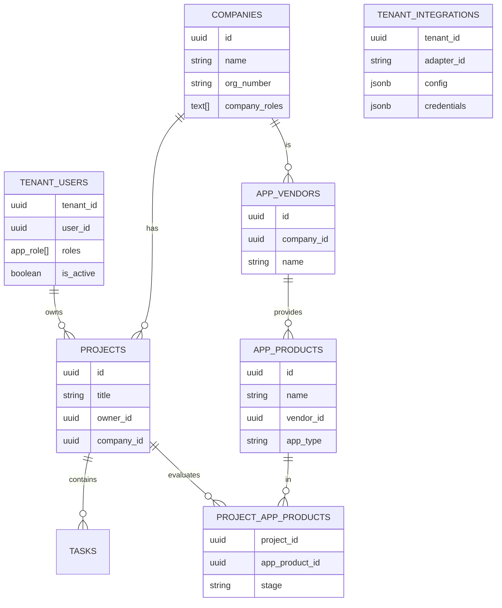
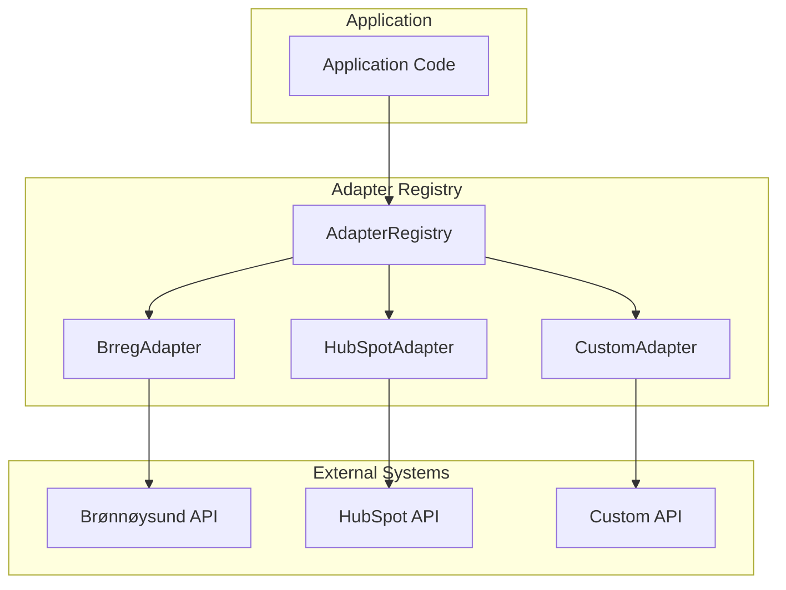
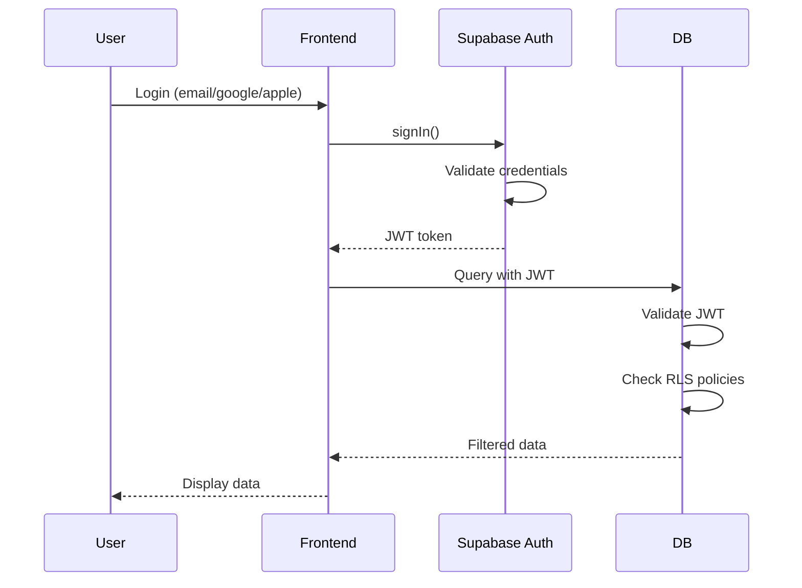

# Arkitektur

## Systemdesign

### Overordnet arkitektur



## Request Flow

### Typisk request-flyt



### Context Builder

Hver request bygger en `RequestContext`:

```typescript
interface RequestContext {
  tenant_id: string;
  tenant: TenantConfig;
  userId?: string;
  roles?: AppRole[];
  request_id: string;
  timestamp: string;
  db: SupabaseClient;
  featureFlags?: Record<string, boolean>;
}
```

**Byggeprosess**:
1. Resolve tenant fra host/subdomain
2. Hent tenant config fra `tenants.json` eller control-DB
3. Valider bruker (auth.uid())
4. Hent roller fra `tenant_users`
5. Initialiser DB-client med RLS-context
6. Returner ctx

## Modularkitektur

### Core Modules



### Modul-struktur

Hver modul følger samme pattern:

```
modules/core/<module-name>/
├── components/          # React komponenter
├── hooks/              # Custom hooks (useX)
├── services/           # Business logic
├── types/              # TypeScript types
└── index.ts            # Public API
```

**Eksempel**: Company-modul

```typescript
// modules/core/company/index.ts
export * from "./types/company.types";
export { CompanyService } from "./services/companyService";
export { useCompany } from "./hooks/useCompany";
export { CompanyCard } from "./components/CompanyCard";
```

## Event System

### Event Bus Pattern



### Event Kontrakter

**CompanyCreated**:
```typescript
interface CompanyCreatedEvent {
  type: "company.created";
  data: {
    companyId: string;
    tenantId: string;
    userId: string;
  };
  timestamp: string;
}
```

**Publisering**:
```typescript
eventBus.publish("company.created", {
  companyId: company.id,
  tenantId: ctx.tenant_id,
  userId: ctx.userId,
});
```

**Lytting**:
```typescript
eventBus.on("company.created", async (event) => {
  // Auto-opprett AI-analyse task
  await TaskService.create(ctx, {
    title: `Analyser ${company.name}`,
    entity_type: "company",
    entity_id: event.data.companyId,
  });
});
```

## Data Layer

### Database Schema



### RLS Policies

Alle tabeller har Row-Level Security aktivert:

**Eksempel - Projects**:
```sql
-- Users can only see projects in their tenant
CREATE POLICY "Users can view own tenant projects"
ON projects FOR SELECT
USING (
  EXISTS (
    SELECT 1 FROM tenant_users
    WHERE tenant_id = projects.tenant_id
    AND user_id = auth.uid()
    AND is_active = true
  )
);
```

## Integration Layer

### Adapter Pattern



**Adapter Interface**:
```typescript
interface IntegrationAdapter {
  id: string;
  name: string;
  setup(ctx: RequestContext, config: AdapterConfig): Promise<void>;
  invoke(ctx: RequestContext, action: string, payload: any): Promise<any>;
  validate(config: AdapterConfig): Promise<boolean>;
  getActions(): AdapterAction[];
}
```

**Bruk**:
```typescript
// Via edge function
POST /api/integrations/brreg/company-search
Body: { query: "Acme AS" }

// Eller direkte
const adapter = AdapterRegistry.get("brreg");
const result = await adapter.invoke(ctx, "company-search", { query: "Acme AS" });
```

## Security

### Authentication Flow



### RBAC Enforcement

**Frontend**:
```typescript
const { hasRole } = useUserRole();

if (hasRole("tenant_admin")) {
  return <AdminPanel />;
}
```

**Backend**:
```typescript
const hasRole = await userHasRole(ctx.userId, ctx.tenant_id, "tenant_admin");
if (!hasRole) {
  throw new UnauthorizedError("Requires tenant_admin role");
}
```

**Database**:
```sql
-- Via security definer function
CREATE POLICY "Only admins can delete"
ON projects FOR DELETE
USING (
  user_has_role(auth.uid(), tenant_id, 'tenant_admin')
);
```

## Performance

### Caching Strategy

- **Tenant config**: In-memory cache, 5 min TTL
- **User roles**: Session cache
- **Static data**: Browser cache headers
- **API responses**: SWR/React Query

### Optimization

- Lazy loading av moduler
- Code splitting per route
- Optimistic updates (React Query)
- Debouncing av søk
- Pagination på alle lister

## Skalerbarhet

### Horizontal Scaling

- **Frontend**: Statisk, CDN-cachet
- **Edge Functions**: Auto-scale via Supabase
- **Database**: Connection pooling, read replicas

### Tenant Isolation

- Per-tenant database schemas (fremtidig)
- RLS policies sikrer data-isolering
- Rate limiting per tenant på integrasjoner
