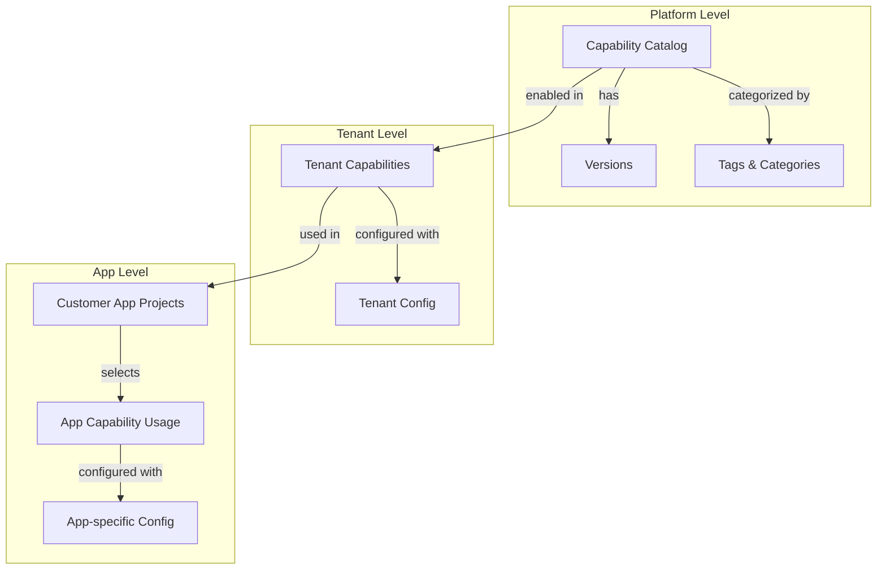
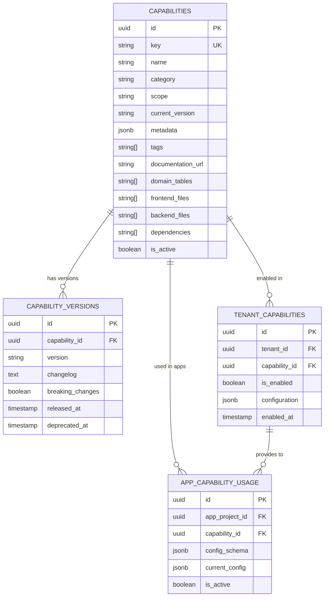
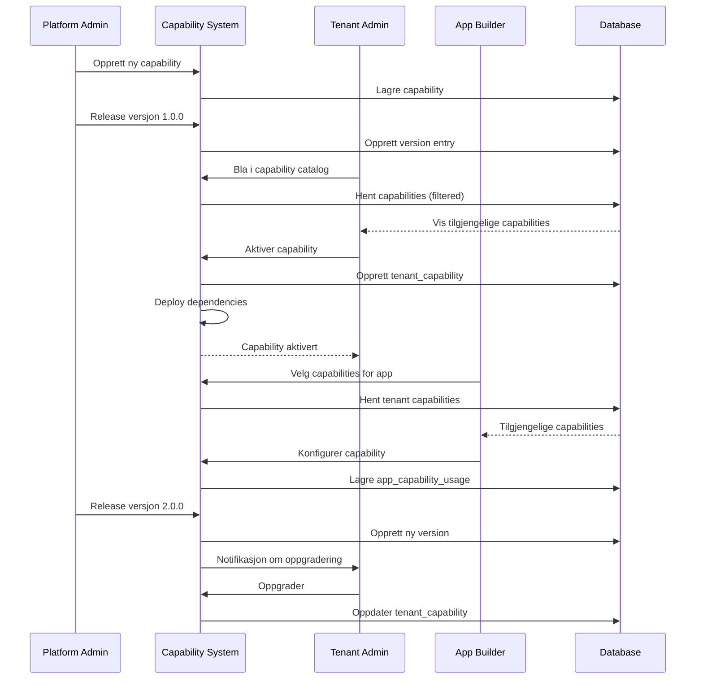
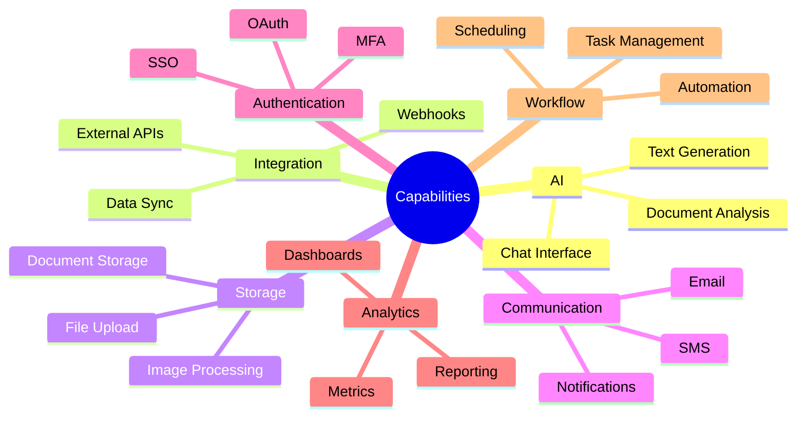

# Capabilities System

## 📝 Oversikt

Capabilities-systemet er en katalog over gjenbrukbare funksjoner, tjenester og integrasjoner som kan aktiveres per tenant eller applikasjon.

## 🏗️ Arkitektur



## 📊 Data Model



## 🔄 Capability Lifecycle



## 🎯 Capability Categories



## 🔌 API Reference

### Services

**CapabilityService**
```typescript
// List capabilities med filtrering
const capabilities = await CapabilityService.listCapabilities({
  category: "AI",
  scope: "platform",
  search: "generation",
  tags: ["ai", "content"],
  is_active: true
});

// Hent enkelt capability
const capability = await CapabilityService.getCapability("ai-generation");

// Opprett ny capability
const newCap = await CapabilityService.createCapability({
  key: "ai-generation",
  name: "AI Content Generation",
  category: "AI",
  scope: "platform",
  description: "Generate content using AI models",
  metadata: {
    cost_estimate: "medium",
    complexity: "low"
  }
});

// Release ny versjon
await CapabilityService.releaseVersion(
  capabilityId,
  "2.0.0",
  "Added support for image generation",
  false // breaking_changes
);
```

**TenantCapabilityService**
```typescript
// Hent tenant capabilities
const tenantCaps = await TenantCapabilityService.getTenantCapabilities(tenantId);

// Aktiver capability
await TenantCapabilityService.enableCapability(tenantId, capabilityId, {
  max_requests: 1000,
  model: "gemini-2.5-flash"
});

// Deaktiver capability
await TenantCapabilityService.disableCapability(tenantId, capabilityId);
```

**AppCapabilityService**
```typescript
// Hent app capabilities
const appCaps = await AppCapabilityService.getAppCapabilities(appProjectId);

// Legg til capability i app
await AppCapabilityService.addCapability(appProjectId, capabilityId, {
  field: "description",
  trigger: "button"
});
```

### React Hooks

```typescript
// List all capabilities
const { data: capabilities } = useCapabilities({
  category: "AI",
  is_active: true
});

// Get single capability
const { data: capability } = useCapability("ai-generation");

// Tenant capabilities
const { data: tenantCaps } = useTenantCapabilities(tenantId);

// Check if capability is enabled
const { hasCapability } = useHasCapability(tenantId, "ai-generation");

// Enable capability
const { mutate: enable } = useEnableCapability();
enable({ tenantId, capabilityId, config });
```

## 🎨 UI Components

### CapabilityCard
```tsx
import { CapabilityCard } from "@/modules/core/capabilities";

<CapabilityCard
  capability={capability}
  isEnabled={hasCapability}
  onToggle={(enabled) => handleToggle(capability.id, enabled)}
  onConfigure={() => showConfigDialog(capability)}
/>
```

### CapabilityBrowser
```tsx
import { CapabilityBrowser } from "@/modules/core/capabilities";

<CapabilityBrowser
  tenantId={tenantId}
  onSelectCapability={(cap) => handleSelect(cap)}
  filterByCategory="AI"
/>
```

### AppCapabilityDrawer
```tsx
import { AppCapabilityDrawer } from "@/modules/core/capabilities";

<AppCapabilityDrawer
  appProjectId={appId}
  availableCapabilities={capabilities}
  onAddCapability={(capId, config) => handleAdd(capId, config)}
/>
```

## 📝 Opprett Ny Capability

```typescript
// 1. Definer capability
const aiGenerationCapability: CapabilityInput = {
  key: "ai-generation",
  name: "AI Content Generation",
  description: "Generate text using AI models",
  category: "AI",
  scope: "platform",
  metadata: {
    cost_estimate: "medium",
    requires_api_key: false // Lovable AI inkludert
  },
  documentation_url: "docs/capabilities/ai-generation.md",
  domain_tables: ["ai_generations", "ai_prompts"],
  frontend_files: [
    "src/modules/core/ai/hooks/useAIGeneration.ts",
    "src/modules/core/ai/components/AIGenerationButton.tsx"
  ],
  backend_files: [
    "supabase/functions/generate-text/index.ts"
  ],
  dependencies: ["auth", "user-profile"],
  tags: ["ai", "content", "generation"]
};

// 2. Opprett i databasen
await CapabilityService.createCapability(aiGenerationCapability);

// 3. Seed initial version
await CapabilityService.releaseVersion(
  capabilityId,
  "1.0.0",
  "Initial release",
  false
);
```

## 🔐 Sikkerhet og Tilganger

### Capability Scopes

1. **Platform** - Tilgjengelig for alle tenants
2. **Tenant** - Må aktiveres per tenant
3. **App** - Konfigureres per applikasjon

### RLS Policies

```sql
-- Tenant capabilities - kun admin kan endre
CREATE POLICY "Tenant admins manage capabilities"
ON tenant_capabilities FOR ALL
USING (
  EXISTS (
    SELECT 1 FROM user_roles
    WHERE user_id = auth.uid()
    AND scope_type = 'tenant'
    AND scope_id = tenant_capabilities.tenant_id
    AND role IN ('tenant_owner', 'tenant_admin')
  )
);

-- App capabilities - app admin kan konfigurere
CREATE POLICY "App admins configure capabilities"
ON app_capability_usage FOR ALL
USING (
  EXISTS (
    SELECT 1 FROM user_roles ur
    JOIN customer_app_projects cap ON cap.id = app_capability_usage.app_project_id
    WHERE ur.user_id = auth.uid()
    AND ur.scope_type = 'app'
    AND ur.role = 'app_admin'
  )
);
```

## 📈 Best Practices

1. **Versjonering** - Bruk semantic versioning (1.0.0, 1.1.0, 2.0.0)
2. **Avhengigheter** - Dokumenter dependencies tydelig
3. **Konfigurering** - Tilby sensible defaults
4. **Dokumentasjon** - Skriv capability docs med templates
5. **Testing** - Test capability isolert før aktivering
6. **Migrering** - Plan breaking changes nøye

## 🧪 Testing

```typescript
describe("Capability System", () => {
  it("should enable capability for tenant", async () => {
    await TenantCapabilityService.enableCapability(tenantId, capId, config);
    const hasIt = await TenantCapabilityService.hasCapability(tenantId, capId);
    expect(hasIt).toBe(true);
  });
  
  it("should configure capability for app", async () => {
    await AppCapabilityService.addCapability(appId, capId, schema);
    const appCaps = await AppCapabilityService.getAppCapabilities(appId);
    expect(appCaps).toContainEqual(expect.objectContaining({ capability_id: capId }));
  });
});
```

## 📚 Eksempler

Se individuelle capability-dokumenter for detaljer:
- [AI Generation](./ai-generation.md)
- [Task Management](./task-management.md)
- [Invitation System](./invitation-system.md)

---
*Del av Lovable Platform • Sist oppdatert: 2025-01-13*
