# Integrations Module

## Oversikt

Integrations-modulen er kjernen for all kommunikasjon med eksterne systemer. Den tilbyr et standardisert rammeverk for å bygge, registrere og administrere integrasjoner med tredjepartstjenester som ERP, CRM, e-post, betalingssystemer, og mer.

## Arkitektur

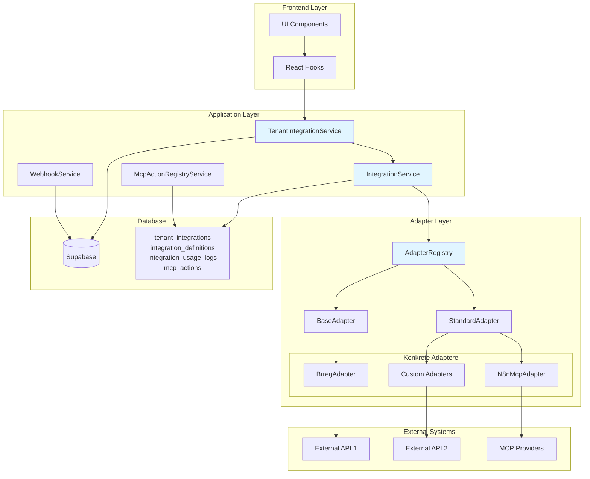

## Adapter Registry

AdapterRegistry er det sentrale registeret for alle integrasjonsadaptere. Det fungerer som et singleton-mønster som lar systemet dynamisk registrere, hente og administrere adaptere.

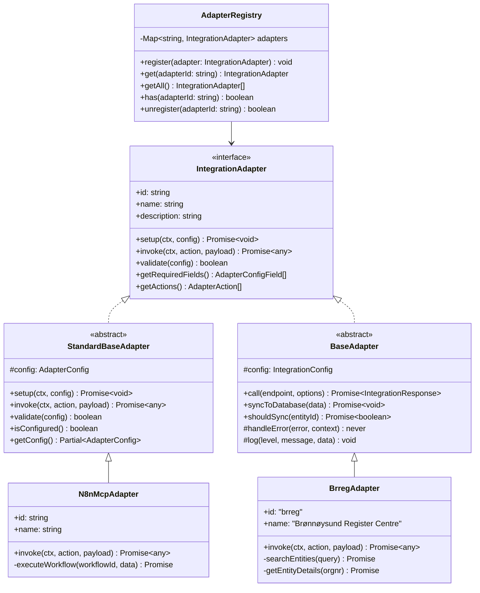

## Standard Integrasjonsflyt

### 1. Setup-fase

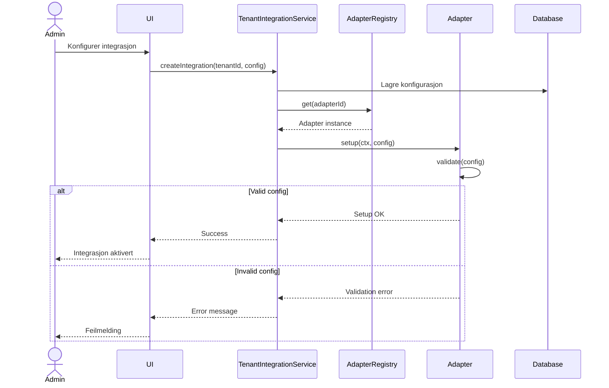

### 2. Invoke-fase (Runtime)

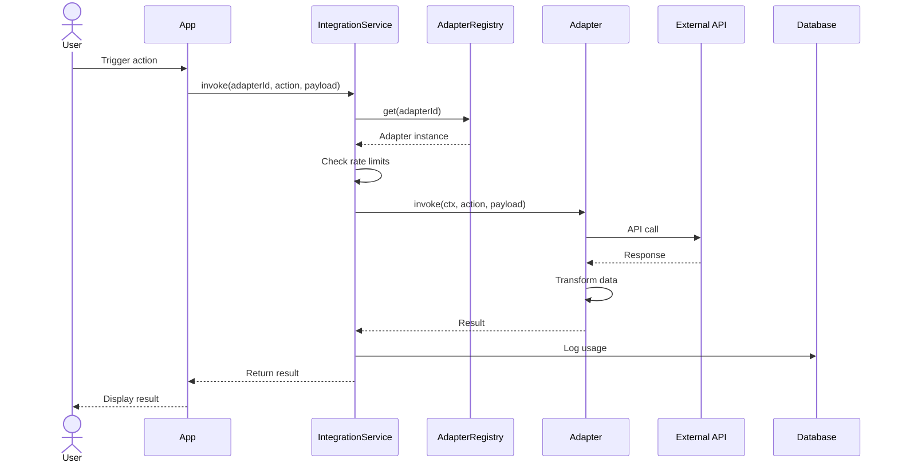

## MCP (Model Context Protocol) Integrasjon

MCP-integrasjonen lar systemet kommunisere med eksterne MCP-providers som n8n, Make, Zapier, eller egenutviklede løsninger.

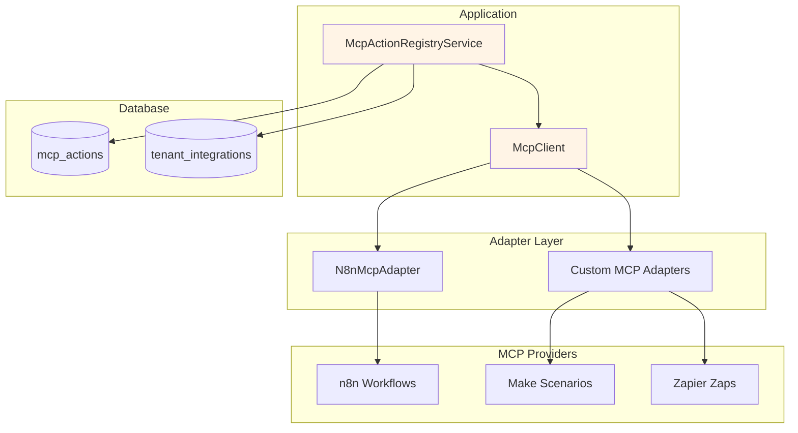

### MCP Action Flow

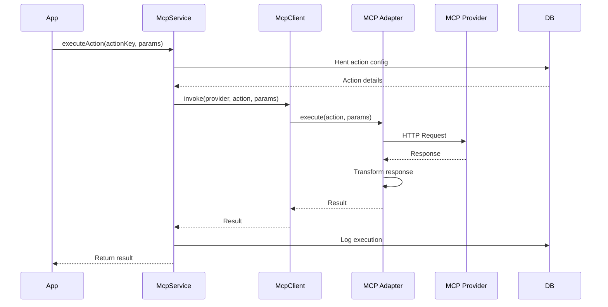

## Webhook System

Webhook-systemet håndterer innkommende events fra eksterne systemer.

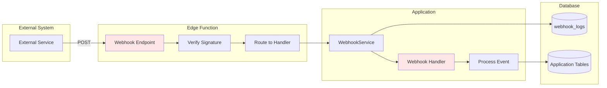

### Webhook Event Flow

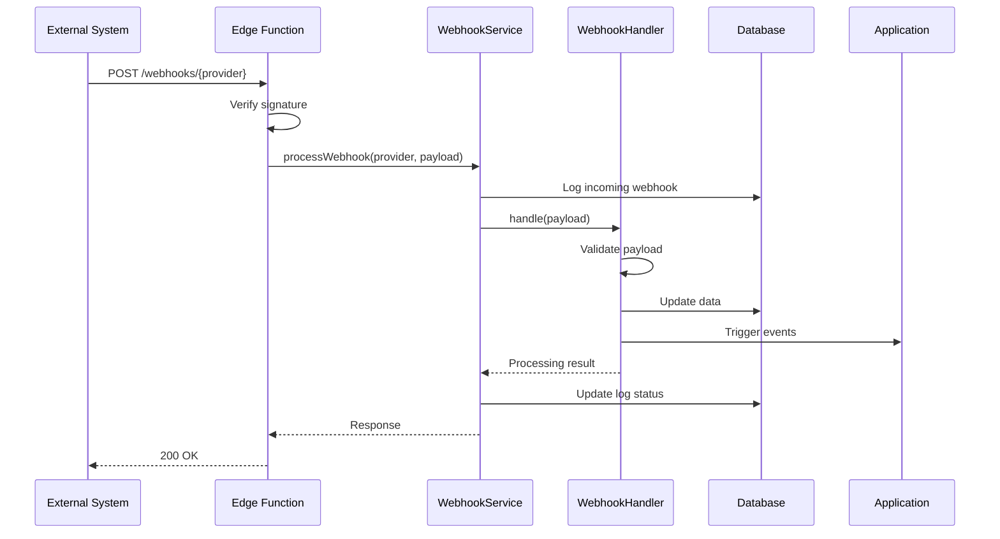

## Datamodell

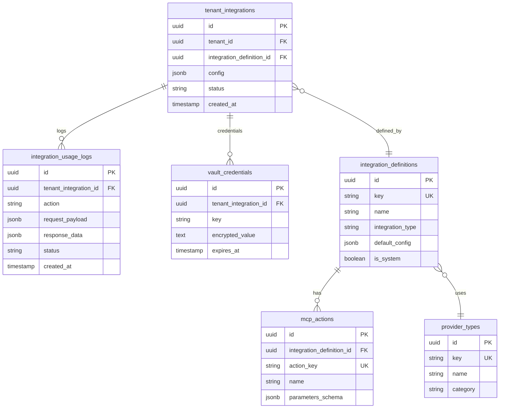

## Adapter-typer

### BaseAdapter (Legacy)

Brukes for eldre integrasjoner som BrregAdapter. Støtter:
- HTTP API calls med retry-logikk
- Database-synkronisering
- Konsistent feilhåndtering
- Logging

**Eksempel:**
```typescript
class BrregAdapter extends BaseAdapter<BrregConfig> {
  name = 'brreg';
  
  async call(endpoint: string, options?: IntegrationCallOptions) {
    // HTTP request logic
  }
  
  async syncToDatabase(data: any) {
    // Save to Supabase
  }
}
```

### StandardAdapter (Modern)

Nyere adaptere bruker StandardAdapter som støtter:
- RequestContext (tenantId, userId, roles)
- Konfigurasjonsskjema
- Action-basert API
- Validering

**Eksempel:**
```typescript
class N8nMcpAdapter extends StandardBaseAdapter {
  id = 'n8n-mcp';
  name = 'n8n MCP Provider';
  
  async invoke(ctx: RequestContext, action: string, payload: any) {
    switch(action) {
      case 'execute-workflow':
        return this.executeWorkflow(payload);
      default:
        throw new Error(`Unknown action: ${action}`);
    }
  }
  
  getRequiredFields() {
    return [
      { key: 'baseUrl', label: 'n8n URL', type: 'text', required: true },
      { key: 'apiKey', label: 'API Key', type: 'password', required: true }
    ];
  }
}
```

## Rate Limiting

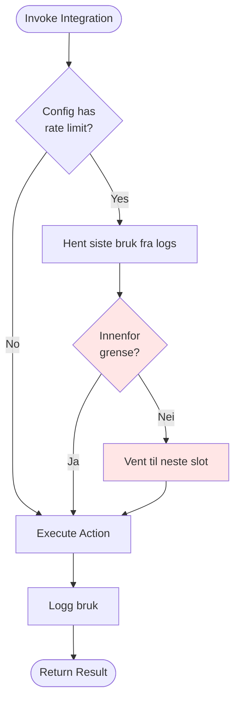

## Secrets Management

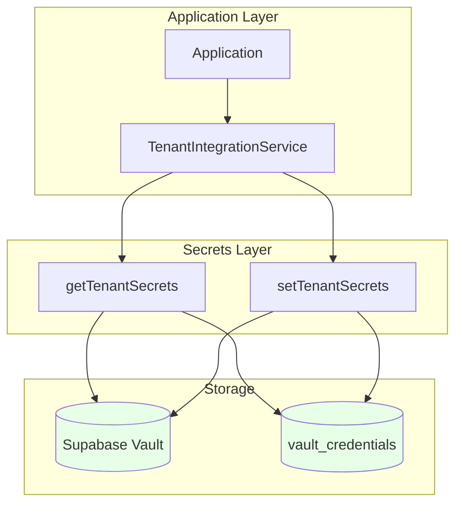

API-nøkler og andre hemmeligheter lagres kryptert i Supabase Vault:

```typescript
// Lagre secret
await setTenantSecrets(tenantId, integrationId, {
  apiKey: 'secret-value',
  clientSecret: 'another-secret'
});

// Hente secret
const secrets = await getTenantSecrets(tenantId, integrationId);
console.log(secrets.apiKey); // Dekryptert verdi
```

## Brukseksempler

### 1. Registrere ny adapter

```typescript
import { adapterRegistry } from '@/modules/core/integrations/services/AdapterRegistry';
import { MyCustomAdapter } from './adapters/MyCustomAdapter';

// Opprett og registrer adapter
const adapter = new MyCustomAdapter({
  enabled: true,
  apiKey: 'xyz',
  baseUrl: 'https://api.example.com'
});

adapterRegistry.register(adapter);
```

### 2. Bruke en adapter

```typescript
import { adapterRegistry } from '@/modules/core/integrations/services/AdapterRegistry';

const ctx = {
  tenantId: 'tenant-123',
  userId: 'user-456',
  roles: ['admin']
};

const adapter = adapterRegistry.get('my-custom-adapter');
const result = await adapter.invoke(ctx, 'search', { query: 'test' });
```

### 3. Opprette tenant-integrasjon

```typescript
import { TenantIntegrationService } from '@/modules/core/integrations';

await TenantIntegrationService.create({
  tenantId: 'tenant-123',
  integrationDefinitionId: 'def-456',
  config: {
    enabled: true,
    apiKey: 'secret-key',
    baseUrl: 'https://api.example.com'
  }
});
```

## Best Practices

### 1. Adapter Development
- **Enkelt ansvar**: Hver adapter skal kun håndtere én tjeneste
- **Valider alltid**: Bruk `validate()` for å sjekke konfigurasjon før bruk
- **Logging**: Logg alle API-kall for debugging
- **Feilhåndtering**: Bruk `handleError()` for konsistent feilhåndtering

### 2. Configuration
- **Secrets**: Lagre API-nøkler i Vault, aldri i config
- **Defaults**: Definer fornuftige standardverdier
- **Schema**: Bruk JSON Schema for å validere konfigurasjon

### 3. Rate Limiting
- **Respekter grenser**: Implementer rate limiting basert på leverandørens grenser
- **Retry logic**: Implementer exponential backoff for feilede forespørsler
- **Circuit breaker**: Stopp forespørsler midlertidig ved gjentatte feil

### 4. Security
- **Credentials rotation**: Støtt oppdatering av credentials uten nedetid
- **Scoped access**: Bruk RequestContext for å begrense tilgang
- **Audit logging**: Logg alle integrasjonshandlinger

## Testing

### Unit Tests
```typescript
describe('MyCustomAdapter', () => {
  it('should validate config correctly', () => {
    const adapter = new MyCustomAdapter();
    expect(adapter.validate({ apiKey: 'test' })).toBe(true);
    expect(adapter.validate({})).toBe(false);
  });
  
  it('should invoke actions', async () => {
    const adapter = new MyCustomAdapter({ apiKey: 'test' });
    const result = await adapter.invoke(ctx, 'search', { query: 'test' });
    expect(result).toBeDefined();
  });
});
```

### Integration Tests
```typescript
describe('Integration Flow', () => {
  it('should register and use adapter', async () => {
    const adapter = new MyCustomAdapter({ apiKey: 'test' });
    adapterRegistry.register(adapter);
    
    const retrieved = adapterRegistry.get('my-custom-adapter');
    expect(retrieved).toBe(adapter);
    
    const result = await retrieved.invoke(ctx, 'search', { query: 'test' });
    expect(result).toBeDefined();
  });
});
```

## Videre Utvikling

- [ ] GraphQL-støtte for adaptere
- [ ] Caching-lag for API-kall
- [ ] Batch operations support
- [ ] Webhook transformation pipeline
- [ ] Integration marketplace
- [ ] Self-service adapter registration
