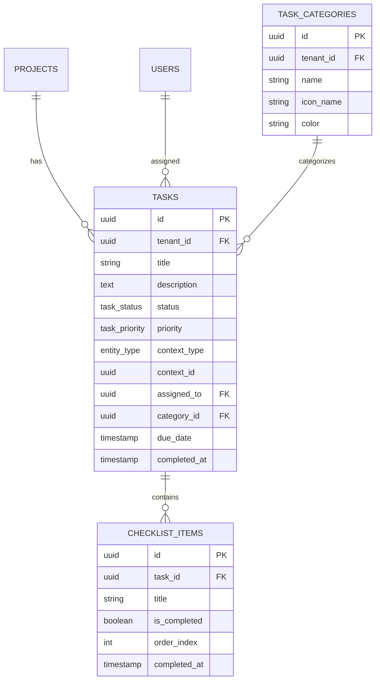
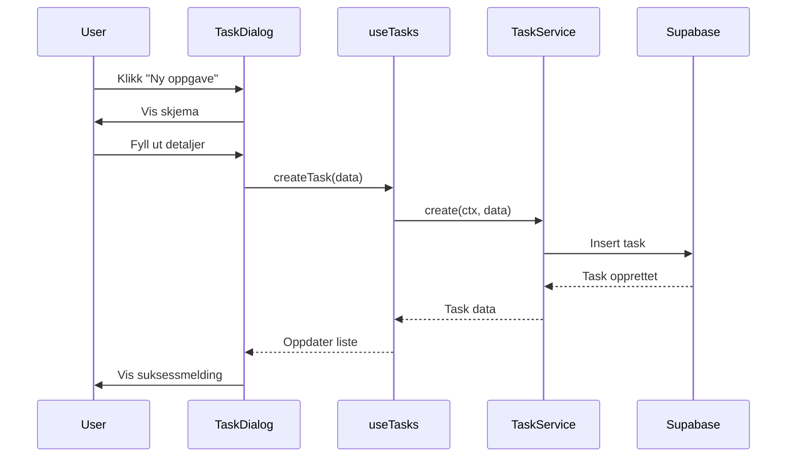

# Task Management

## 📝 Overview
Comprehensive task management system with support for assignees, priorities, categories, checklists, and context-aware task creation. Tasks can be linked to projects, companies, opportunities, or other entities.

## 🎯 Use Cases
- **Project Tasks**: Track work items within projects
- **Company Follow-ups**: Schedule and manage company interactions
- **Opportunity Actions**: Track sales activities
- **Checklist Management**: Break down tasks into sub-items
- **Team Collaboration**: Assign tasks to team members

## 🚀 Quick Start

### Create a Task
```typescript
import { useTasks } from "@/modules/core/tasks";

function TaskCreator() {
  const { createTask } = useTasks();
  
  const handleCreate = async () => {
    await createTask({
      title: "Follow up with client",
      description: "Discuss project requirements",
      context_type: "company",
      context_id: companyId,
      priority: "high",
      status: "todo",
      due_date: "2025-02-01"
    });
  };
  
  return <button onClick={handleCreate}>Create Task</button>;
}
```

## 📊 Data Model



### Database Tables

**`tasks`**
- Core task information (title, description, status, priority)
- Context linking (context_type, context_id)
- Assignment and scheduling (assigned_to, due_date, completed_at)
- Categorization (category_id)

**`task_categories`**
- Custom task categories per tenant
- Icon and color customization

**`checklist_items`**
- Sub-tasks within a task
- Track completion progress

### Key Relationships
- Tasks belong to a context (project, company, opportunity, etc.)
- Tasks can have multiple checklist items
- Tasks belong to a category
- Tasks are assigned to users

## 🔌 API Reference

### React Hooks

**`useTasks(filters?)`**
```typescript
const { tasks, isLoading, createTask, updateTask, deleteTask } = useTasks({
  context_type: "project",
  context_id: projectId,
  status: "todo"
});
```

**`useChecklistItems(taskId)`**
```typescript
const { items, addItem, toggleItem, deleteItem } = useChecklistItems(taskId);
```

### Services

**`TaskService.createTask(data)`**
- Creates a new task
- Automatically sets tenant_id and created_by
- Triggers task creation events

**`TaskService.updateTaskStatus(taskId, status)`**
- Updates task status
- Sets completed_at when status is "done"

**`TaskService.reassignTask(taskId, newAssigneeId)`**
- Reassigns task to another user
- Logs audit trail

## 🔧 Configuration

### Task Statuses
- `todo` - Not started
- `in_progress` - Work in progress
- `done` - Completed
- `blocked` - Blocked/waiting

### Task Priorities
- `low` - Low priority
- `medium` - Medium priority
- `high` - High priority
- `urgent` - Urgent

### Context Types
Tasks can be linked to any entity:
- `project`
- `company`
- `opportunity`
- `supplier_evaluation`
- `app_definition`

## 💡 Examples

### Task Creation Flow



### Example 1: Project Task List
```typescript
import { useTasks, TaskCard } from "@/modules/core/tasks";

function ProjectTasks({ projectId }: { projectId: string }) {
  const { tasks, updateTask } = useTasks({
    context_type: "project",
    context_id: projectId
  });
  
  return (
    <div className="space-y-2">
      {tasks?.map(task => (
        <TaskCard
          key={task.id}
          task={task}
          onUpdate={updateTask}
        />
      ))}
    </div>
  );
}
```

### Example 2: Context-Aware Task Button
```typescript
import { ContextTaskButton } from "@/modules/core/tasks";

function CompanyHeader({ company }: { company: Company }) {
  return (
    <div>
      <h1>{company.name}</h1>
      <ContextTaskButton
        contextType="company"
        contextId={company.id}
        defaultTitle={`Follow up with ${company.name}`}
      />
    </div>
  );
}
```

### Example 3: Task with Checklist
```typescript
import { useChecklistItems } from "@/modules/core/tasks";

function TaskDetail({ taskId }: { taskId: string }) {
  const { items, addItem, toggleItem } = useChecklistItems(taskId);
  
  return (
    <div>
      <h3>Checklist</h3>
      {items?.map(item => (
        <div key={item.id}>
          <input
            type="checkbox"
            checked={item.completed}
            onChange={() => toggleItem(item.id)}
          />
          {item.title}
        </div>
      ))}
      <button onClick={() => addItem({ title: "New item" })}>
        Add Item
      </button>
    </div>
  );
}
```

## 🔗 Dependencies

No required dependencies - this is a core capability.

Optional integrations:
- **User Management**: For task assignment
- **Projects**: For project-scoped tasks
- **Companies**: For company follow-ups

## 🏗️ Technical Implementation

### Frontend Files
- `src/modules/core/tasks/hooks/useTasks.ts`
- `src/modules/core/tasks/hooks/useChecklistItems.ts`
- `src/modules/core/tasks/components/TaskCard.tsx`
- `src/modules/core/tasks/components/TaskDialog.tsx`
- `src/modules/core/tasks/components/ContextTaskButton.tsx`
- `src/modules/core/tasks/components/ReassignTaskDialog.tsx`
- `src/modules/core/tasks/services/taskService.ts`

### Database Tables
- `tasks`
- `task_categories`
- `checklist_items`

## 🔐 Security Considerations
- RLS policies ensure users only see tasks in their tenant
- Task assignment respects user permissions
- Audit logs track all task changes
- Completed tasks are immutable (status can't be reverted without audit)

## 🐛 Troubleshooting

**Issue**: Tasks not showing up
**Solution**: Check that tenant_id is correctly set and RLS policies allow access

**Issue**: Can't assign tasks to users
**Solution**: Ensure the target user has appropriate role in the tenant

---
*Part of the Lovable Platform • Last updated: 2025-01-15*
