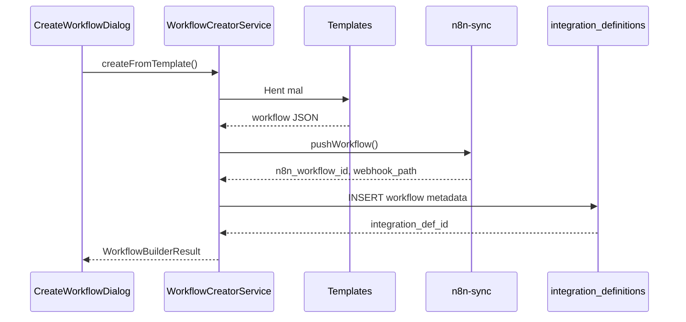

# Workflow Builder Capability

## Oversikt

Workflow Builder er en byggekloss-capability som lar andre capabilities opprette n8n workflows dynamisk fra plattformen. Den er designet som en gjenbrukbar tjeneste som f.eks. OCR, fakturaprosessering, eller andre capabilities kan kalle.

## Bruksområder

- **OCR**: Opprett workflow for å lagre OCR-resultater i Google Sheets eller ERP
- **Fakturaprosessering**: Opprett workflow for å sende fakturadata til regnskapssystem
- **Kvitteringsskanning**: Opprett workflow for utgiftsrapportering

## Relaterte Capabilities

| Capability | Relasjon | Beskrivelse |
|------------|----------|-------------|
| `document-ocr` | **Kaller denne** | OCR bruker workflow-builder for destinasjons-workflows |
| `workflow-compatibility` | Komplementerer | Verifiserer eksisterende workflows før visning |
| `content-library` | Parallell | Alternativ destinasjon for lagring |

## API

### WorkflowCreatorService

```typescript
import { WorkflowCreatorService } from '@/modules/core/capabilities';

// Opprett fra mal
const result = await WorkflowCreatorService.createFromTemplate(tenantId, {
  name: 'Min OCR Workflow',
  description: 'Lagrer OCR-data i regneark',
  templateId: 'ocr-to-sheets',
  context: {
    tenantId,
    sourceCapability: 'document-ocr',
  },
});

if (result.success) {
  console.log('Workflow opprettet:', result.webhookUrl);
}
```

### Tilgjengelige maler

| Template ID | Navn | Beskrivelse |
|-------------|------|-------------|
| `generic-webhook` | Generisk webhook | Aksepterer all JSON-input |
| `ocr-to-sheets` | OCR til Google Sheets | Lagrer OCR i regneark |
| `invoice-to-erp` | Faktura til ERP | Sender til ERP-system |
| `data-transformer` | Datatransformering | Fleksibel transformasjon |

## UI-komponent

```tsx
import { CreateWorkflowDialog } from '@/modules/core/capabilities';

function MyComponent() {
  const [showDialog, setShowDialog] = useState(false);

  return (
    <CreateWorkflowDialog
      open={showDialog}
      onOpenChange={setShowDialog}
      tenantId={tenantId}
      sourceCapability={{
        key: 'document-ocr',
        name: 'OCR',
        outputFormat: '{ extractedText, confidence, ... }',
      }}
      onWorkflowCreated={(result) => {
        console.log('Webhook URL:', result.webhookUrl);
      }}
    />
  );
}
```

## Arkitektur



## Database

Bruker eksisterende tabeller:

- `integration_definitions` - Lagrer workflow metadata med `type='workflow'`
- `capabilities` - Registrerer workflow-builder som capability

## Konfigurasjon

```json
{
  "defaultTemplate": "generic-webhook",
  "allowCustomWorkflows": true
}
```

## Versjon

- **1.0.0** (2024-12-12): Initial release

