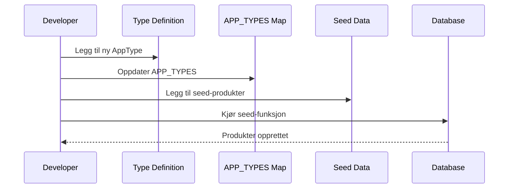
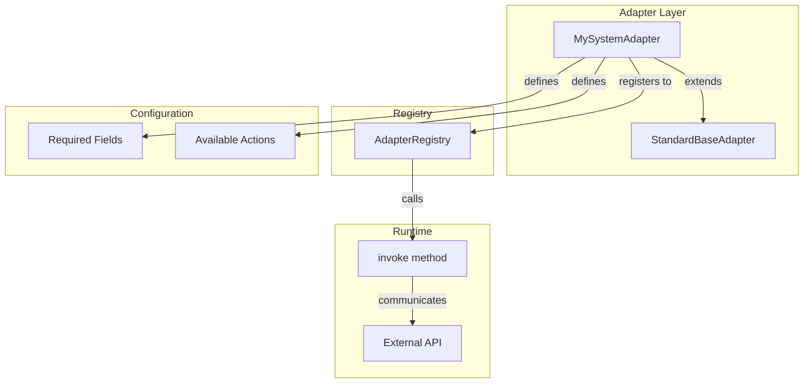

# Utviklerguide

## Oversikt: Utviklingsprosess

```mermaid
graph LR
    subgraph "1. Setup"
        CREATE[Opprett Modulstruktur]
        TYPES[Definer TypeScript Types]
    end
    
    subgraph "2. Backend"
        DB[Database Migrering]
        RLS[RLS Policies]
        SERVICE[Service Layer]
    end
    
    subgraph "3. Frontend"
        HOOKS[React Hooks]
        COMP[UI Komponenter]
    end
    
    subgraph "4. Integration"
        EXPORT[Export fra index.ts]
        REG[Registrer i moduleRegistry]
        TEST[Tester]
    end
    
    CREATE --> TYPES
    TYPES --> DB
    DB --> RLS
    RLS --> SERVICE
    SERVICE --> HOOKS
    HOOKS --> COMP
    COMP --> EXPORT
    EXPORT --> REG
    REG --> TEST
```



## Legge til ny modul

### 1. Opprett modulstruktur

```bash
mkdir -p src/modules/core/mymodule/{components,hooks,services,types}
touch src/modules/core/mymodule/{index.ts,README.md}
```

### 2. Definer typer

```typescript
// src/modules/core/mymodule/types/mymodule.types.ts
import { BaseEntity } from "@/core/types/common.types";

export interface MyEntity extends BaseEntity {
  name: string;
  tenant_id: string;
}
```

### 3. Lag service

```typescript
// src/modules/core/mymodule/services/myService.ts
import { supabase } from "@/integrations/supabase/client";
import type { RequestContext } from "@/shared/types";

export class MyService {
  static async create(ctx: RequestContext, data: MyEntityInput) {
    const { data: result, error } = await supabase
      .from("my_entities")
      .insert({ ...data, tenant_id: ctx.tenant_id })
      .select()
      .single();
    
    if (error) throw error;
    return result;
  }
}
```

### 4. Eksporter fra index

```typescript
// src/modules/core/mymodule/index.ts
export * from "./types/mymodule.types";
export { MyService } from "./services/myService";
```

## Legge til ny AppType



### 1. Utvid type definition

```typescript
// src/modules/core/applications/types/application.types.ts
export type AppType = 
  | "ERP" 
  | "CRM" 
  | "EmailSuite"
  | "MyNewType"; // Add here
```

### 2. Legg til i mapping

```typescript
export const APP_TYPES: Record<AppType, string> = {
  // ... existing
  MyNewType: "Min Nye Type",
};
```

### 3. Oppdater seed-data

```typescript
// src/modules/core/applications/services/seedApplications.ts
const SEED_PRODUCTS: SeedData[] = [
  // ... existing
  {
    vendor: { name: "Vendor", slug: "vendor" },
    product: {
      name: "Product Name",
      app_type: "MyNewType",
      // ... rest
    },
  },
];
```

## Legge til ny integrasjon



### 1. Lag adapter

```typescript
// src/modules/core/integrations/adapters/mysystem/MySystemAdapter.ts
import { StandardBaseAdapter } from "../base/StandardAdapter";

export class MySystemAdapter extends StandardBaseAdapter {
  id = "mysystem";
  name = "My System";
  
  getRequiredFields() {
    return [
      { key: "api_key", label: "API Key", type: "password" as const },
      { key: "base_url", label: "Base URL", type: "text" as const },
    ];
  }
  
  getActions() {
    return [
      { id: "search", name: "Search", description: "Search entities" },
      { id: "get", name: "Get", description: "Get by ID" },
    ];
  }
  
  async invoke(ctx, action, payload) {
    switch (action) {
      case "search":
        return this.search(payload.query);
      case "get":
        return this.getById(payload.id);
      default:
        throw new Error(`Unknown action: ${action}`);
    }
  }
  
  private async search(query: string) {
    // Implement API call
  }
}
```

### 2. Registrer adapter

```typescript
// src/modules/core/integrations/services/AdapterRegistry.ts
import { MySystemAdapter } from "../adapters/mysystem/MySystemAdapter";

AdapterRegistry.register(new MySystemAdapter());
```

## Best Practices

- Alltid pass `RequestContext` til services
- Bruk events for tverrgående logikk
- Følg eksisterende patterns
- Skriv TypeScript interfaces
- Test tenant-isolering
