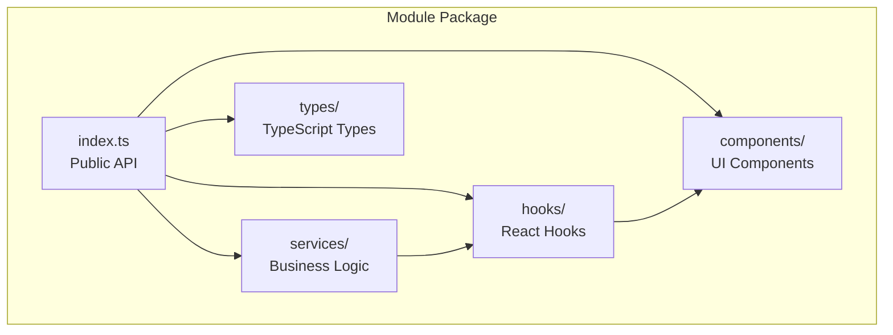
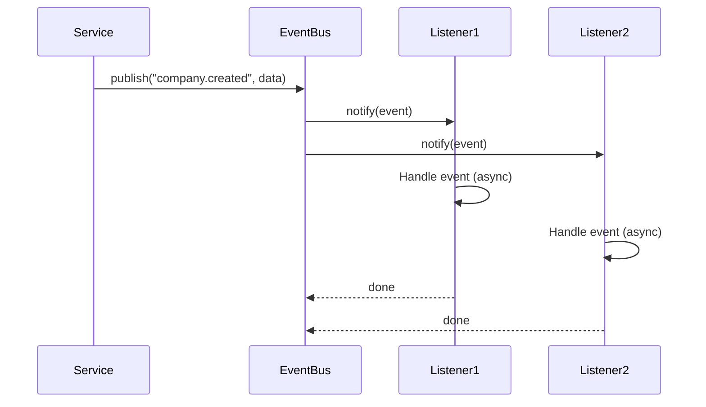

# Module System og Events

## Module Registry

Moduler registreres i `moduleRegistry` og lastes dynamisk basert på tenant-konfigurasjon.

### Module Structure



### Modul-registrering

**moduleRegistry.ts**:
```typescript
interface ModuleDefinition {
  id: string;
  name: string;
  version: string;
  dependencies: string[];
  init?: (ctx: RequestContext) => Promise<void>;
  routes?: RouteDefinition[];
  permissions?: Permission[];
}

class ModuleRegistry {
  private modules = new Map<string, ModuleDefinition>();
  
  register(module: ModuleDefinition) {
    this.modules.set(module.id, module);
  }
  
  get(id: string): ModuleDefinition | undefined {
    return this.modules.get(id);
  }
  
  isEnabled(ctx: RequestContext, moduleId: string): boolean {
    return ctx.tenant.enabled_modules.includes(moduleId);
  }
}
```

## Core Modules

### 1. User/Auth Module

```typescript
// modules/core/user/index.ts
export * from "./types/user.types";
export { UserService } from "./services/userService";
export { useAuth } from "./hooks/useAuth";
export { useUserRole } from "./hooks/useUserRole";
export { UserList } from "./components/UserList";
```

**Services**:
- `UserService.getCurrentUser(ctx)`
- `UserService.updateProfile(ctx, userId, data)`
- `UserService.inviteUser(ctx, email, roles)`

**Hooks**:
- `useAuth()` - Auth state og metoder
- `useCurrentUser()` - Innlogget bruker
- `useUserRole(role)` - Rolle-basert visibility

### 2. Company Module

```typescript
// modules/core/company/index.ts
export { CompanyService } from "./services/companyService";
export { useCompany } from "./hooks/useCompany";
export { useCompanySearch } from "./hooks/useCompanySearch";
export { CompanyCard } from "./components/CompanyCard";
```

**Services**:
- `CompanyService.searchBrreg(query)` - Søk i Brønnøysund
- `CompanyService.createCompany(ctx, data)`
- `CompanyService.findByOrgNumber(orgNumber)`

**Events**:
- `company.created` - Trigger AI-analyse
- `company.updated` - Oppdater cache

### 3. Project Module

```typescript
// modules/core/project/index.ts
export { ProjectService } from "./services/projectService";
export { useProject } from "./hooks/useProject";
export { useUserProjects } from "./hooks/useUserProjects";
export { ProjectCard } from "./components/ProjectCard";
```

**Services**:
- `ProjectService.createProject(ctx, title, description, companyId, ownerId)`
- `ProjectService.getUserProjects(ctx, userId)`
- `ProjectService.updatePhase(ctx, projectId, phase)`

**Events**:
- `project.created` - Auto-opprett tasks
- `project.phaseChanged` - Oppdater status
- `project.completed` - Arkiver data

### 4. Applications Module

```typescript
// modules/core/applications/index.ts
export { ApplicationService } from "./services/applicationService";
export { VendorService } from "./services/vendorService";
export { useApplications } from "./hooks/useApplications";
```

**Services**:
- `ApplicationService.listProducts(ctx, filters)`
- `ApplicationService.getProductBySlug(ctx, slug)`
- `ApplicationService.createSku(ctx, productId, skuData)`
- `VendorService.createVendor(ctx, data)`

**Entities**:
- `AppVendor` - Leverandør (company-backed)
- `AppProduct` - Produkt (ERP/CRM/EmailSuite)
- `SKU` - Variant/edition
- `CompanyApp` - Installasjon hos kunde
- `ProjectAppProduct` - Evaluering i prosjekt

### 5. Integrations Module

```typescript
// modules/core/integrations/index.ts
export { IntegrationService } from "./services/IntegrationService";
export { AdapterRegistry } from "./services/AdapterRegistry";
export { BrregAdapter } from "./adapters/brreg/BrregAdapter";
```

**Services**:
- `IntegrationService.invoke(ctx, adapterId, action, payload)`
- `AdapterRegistry.register(adapter)`
- `AdapterRegistry.get(adapterId)`

**Adapters**:
- `BrregAdapter` - Brønnøysund API
- `HubSpotAdapter` - HubSpot CRM (planlagt)
- `VismaAdapter` - Visma ERP (planlagt)

### 6. Tasks Module

```typescript
// modules/core/tasks/index.ts
export { TaskService } from "./services/taskService";
export { useTasks } from "./hooks/useTasks";
export { TaskCard } from "./components/TaskCard";
export { ContextTaskButton } from "./components/ContextTaskButton";
```

**Services**:
- `TaskService.createTask(ctx, data)`
- `TaskService.getUserTasks(ctx, userId, filters)`
- `TaskService.updateStatus(ctx, taskId, status)`

**Events**:
- `task.created` - Notifikasjon
- `task.completed` - Oppdater prosjekt-status
- `task.assigned` - Send varsel

### 7. Wizard Module

```typescript
// modules/wizard/index.ts
export { WizardService } from "./services/WizardService";
export { useProject, useCustomerCompanies, useExternalSystems } from "./hooks/useWizardData";
export { Step1Company, Step2Discovery, Step3Workshop } from "./components";
export { StepErrorBoundary, WizardStepIndicator } from "./components";
```

**Services**:
- `WizardService.loadFullProject(projectId)` - Laster prosjekt med alle relasjoner
- `WizardService.saveQuestionnaireAnswer(projectId, key, text, answer)`
- `WizardService.triggerMiroBoardCreation(projectId, ...)`

**Hooks**:
- `useProject(projectId)` - React Query for prosjektdata
- `useQuestionnaireMutation()` - Auto-save av svar
- `useCustomerCompanies(tenantId)` - Hent kundeselskaper

**Komponenter**:
- `WizardStepIndicator` - Progress-visning
- `StepErrorBoundary` - Feilhåndtering per steg
- `Step1Company` - `Step6Deploy`

Se [docs/modules/wizard.md](modules/wizard.md) for komplett dokumentasjon.

## Addon Modules

Valgfrie moduler som kan aktiveres per tenant.

### Supplier Module

```typescript
// modules/addons/supplier/index.ts
export { SupplierService } from "./services/supplierService";
export { useSupplierEvaluation } from "./hooks/useSupplierEvaluation";
export { SupplierCard } from "./components/SupplierCard";
```

**Avhengigheter**: `project`, `company`

**Features**:
- Supplier evaluation & scoring
- Questionnaires
- Document comparison
- AI-powered analysis

### Industry Module

```typescript
// modules/addons/industry/index.ts
export { IndustryService } from "./services/industryService";
export { useIndustries } from "./hooks/useIndustries";
export { IndustryManager } from "./components/IndustryManager";
```

**Features**:
- NACE code mapping
- Industry-specific templates
- Regulatory compliance per industry

## Event System

### Event Bus Architecture



### Event Contracts

**shared/events/contracts.ts**:
```typescript
// Company Events
export interface CompanyCreatedEvent {
  type: "company.created";
  data: {
    companyId: string;
    tenantId: string;
    userId: string;
    company: Company;
  };
  timestamp: string;
}

export interface CompanyUpdatedEvent {
  type: "company.updated";
  data: {
    companyId: string;
    changes: Partial<Company>;
    userId: string;
  };
  timestamp: string;
}

// Project Events
export interface ProjectCreatedEvent {
  type: "project.created";
  data: {
    projectId: string;
    tenantId: string;
    ownerId: string;
    companyId?: string;
  };
  timestamp: string;
}

export interface ProjectPhaseChangedEvent {
  type: "project.phaseChanged";
  data: {
    projectId: string;
    oldPhase: string;
    newPhase: string;
    userId: string;
  };
  timestamp: string;
}

// Task Events
export interface TaskCreatedEvent {
  type: "task.created";
  data: {
    taskId: string;
    projectId?: string;
    assignedTo?: string;
  };
  timestamp: string;
}

export interface TaskCompletedEvent {
  type: "task.completed";
  data: {
    taskId: string;
    completedBy: string;
    completedAt: string;
  };
  timestamp: string;
}
```

### Event Listeners

**shared/events/listeners/aiAnalysisListener.ts**:
```typescript
import { eventBus } from "../bus";
import { AIService } from "@/modules/core/ai";
import { TaskService } from "@/modules/core/tasks";

eventBus.on("company.created", async (event) => {
  const { companyId, tenantId } = event.data;
  
  // Auto-opprett AI analyse-task
  await TaskService.createTask({
    tenant_id: tenantId,
    title: `AI-analyse av selskap`,
    description: "Automatisk generert analyse-oppgave",
    entity_type: "company",
    entity_id: companyId,
    category: "analysis",
    priority: "medium",
  });
});
```

**shared/events/listeners/taskAutoCreateListener.ts**:
```typescript
import { eventBus } from "../bus";
import { TaskService } from "@/modules/core/tasks";

eventBus.on("project.created", async (event) => {
  const { projectId, tenantId, ownerId } = event.data;
  
  // Auto-opprett initielle tasks
  const initialTasks = [
    {
      title: "Definer prosjektmandat",
      description: "Klargjør scope, mål og suksesskriterier",
      priority: "high",
    },
    {
      title: "Identifiser interessenter",
      description: "Kartlegg alle relevante parter",
      priority: "high",
    },
    {
      title: "Lag kravspesifikasjon",
      description: "Dokumenter funksjonelle og ikke-funksjonelle krav",
      priority: "medium",
    },
  ];
  
  for (const task of initialTasks) {
    await TaskService.createTask({
      tenant_id: tenantId,
      ...task,
      entity_type: "project",
      entity_id: projectId,
      assigned_to: ownerId,
    });
  }
});
```

**shared/events/listeners/projectStatusListener.ts**:
```typescript
import { eventBus } from "../bus";
import { ProjectService } from "@/modules/core/project";
import { TaskService } from "@/modules/core/tasks";

eventBus.on("task.completed", async (event) => {
  const { taskId } = event.data;
  
  // Sjekk om alle tasks i prosjektet er fullført
  const task = await TaskService.getById(taskId);
  if (task.entity_type === "project") {
    const allTasks = await TaskService.getByEntity("project", task.entity_id);
    const allCompleted = allTasks.every(t => t.status === "completed");
    
    if (allCompleted) {
      eventBus.publish("project.allTasksCompleted", {
        projectId: task.entity_id,
      });
    }
  }
});
```

### Event Bus Implementation

**shared/events/bus.ts**:
```typescript
type EventHandler = (event: any) => Promise<void> | void;

class EventBus {
  private handlers = new Map<string, Set<EventHandler>>();
  
  on(eventType: string, handler: EventHandler) {
    if (!this.handlers.has(eventType)) {
      this.handlers.set(eventType, new Set());
    }
    this.handlers.get(eventType)!.add(handler);
  }
  
  off(eventType: string, handler: EventHandler) {
    const handlers = this.handlers.get(eventType);
    if (handlers) {
      handlers.delete(handler);
    }
  }
  
  async publish(eventType: string, data: any) {
    const handlers = this.handlers.get(eventType);
    if (!handlers) return;
    
    const event = {
      type: eventType,
      data,
      timestamp: new Date().toISOString(),
    };
    
    // Execute all handlers in parallel
    await Promise.allSettled(
      Array.from(handlers).map(handler => handler(event))
    );
  }
}

export const eventBus = new EventBus();
```

### Registrering av listeners

**shared/events/listeners/index.ts**:
```typescript
// Import all listeners to register them
import "./aiAnalysisListener";
import "./taskAutoCreateListener";
import "./projectStatusListener";
```

**main.tsx**:
```typescript
import "@/shared/events/listeners"; // Register event listeners
```

## Best Practices

### 1. Modul-dependencies

```typescript
// ❌ FEIL - circular dependency
// modules/core/company/services/companyService.ts
import { ProjectService } from "@/modules/core/project";

// ✅ RIKTIG - bruk events
import { eventBus } from "@/shared/events/bus";

eventBus.publish("company.created", { companyId });
```

### 2. Service layer

```typescript
// ❌ FEIL - business logic i component
const MyComponent = () => {
  const saveCompany = async () => {
    await supabase.from("companies").insert({ ... });
    await supabase.from("tasks").insert({ ... });
  };
};

// ✅ RIKTIG - via service
const MyComponent = () => {
  const saveCompany = async () => {
    await CompanyService.createCompany(ctx, data);
    // Events håndterer task-opprettelse
  };
};
```

### 3. Context passing

```typescript
// ❌ FEIL - bygger context i service
class CompanyService {
  static async create(data: CompanyInput) {
    const ctx = await buildClientContext(); // ❌
    // ...
  }
}

// ✅ RIKTIG - ctx kommer fra caller
class CompanyService {
  static async create(ctx: RequestContext, data: CompanyInput) {
    // ...
  }
}
```

### 4. Type safety

```typescript
// ✅ Definer event types
interface CompanyCreatedEvent {
  type: "company.created";
  data: { companyId: string; tenantId: string };
}

// ✅ Type-safe publishing
eventBus.publish<CompanyCreatedEvent>("company.created", {
  companyId,
  tenantId,
});

// ✅ Type-safe listening
eventBus.on<CompanyCreatedEvent>("company.created", (event) => {
  // event.data er typet
});
```
