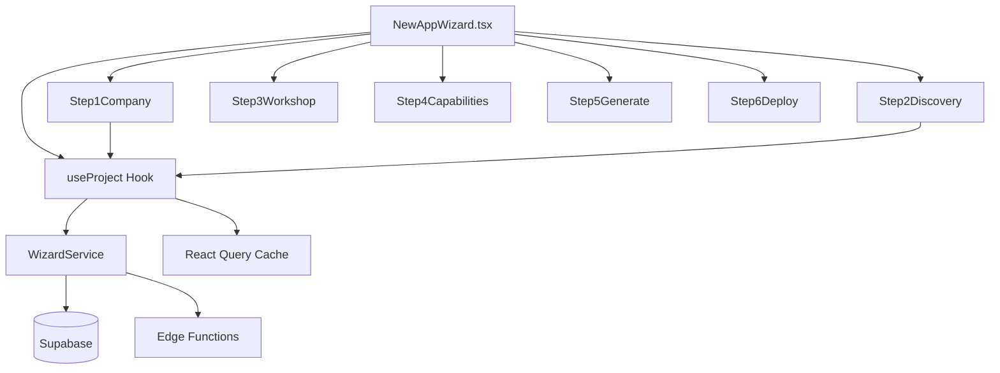
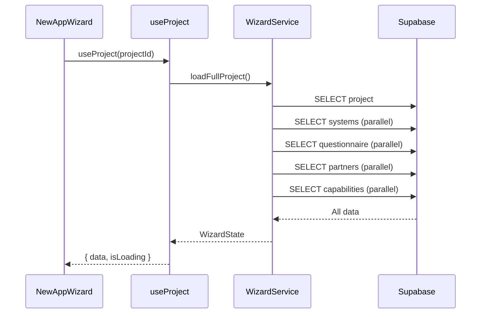
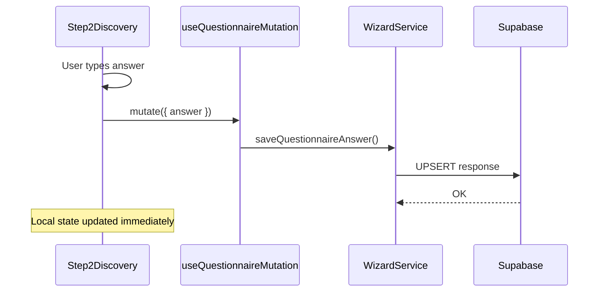

# App Creation Wizard Module

## Oversikt

App Creation Wizard er en multi-stegs prosess for å opprette nye kundeapplikasjoner. Wizarden guider brukeren gjennom 6 steg fra selskapsvalg til deployment.

## Arkitektur



## Mappestruktur

```
src/modules/wizard/
├── __tests__/
│   ├── components/
│   │   ├── StepErrorBoundary.test.tsx
│   │   └── WizardStepIndicator.test.tsx
│   ├── hooks/
│   │   └── useWizardData.test.tsx
│   └── services/
│       └── WizardService.test.ts
├── components/
│   ├── ProjectDocumentUpload.tsx
│   ├── Step1Company.tsx
│   ├── Step2Discovery.tsx
│   ├── Step3Workshop.tsx
│   ├── Step4Capabilities.tsx
│   ├── Step5Generate.tsx
│   ├── Step6Deploy.tsx
│   ├── StepErrorBoundary.tsx
│   └── WizardStepIndicator.tsx
├── hooks/
│   └── useWizardData.ts
├── services/
│   └── WizardService.ts
├── types/
│   └── wizard.types.ts
└── index.ts
```

## Dataflyt

### Lasting av prosjekt



### Lagring av svar



## Steg

### Steg 1: Selskap

- Velg kunde/prospect selskap
- Velg eksisterende systemer
- Velg implementeringspartnere
- Last opp prosjektdokumenter
- Skriv prosjektbeskrivelse
- AI-generering av beskrivelse

### Steg 2: Discovery

- AI-genererte spørsmål basert på kontekst
- Foreslåtte svar fra RAG
- "Forbedre med AI" per spørsmål
- Auto-save av svar

### Steg 3: Workshop

- Generer Miro-board med AI-elementer
- Integrasjon med n8n workflow
- Elementer: Prosesskart, smertepunkter, løsninger, brukerhistorier, MoSCoW

### Steg 4: Capabilities

- Velg capabilities for appen
- Basert på workshop-resultater
- Capability-bundles tilgjengelig

### Steg 5: Generate

- Generer app-konfigurasjon
- Velg integrasjoner
- Konfigurer brukertilganger

### Steg 6: Deploy

- Preview app
- Deploy til produksjon
- Administrer DNS

## Viktige typer

```typescript
interface WizardState {
  step: number;
  highestStepReached: number;
  projectId: string | null;
  projectName: string;
  projectDescription: string;
  companyId: string | null;
  systems: Array<{ id: string; name: string; type: string }>;
  partners: Array<{ id: string; name: string }>;
  questionnaire: Record<string, string>;
  questions: Array<{ key: string; question: string; category: string }>;
  workshopStatus: WorkshopStatus;
  miroUrl: string | null;
  notionUrl: string | null;
  generatedConfig: GeneratedConfig | null;
  selectedCapabilities: SelectedCapability[];
}

interface BaseStepProps {
  state: WizardState;
  onStateChange: (updates: Partial<WizardState>) => void;
  tenantId: string;
}
```

## Hooks

### useProject

```typescript
const { data: project, isLoading, error } = useProject(projectId);
```

Laster fullt prosjekt med alle relaterte data.

### useQuestionnaireMutation

```typescript
const { mutate: saveAnswer } = useQuestionnaireMutation();

saveAnswer({
  projectId,
  questionKey: 'q1',
  questionText: 'What is your goal?',
  answer: 'To improve efficiency',
});
```

### useCustomerCompanies

```typescript
const { data: companies } = useCustomerCompanies(tenantId);
```

## Edge Functions

| Function | Beskrivelse |
|----------|-------------|
| `generate-project-description` | AI-genererer prosjektbeskrivelse |
| `generate-discovery-questions` | AI-genererer discovery-spørsmål |
| `improve-discovery-answer` | Forbedrer svar med AI |
| `generate-workshop-elements` | Genererer Miro-elementer |
| `trigger-n8n-workflow` | Starter n8n workflows |

## Testing

Kjør wizard-tester:

```bash
npm run test -- src/modules/wizard
```

### Testdekning

- **WizardService**: 15 tester
- **StepErrorBoundary**: 6 tester
- **WizardStepIndicator**: 10 tester
- **useWizardData hooks**: 7 tester

## Feilhåndtering

Hvert steg er pakket i `StepErrorBoundary` som fanger feil og viser en bruker-vennlig melding:

```tsx
<StepErrorBoundary stepName="Discovery">
  <Step2Discovery {...props} />
</StepErrorBoundary>
```

## Best Practices

1. **Single Source of Truth**: All data lastes via `useProject` og distribueres ned
2. **Props Pattern**: Alle steg bruker `BaseStepProps` for konsistens
3. **Auto-save**: Bruk `useQuestionnaireMutation` for umiddelbar lagring
4. **Error Boundaries**: Alltid wrap steg i error boundaries
5. **Optimistic Updates**: Oppdater lokal state før server-respons


