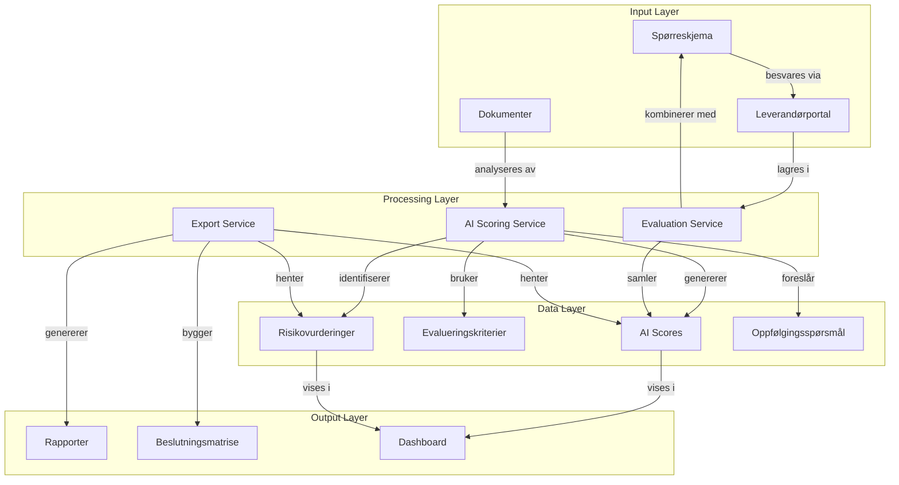
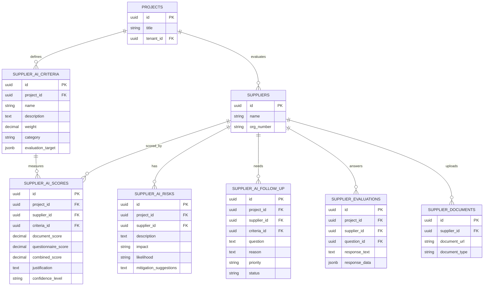
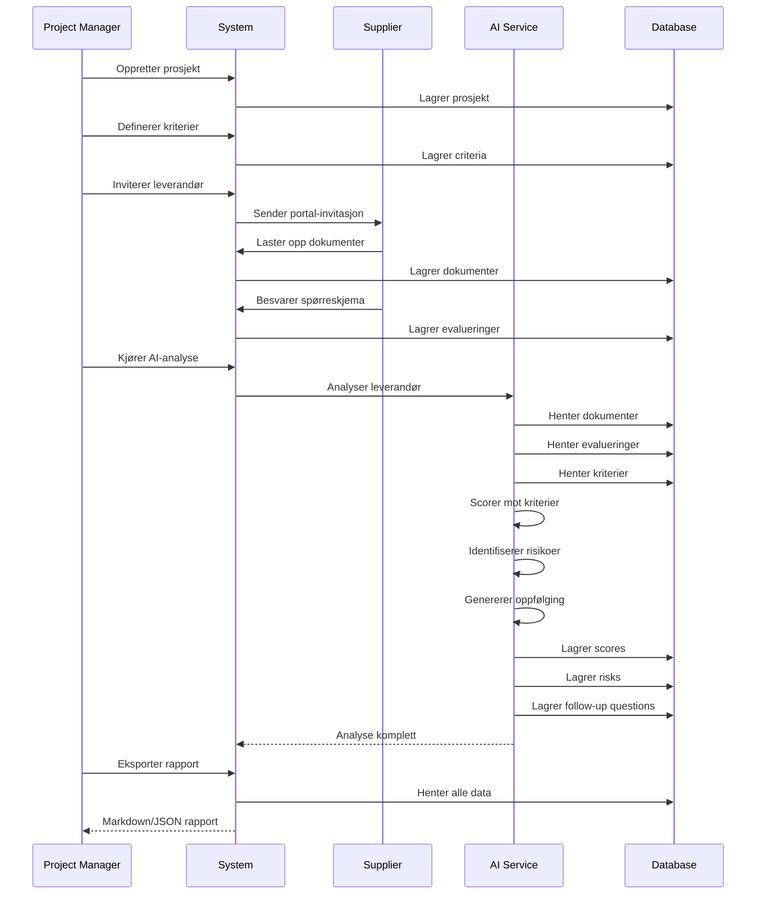

# Supplier Evaluation Module

## 📝 Oversikt

Supplier-modulen håndterer evaluering og scoring av leverandører i forbindelse med prosjekter. Modulen støtter både manuell vurdering via spørreskjema og AI-basert analyse av dokumenter og svar.

## 🏗️ Arkitektur



## 📊 Data Model



## 🔄 Evaluerings-flyt



## 🎯 Bruksscenarier

### Scenario 1: ERP-valg
```typescript
// Definere kriterier for ERP-evaluering
const criteria: AICriteria[] = [
  {
    name: "Funksjonalitet",
    description: "Dekker løsningen alle nødvendige ERP-funksjoner?",
    weight: 0.35,
    category: "functional",
    evaluation_target: {
      app_type: "ERP"
    }
  },
  {
    name: "Integrasjoner",
    description: "Hvor godt integrerer systemet med eksisterende verktøy?",
    weight: 0.25,
    category: "technical"
  },
  {
    name: "Brukervennlighet",
    description: "Er systemet intuitivt og lett å bruke?",
    weight: 0.20,
    category: "ux"
  },
  {
    name: "Support og vedlikehold",
    description: "Kvalitet på leverandørens support",
    weight: 0.20,
    category: "service"
  }
];
```

### Scenario 2: Leverandørportal
```typescript
import { useCreatePortalInvitation } from "@/modules/core/supplier";

function InviteSupplier({ projectId, supplierId }: Props) {
  const { mutate: createInvitation } = useCreatePortalInvitation();
  
  const handleInvite = () => {
    createInvitation({
      projectId,
      supplierId,
      email: "supplier@example.com"
    });
  };
  
  return <Button onClick={handleInvite}>Send invitasjon</Button>;
}
```

### Scenario 3: AI-analyse
```typescript
import { AIScoringService } from "@/modules/core/supplier";

async function analyzeSupplier(ctx: RequestContext, projectId: string, supplierId: string) {
  // Kjør AI-analyse
  await AIScoringService.analyzeSupplier(ctx, projectId, supplierId);
  
  // Hent resultater
  const scores = await AIScoringService.getSupplierScores(ctx, projectId, supplierId);
  const risks = await AIScoringService.getRisks(ctx, projectId, supplierId);
  const followUp = await AIScoringService.getFollowUpQuestions(ctx, projectId, supplierId);
  
  return { scores, risks, followUp };
}
```

### Scenario 4: Eksporter rapport
```typescript
import { EvaluationExportService } from "@/modules/core/supplier";

async function exportReport(ctx: RequestContext, projectId: string, supplierId: string) {
  // Eksporter som Markdown
  const markdown = await EvaluationExportService.exportAsMarkdown(
    ctx, 
    projectId, 
    supplierId
  );
  
  // Eller eksporter som JSON
  const json = await EvaluationExportService.exportAsJSON(
    ctx, 
    projectId, 
    supplierId
  );
  
  return { markdown, json };
}
```

## 🔌 API Reference

### Services

**AIScoringService**
- `analyzeSupplier(ctx, projectId, supplierId)` - Kjør AI-analyse
- `getSupplierScores(ctx, projectId, supplierId)` - Hent AI-scorer
- `getCriteria(ctx, projectId)` - Hent evalueringskriterier
- `getRisks(ctx, projectId, supplierId)` - Hent identifiserte risikoer
- `getFollowUpQuestions(ctx, projectId, supplierId)` - Hent oppfølgingsspørsmål

**EvaluationService**
- `getEvaluationsBySupplier(ctx, projectId, supplierId)` - Hent spørreskjemasvar
- `saveEvaluation(ctx, evaluation)` - Lagre evaluering
- `getEvaluationSummary(ctx, projectId, supplierId)` - Oppsummering per leverandør
- `createPortalInvitation(ctx, projectId, supplierId, email)` - Opprett invitasjon

**EvaluationExportService**
- `generateReport(ctx, projectId, supplierId)` - Generer rapport-data
- `exportAsJSON(ctx, projectId, supplierId)` - Eksporter som JSON
- `exportAsMarkdown(ctx, projectId, supplierId)` - Eksporter som Markdown

### React Hooks

```typescript
// Hent evalueringer
const { data: evaluations } = useSupplierEvaluations(projectId, supplierId);

// Hent sammendrag
const { data: summary } = useEvaluationSummary(projectId, supplierId);

// Lagre evaluering
const { mutate: saveEvaluation } = useSaveEvaluation();

// Opprett invitasjon
const { mutate: createInvitation } = useCreatePortalInvitation();
```

## 🔐 Sikkerhet

### RLS Policies

Alle tabeller har Row Level Security:

```sql
-- Eksempel: supplier_ai_scores
CREATE POLICY "Users can view scores for their tenant projects"
ON supplier_ai_scores FOR SELECT
USING (
  EXISTS (
    SELECT 1 FROM projects
    WHERE projects.id = supplier_ai_scores.project_id
    AND projects.tenant_id = auth.uid_tenant_id()
  )
);
```

### Portal-tilgang

Leverandører får midlertidig tilgang via token:
- Token utløper etter 30 dager
- Kun tilgang til egne data
- Må godkjennes av prosjekteier

## 📈 Best Practices

1. **Definer klare kriterier** - Spesifiser vekt og kategori for hvert kriterium
2. **Kombiner automatikk og manuell vurdering** - Bruk AI som støtte, ikke erstatning
3. **Dokumenter beslutninger** - Eksporter rapporter for revisjonsspor
4. **Følg opp identifiserte risikoer** - Lag oppgaver basert på AI-funn
5. **Sett evaluation_target** - Knytt kriterier til spesifikke produkter/SKU når relevant

## 🧪 Testing

Testeksempler:
```typescript
describe("Supplier Evaluation", () => {
  it("should analyze supplier and generate scores", async () => {
    const result = await AIScoringService.analyzeSupplier(ctx, projectId, supplierId);
    expect(result.scores).toHaveLength(criteriaCount);
    expect(result.risks).toBeDefined();
  });
  
  it("should export report as markdown", async () => {
    const markdown = await EvaluationExportService.exportAsMarkdown(ctx, projectId, supplierId);
    expect(markdown).toContain("# Leverandørevaluering");
    expect(markdown).toContain("## Kriterier");
  });
});
```

## 📝 Migreringer

Relevante migreringsfiler:
- `*_create_supplier_tables.sql`
- `*_create_supplier_ai_tables.sql`
- `*_create_supplier_evaluation_tables.sql`
- `*_supplier_rls_policies.sql`

---
*Del av Lovable Platform • Sist oppdatert: 2025-01-13*
