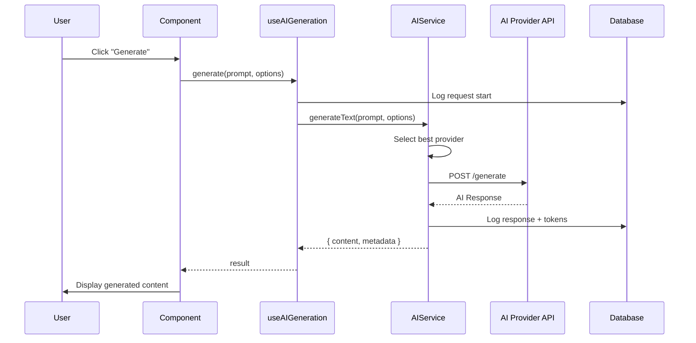
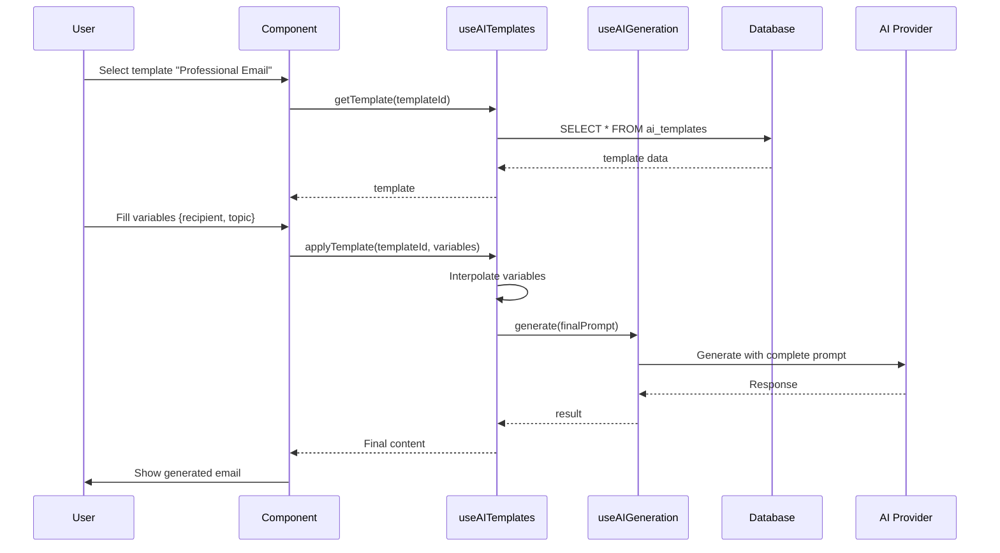
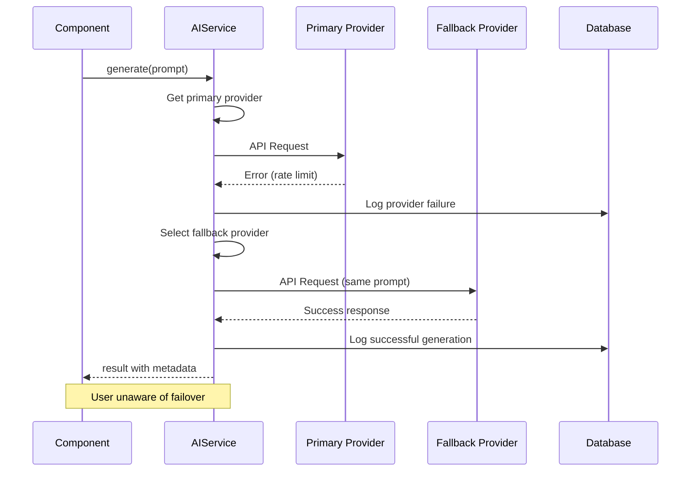

# AI Text Generation

## 📝 Overview
AI Text Generation capability enables intelligent content creation, analysis, and transformation using multiple AI providers. The system supports dynamic provider selection, context-aware generation, and structured output parsing.

## 🎯 Use Cases
- **Content Generation**: Create marketing copy, documentation, emails, and proposals
- **Data Analysis**: Extract insights, summarize documents, and analyze sentiment
- **Translation & Localization**: Translate content while preserving context and formatting
- **Code Generation**: Generate code snippets, SQL queries, and technical documentation

## 🚀 Quick Start

### Installation
This capability is part of the core platform and available by default.

### Basic Usage
```typescript
import { useAIGeneration } from "@/modules/core/ai/hooks/useAIGeneration";

function MyComponent() {
  const { generate, isLoading } = useAIGeneration();
  
  const handleGenerate = async () => {
    const result = await generate({
      prompt: "Write a professional email...",
      context: { recipient: "John", topic: "Project Update" }
    });
    console.log(result.content);
  };
  
  return <button onClick={handleGenerate}>Generate</button>;
}
```

## 📊 Data Model

### Database Tables

**`ai_providers`**
- Stores AI provider configurations (OpenAI, Anthropic, Google, etc.)
- Fields: `id`, `name`, `provider_type`, `api_endpoint`, `capabilities`, `is_active`

**`ai_requests`**
- Logs all AI generation requests for auditing and analytics
- Fields: `id`, `tenant_id`, `user_id`, `provider_id`, `prompt`, `response`, `tokens_used`, `created_at`

**`ai_templates`**
- Pre-configured prompts and generation templates
- Fields: `id`, `name`, `template`, `variables`, `category`, `is_public`

### Key Relationships
- `ai_requests` → `tenants` (tenant_id)
- `ai_requests` → `profiles` (user_id)
- `ai_requests` → `ai_providers` (provider_id)
- `ai_templates` → `tenants` (tenant_id)

## 🔌 API Reference

### React Hooks

**`useAIGeneration()`**
- **Purpose**: Main hook for generating AI content
- **Returns**: `{ generate, isLoading, error, result }`
- **Example**:
```typescript
const { generate } = useAIGeneration();
const result = await generate({
  prompt: "Analyze this text...",
  maxTokens: 500,
  temperature: 0.7
});
```

**`useAITemplates()`**
- **Purpose**: Manage and use AI generation templates
- **Returns**: `{ templates, applyTemplate, saveTemplate }`
- **Example**:
```typescript
const { templates, applyTemplate } = useAITemplates();
const emailTemplate = templates.find(t => t.category === 'email');
const result = await applyTemplate(emailTemplate.id, { recipient: "John" });
```

**`useAIProviders()`**
- **Purpose**: Manage AI provider selection and configuration
- **Returns**: `{ providers, selectProvider, testProvider }`
- **Example**:
```typescript
const { providers, selectProvider } = useAIProviders();
await selectProvider('openai-gpt4');
```

### Services

**`AIService.generate()`**
- **Parameters**: `{ prompt: string, options?: GenerationOptions }`
- **Returns**: `Promise<AIResponse>`
- **Example**:
```typescript
const response = await AIService.generate({
  prompt: "Summarize this document",
  maxTokens: 200,
  temperature: 0.5
});
```

**`AIService.analyzeText()`**
- **Parameters**: `{ text: string, analysisType: string }`
- **Returns**: `Promise<AnalysisResult>`
- **Example**:
```typescript
const analysis = await AIService.analyzeText({
  text: "Customer feedback...",
  analysisType: "sentiment"
});
```

## 🔄 Sequence Diagrams

### 1. Basic Text Generation Flow



### 2. Template-Based Generation



### 3. Provider Fallback Strategy



## 🔧 Configuration

### Environment Variables
```bash
# AI Provider API Keys (via Secrets Management)
OPENAI_API_KEY=sk-...
ANTHROPIC_API_KEY=sk-ant-...
GOOGLE_AI_API_KEY=...

# Default Settings
VITE_AI_DEFAULT_PROVIDER=openai
VITE_AI_MAX_TOKENS=2000
VITE_AI_TEMPERATURE=0.7
```

### Required Secrets
- `OPENAI_API_KEY` - For OpenAI GPT models
- `ANTHROPIC_API_KEY` - For Claude models
- `GOOGLE_AI_API_KEY` - For Gemini models

### RLS Policies
```sql
-- Users can only read their own AI requests
CREATE POLICY "Users view own ai_requests"
  ON ai_requests FOR SELECT
  USING (auth.uid() = user_id);

-- Public templates visible to all
CREATE POLICY "Public templates readable"
  ON ai_templates FOR SELECT
  USING (is_public = true OR tenant_id = current_tenant_id());
```

## 💡 Examples

### Example 1: Content Summarization
```typescript
const { generate } = useAIGeneration();

const summarize = async (longText: string) => {
  const result = await generate({
    prompt: `Summarize the following text in 3 bullet points:\n\n${longText}`,
    maxTokens: 150,
    temperature: 0.3 // Lower for more focused output
  });
  
  return result.content;
};
```

### Example 2: Structured Data Extraction
```typescript
const { generate } = useAIGeneration();

const extractCompanyInfo = async (description: string) => {
  const result = await generate({
    prompt: `Extract company information from: ${description}
    
    Return JSON with: name, industry, size, location`,
    responseFormat: 'json',
    temperature: 0.2
  });
  
  return JSON.parse(result.content);
};
```

### Example 3: Multi-Language Translation
```typescript
const { generate } = useAIGeneration();

const translate = async (text: string, targetLang: string) => {
  const result = await generate({
    prompt: `Translate to ${targetLang}, preserve formatting:\n\n${text}`,
    temperature: 0.3
  });
  
  return result.content;
};
```

## 🔗 Dependencies

This capability requires:
- **Lovable Cloud**: For AI provider API access
- **Authentication**: User context for request logging
- **Tenant Management**: Multi-tenant isolation

## 🏗️ Technical Implementation

### Frontend Files
- `src/modules/core/ai/hooks/useAIGeneration.tsx` - Main generation hook
- `src/modules/core/ai/hooks/useAITemplates.tsx` - Template management
- `src/modules/core/ai/hooks/useAIProviders.tsx` - Provider selection
- `src/modules/core/ai/components/AITextarea.tsx` - AI-powered input
- `src/modules/core/ai/components/AITemplateSelector.tsx` - Template picker

### Backend Files
- `supabase/functions/ai-generate/index.ts` - Main generation endpoint
- `supabase/functions/ai-analyze/index.ts` - Text analysis endpoint
- `src/modules/core/ai/services/AIService.ts` - Client-side service

### Database Migrations
- `20240115_create_ai_providers.sql` - Provider configuration
- `20240115_create_ai_requests.sql` - Request logging
- `20240116_create_ai_templates.sql` - Template storage

## 🔐 Security Considerations

1. **API Key Protection**: All provider API keys stored in Lovable Cloud Secrets
2. **Request Logging**: All AI requests logged with user_id and tenant_id
3. **Rate Limiting**: Per-user and per-tenant rate limits enforced
4. **Content Filtering**: Automatic detection of sensitive/inappropriate content
5. **Data Privacy**: AI requests never sent to third parties without consent

## 🐛 Troubleshooting

### Common Issues

**Issue**: "AI provider unavailable"
**Solution**: Check provider status in AI Provider Settings. System automatically falls back to secondary provider.

**Issue**: "Token limit exceeded"
**Solution**: Reduce maxTokens parameter or split prompt into smaller chunks.

**Issue**: "Rate limit reached"
**Solution**: Wait for rate limit reset or upgrade plan. Check usage in analytics dashboard.

**Issue**: "Invalid response format"
**Solution**: Verify responseFormat parameter matches expected output. Use temperature < 0.5 for structured data.

---
*Part of the Lovable Platform • Last updated: 2025-01-23*
