# Company Management

## 📝 Overview
Company Management capability provides comprehensive organization and relationship management. It handles company registration, verification, classification, and relationship tracking with support for customers, suppliers, partners, and competitors.

## 🎯 Use Cases
- **Customer Management**: Track customer relationships, contracts, and interactions
- **Supplier Database**: Maintain supplier information, evaluations, and performance
- **Partner Network**: Manage implementation partners and resellers
- **Competitor Analysis**: Track competitor information and market positioning
- **Company Verification**: Validate companies against external registries (Brønnøysund)

## 🚀 Quick Start

### Installation
This capability is part of the core platform and available by default.

### Basic Usage
```typescript
import { useCompanies } from "@/modules/core/company/hooks/useCompanies";
import { useCreateCompany } from "@/modules/core/company/hooks/useCreateCompany";

function CompanyList() {
  const { data: companies, isLoading } = useCompanies({ 
    company_type: 'customer' 
  });
  const createCompany = useCreateCompany();
  
  const handleCreate = async () => {
    await createCompany.mutateAsync({
      name: "Acme Corp",
      org_number: "123456789",
      company_type: "customer"
    });
  };
  
  return (
    <div>
      {companies?.map(company => (
        <CompanyCard key={company.id} company={company} />
      ))}
    </div>
  );
}
```

## 📊 Data Model

### Database Tables

**`companies`**
- Core company information
- Fields: `id`, `name`, `org_number`, `company_type`, `industry_id`, `size`, `country`, `website`, `verified`, `brreg_data`, `tenant_id`
- company_type: `customer`, `supplier`, `partner`, `competitor`, `internal`

**`company_contacts`**
- Contact persons within companies
- Fields: `id`, `company_id`, `name`, `email`, `phone`, `role`, `is_primary`

**`company_relationships`**
- Relationships between companies
- Fields: `id`, `company_id`, `related_company_id`, `relationship_type`, `notes`
- relationship_type: `parent`, `subsidiary`, `partner`, `competitor`

**`company_documents`**
- Documents associated with companies
- Fields: `id`, `company_id`, `document_id`, `category`

### Key Relationships
- `companies` → `tenants` (tenant_id)
- `companies` → `industries` (industry_id)
- `company_contacts` → `companies` (company_id)
- `company_relationships` → `companies` (company_id, related_company_id)
- `company_documents` → `companies` (company_id)
- `company_documents` → `documents` (document_id)

## 🔌 API Reference

### React Hooks

**`useCompanies(filters?)`**
- **Purpose**: Fetch and filter companies
- **Returns**: `{ data: Company[], isLoading, error }`
- **Example**:
```typescript
const { data: customers } = useCompanies({ 
  company_type: 'customer',
  country: 'NO'
});
```

**`useCompany(companyId)`**
- **Purpose**: Fetch single company with full details
- **Returns**: `{ data: Company, isLoading }`
- **Example**:
```typescript
const { data: company } = useCompany(companyId);
```

**`useCreateCompany()`**
- **Purpose**: Create new company
- **Returns**: `{ mutate, isLoading }`
- **Example**:
```typescript
const createCompany = useCreateCompany();
await createCompany.mutateAsync({
  name: "Tech Solutions AS",
  org_number: "987654321",
  company_type: "supplier"
});
```

**`useUpdateCompany()`**
- **Purpose**: Update company information
- **Returns**: `{ mutate, isLoading }`
- **Example**:
```typescript
const updateCompany = useUpdateCompany();
await updateCompany.mutateAsync({
  id: companyId,
  verified: true,
  brreg_data: { ...verificationData }
});
```

**`useVerifyCompany()`**
- **Purpose**: Verify company against Brønnøysund registry
- **Returns**: `{ verify, isLoading, data }`
- **Example**:
```typescript
const { verify } = useVerifyCompany();
const result = await verify(orgNumber);
```

### Services

**`CompanyService.searchBrreg()`**
- **Parameters**: `{ orgNumber: string }`
- **Returns**: `Promise<BrregData>`
- **Example**:
```typescript
const brregData = await CompanyService.searchBrreg("987654321");
```

**`CompanyService.enrichCompanyData()`**
- **Parameters**: `{ companyId: string }`
- **Returns**: `Promise<Company>`
- Fetches additional data from external sources

## 🔄 Sequence Diagrams

### 1. Company Registration with Verification

```mermaid
sequenceDiagram
    participant U as User
    participant C as Component
    participant H as useCreateCompany
    participant V as useVerifyCompany
    participant B as Brønnøysund API
    participant DB as Database

    U->>C: Enter org number
    C->>V: verify(orgNumber)
    V->>B: GET /enhetsregisteret/{orgNumber}
    B-->>V: Company data
    V-->>C: Verified data
    C->>U: Pre-fill form with data
    U->>C: Confirm and submit
    C->>H: mutate(companyData)
    H->>DB: INSERT INTO companies
    H->>DB: Set verified = true
    H->>DB: Store brreg_data
    DB-->>H: company created
    H-->>C: Success
    C->>U: Show company details
```



### 2. Company Search and Selection

```mermaid
sequenceDiagram
    participant U as User
    participant C as CompanySearch
    participant H as useCompanies
    participant DB as Database
    participant S as useCompanySearch

    U->>C: Enter search term
    C->>S: searchCompanies(query)
    
    par Local Search
        S->>H: Query local companies
        H->>DB: SELECT * WHERE name ILIKE query
        DB-->>H: Local results
        H-->>S: companies
    and External Search (if enabled)
        S->>B: Search Brønnøysund
        B-->>S: External results
    end
    
    S-->>C: Combined results
    C->>U: Display results
    U->>C: Select company
    C->>C: Load full company details
```



### 3. Company Relationship Mapping


## 🔧 Configuration

### Environment Variables
```bash
# Brønnøysund API (optional for Norwegian companies)
VITE_BRREG_API_URL=https://data.brreg.no/enhetsregisteret/api
```

### RLS Policies
```sql
-- Users can view companies in their tenant
CREATE POLICY "Users view tenant companies"
  ON companies FOR SELECT
  USING (tenant_id = current_tenant_id());

-- Users can create companies in their tenant
CREATE POLICY "Users create companies"
  ON companies FOR INSERT
  WITH CHECK (tenant_id = current_tenant_id());

-- Users can update companies in their tenant
CREATE POLICY "Users update companies"
  ON companies FOR UPDATE
  USING (tenant_id = current_tenant_id());
```

## 💡 Examples

### Example 1: Create and Verify Customer
```typescript
const createCompany = useCreateCompany();
const { verify } = useVerifyCompany();

const createVerifiedCustomer = async (orgNumber: string) => {
  // First verify
  const brregData = await verify(orgNumber);
  
  // Then create with verified data
  const company = await createCompany.mutateAsync({
    name: brregData.navn,
    org_number: orgNumber,
    company_type: 'customer',
    verified: true,
    brreg_data: brregData,
    industry_id: mapNaceToIndustry(brregData.naeringskode1)
  });
  
  return company;
};
```

### Example 2: Search Companies with Filters
```typescript
const { data: suppliers } = useCompanies({
  company_type: 'supplier',
  verified: true,
  country: 'NO',
  industry_id: industryId
});
```

### Example 3: Company Hierarchy
```typescript
const { data: relationships } = useCompanyRelationships(companyId);

const subsidiaries = relationships.filter(
  r => r.relationship_type === 'subsidiary'
);

const parent = relationships.find(
  r => r.relationship_type === 'parent'
);
```

## 🔗 Dependencies

This capability requires:
- **Tenant Management**: Multi-tenant company isolation
- **Industry Classification**: NACE code mapping
- **Document Management**: For company-related documents
- **External API**: Brønnøysund registry (optional)

## 🏗️ Technical Implementation

### Frontend Files
- `src/modules/core/company/hooks/useCompanies.tsx`
- `src/modules/core/company/hooks/useCompany.tsx`
- `src/modules/core/company/hooks/useCreateCompany.tsx`
- `src/modules/core/company/hooks/useUpdateCompany.tsx`
- `src/modules/core/company/hooks/useVerifyCompany.tsx`
- `src/modules/core/company/components/CompanyCard.tsx`
- `src/modules/core/company/components/CompanySearch.tsx`
- `src/modules/core/company/components/CompanyForm.tsx`

### Backend Files
- `supabase/functions/company-verify/index.ts` - Brønnøysund integration
- `supabase/functions/company-enrich/index.ts` - Data enrichment

### Database Migrations
- `20240105_create_companies.sql`
- `20240105_create_company_contacts.sql`
- `20240106_create_company_relationships.sql`
- `20240106_create_company_documents.sql`

## 🔐 Security Considerations

1. **Tenant Isolation**: All companies scoped to tenant_id
2. **Verification**: External verification prevents fake companies
3. **Data Privacy**: Sensitive company data protected by RLS
4. **API Rate Limiting**: Brønnøysund API calls rate limited

## 🐛 Troubleshooting

### Common Issues

**Issue**: "Company verification failed"
**Solution**: Check org_number format (9 digits for Norway). Verify external API access.

**Issue**: "Duplicate company error"
**Solution**: Check if company with same org_number exists. Use update instead.

**Issue**: "Cannot link document to company"
**Solution**: Verify both company and document exist in same tenant.

---
*Part of the Lovable Platform • Last updated: 2025-01-23*
