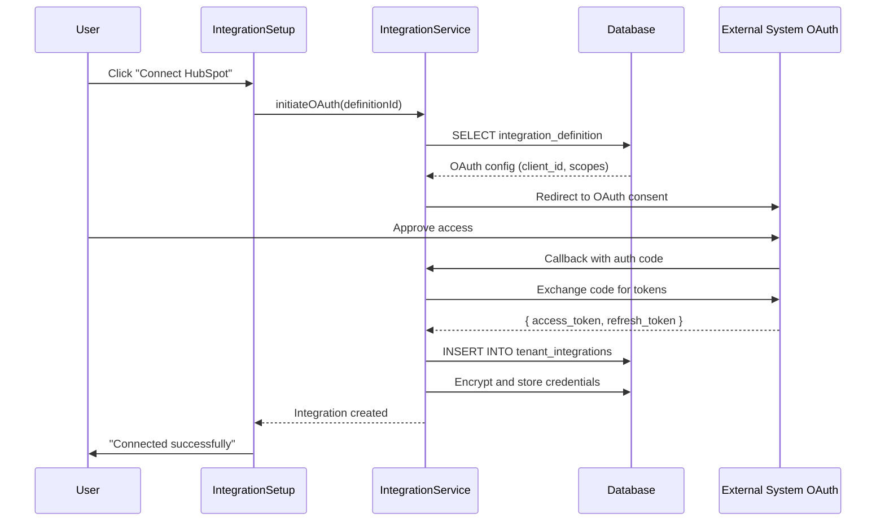
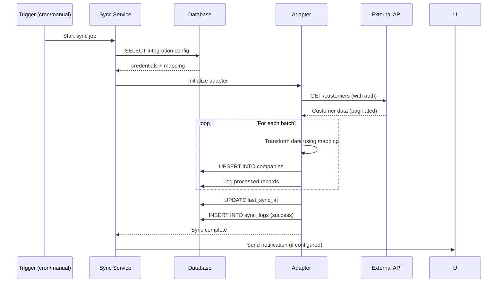
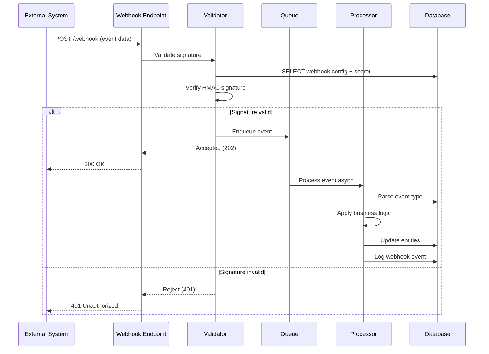
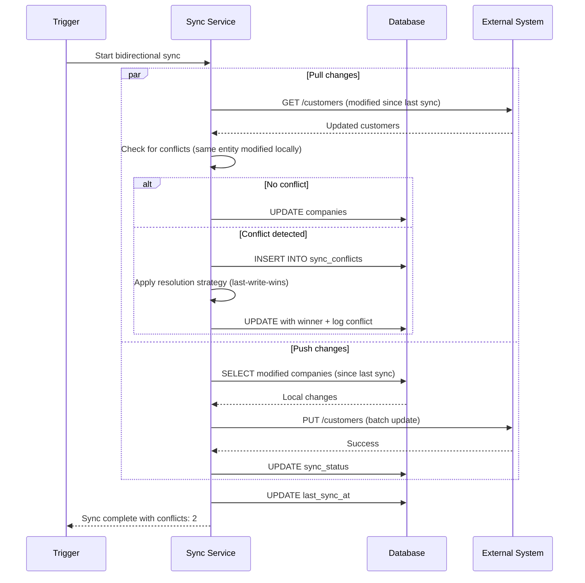

# External Systems Integration

## 📝 Overview
External Systems Integration capability enables seamless connection with third-party business applications including ERP, CRM, accounting, e-commerce, and other enterprise systems. The system uses an adapter pattern for flexible integration management with OAuth support and webhook handling.

## 🎯 Use Cases
- **ERP Integration**: Sync customers, products, orders with Visma, SAP, Microsoft Dynamics
- **CRM Integration**: Connect with HubSpot, Salesforce, Pipedrive for lead/customer sync
- **Accounting Systems**: Integrate with Xledger, Tripletex, PowerOffice for financial data
- **E-commerce**: Connect Shopify, WooCommerce, Magento for order processing
- **Email Platforms**: Integrate with Gmail, Outlook, SendGrid for communication

## 🚀 Quick Start

### Installation
This capability is part of the core platform and available by default.

### Basic Usage
```typescript
import { useIntegrations } from "@/modules/core/integrations/hooks/useIntegrations";
import { useCreateIntegration } from "@/modules/core/integrations/hooks/useCreateIntegration";

function IntegrationsList() {
  const { data: integrations } = useIntegrations();
  const createIntegration = useCreateIntegration();
  
  const handleConnect = async () => {
    await createIntegration.mutateAsync({
      integration_definition_id: "hubspot-crm",
      credentials: { api_key: "xxx" },
      config: { sync_contacts: true }
    });
  };
  
  return (
    <div>
      {integrations?.map(integration => (
        <IntegrationCard key={integration.id} {...integration} />
      ))}
    </div>
  );
}
```

## 📊 Data Model

### Database Tables

**`integration_definitions`**
- Available integration types (platform-level)
- Fields: `id`, `key`, `name`, `category`, `auth_type`, `config_schema`, `capabilities`
- Categories: `erp`, `crm`, `accounting`, `ecommerce`, `email`, `storage`, `communication`

**`tenant_integrations`**
- Active integrations per tenant
- Fields: `id`, `tenant_id`, `integration_definition_id`, `name`, `credentials`, `config`, `status`, `last_sync_at`

**`integration_mappings`**
- Field mappings between systems
- Fields: `id`, `integration_id`, `source_entity`, `target_entity`, `field_map`, `transform_rules`

**`integration_sync_logs`**
- Sync history and error tracking
- Fields: `id`, `integration_id`, `sync_type`, `status`, `records_processed`, `errors`, `started_at`, `completed_at`

**`webhook_endpoints`**
- Incoming webhook configurations
- Fields: `id`, `integration_id`, `url`, `secret`, `events`, `is_active`

### Key Relationships
- `tenant_integrations` → `tenants` (tenant_id)
- `tenant_integrations` → `integration_definitions` (integration_definition_id)
- `integration_mappings` → `tenant_integrations` (integration_id)
- `integration_sync_logs` → `tenant_integrations` (integration_id)
- `webhook_endpoints` → `tenant_integrations` (integration_id)

## 🔌 API Reference

### React Hooks

**`useIntegrations()`**
- **Purpose**: Fetch active integrations for tenant
- **Returns**: `{ data: Integration[], isLoading }`
- **Example**:
```typescript
const { data: integrations } = useIntegrations();
const erpIntegrations = integrations?.filter(i => i.category === 'erp');
```

**`useCreateIntegration()`**
- **Purpose**: Connect new integration
- **Returns**: `{ mutate, isLoading }`
- **Example**:
```typescript
const createIntegration = useCreateIntegration();
await createIntegration.mutateAsync({
  integration_definition_id: "visma-erp",
  credentials: { client_id, client_secret },
  config: { sync_interval: 3600 }
});
```

**`useSyncIntegration()`**
- **Purpose**: Trigger manual sync
- **Returns**: `{ sync, isLoading }`
- **Example**:
```typescript
const { sync } = useSyncIntegration(integrationId);
await sync({ entity: 'customers', direction: 'pull' });
```

**`useIntegrationLogs(integrationId)`**
- **Purpose**: View sync history
- **Returns**: `{ logs, isLoading }`
- **Example**:
```typescript
const { logs } = useIntegrationLogs(integrationId);
const recentErrors = logs?.filter(l => l.status === 'error');
```

### Services

**`IntegrationService.testConnection()`**
- **Parameters**: `{ integrationId: string }`
- **Returns**: `Promise<{ success: boolean, message: string }>`
- **Example**:
```typescript
const result = await IntegrationService.testConnection(integrationId);
if (!result.success) {
  toast.error(`Connection failed: ${result.message}`);
}
```

**`IntegrationService.syncEntity()`**
- **Parameters**: `{ integrationId, entity, direction, filter? }`
- **Returns**: `Promise<SyncResult>`

### Edge Functions

**`/integration-webhook`**
- Receives incoming webhooks from external systems
- Validates signatures and processes events

**`/integration-sync`**
- Executes scheduled or manual sync operations
- Handles rate limiting and error recovery

## 🔄 Sequence Diagrams

### 1. OAuth Integration Setup



### 2. Data Sync Flow (Pull)



### 3. Webhook Processing



### 4. Bidirectional Sync with Conflict Resolution



## 🔧 Configuration

### Environment Variables
```bash
# Integration credentials managed via Secrets
# Each integration stores encrypted credentials in database

# Webhook base URL
VITE_WEBHOOK_BASE_URL=https://yourapp.com/api/webhooks
```

### Required Secrets (per integration)
- Managed via Lovable Cloud Secrets Management
- Examples: `HUBSPOT_API_KEY`, `VISMA_CLIENT_SECRET`, `SHOPIFY_ACCESS_TOKEN`

### RLS Policies
```sql
-- Users can view integrations in their tenant
CREATE POLICY "Users view tenant integrations"
  ON tenant_integrations FOR SELECT
  USING (tenant_id = current_tenant_id());

-- Only admins can create/update integrations
CREATE POLICY "Admins manage integrations"
  ON tenant_integrations FOR ALL
  USING (
    tenant_id = current_tenant_id() 
    AND has_permission(auth.uid(), 'integration', 'admin')
  );
```

## 💡 Examples

### Example 1: Connect HubSpot CRM
```typescript
const createIntegration = useCreateIntegration();

await createIntegration.mutateAsync({
  integration_definition_id: "hubspot-crm",
  name: "HubSpot Production",
  credentials: { api_key: hubspotKey },
  config: {
    sync_interval: 3600, // 1 hour
    entities: ['contacts', 'companies', 'deals'],
    auto_sync: true
  }
});
```

### Example 2: Sync ERP Customers
```typescript
const { sync } = useSyncIntegration(erpIntegrationId);

const result = await sync({
  entity: 'customers',
  direction: 'pull',
  filter: { modified_since: '2025-01-01' }
});

console.log(`Synced ${result.records_processed} customers`);
```

### Example 3: Handle Webhook Event
```typescript
// Edge function: integration-webhook
export async function POST(req: Request) {
  const signature = req.headers.get('x-webhook-signature');
  const event = await req.json();
  
  // Verify signature
  const isValid = await verifyWebhookSignature(signature, event);
  if (!isValid) return new Response('Unauthorized', { status: 401 });
  
  // Process event
  await processWebhookEvent(event);
  
  return new Response('OK', { status: 200 });
}
```

## 🔗 Dependencies

This capability requires:
- **Lovable Cloud**: For edge functions and secrets management
- **Authentication**: For OAuth flows
- **Company Management**: For syncing customer/supplier data
- **Document Management**: For syncing files/attachments

## 🏗️ Technical Implementation

### Frontend Files
- `src/modules/core/integrations/hooks/useIntegrations.tsx`
- `src/modules/core/integrations/hooks/useCreateIntegration.tsx`
- `src/modules/core/integrations/hooks/useSyncIntegration.tsx`
- `src/modules/core/integrations/components/IntegrationCard.tsx`
- `src/modules/core/integrations/components/IntegrationSetup.tsx`
- `src/modules/core/integrations/services/IntegrationService.ts`

### Backend Files
- `supabase/functions/integration-sync/index.ts` - Sync orchestration
- `supabase/functions/integration-webhook/index.ts` - Webhook receiver
- `supabase/functions/integration-oauth-callback/index.ts` - OAuth handler
- `src/modules/core/integrations/adapters/` - System-specific adapters

### Database Migrations
- `20240120_create_integration_definitions.sql`
- `20240120_create_tenant_integrations.sql`
- `20240121_create_integration_mappings.sql`
- `20240121_create_integration_sync_logs.sql`
- `20240122_create_webhook_endpoints.sql`

## 🔐 Security Considerations

1. **Credential Encryption**: All API keys/tokens encrypted at rest
2. **OAuth Security**: PKCE flow for public clients, state validation
3. **Webhook Validation**: HMAC signature verification required
4. **Rate Limiting**: Respects external API rate limits
5. **Audit Logging**: All sync operations logged with user context
6. **Tenant Isolation**: Integrations never cross tenant boundaries

## 🐛 Troubleshooting

### Common Issues

**Issue**: "Authentication failed"
**Solution**: Re-authenticate OAuth or verify API key. Check token expiration.

**Issue**: "Sync failed with 429 rate limit"
**Solution**: Reduce sync frequency. System will auto-retry with backoff.

**Issue**: "Webhook signature invalid"
**Solution**: Verify webhook secret matches external system config. Check payload format.

**Issue**: "Data mapping error"
**Solution**: Review field mappings in integration config. Ensure source fields exist.

**Issue**: "Conflict detected during sync"
**Solution**: Check sync_conflicts table. Apply resolution strategy or manual review.

---
*Part of the Lovable Platform • Last updated: 2025-01-23*
