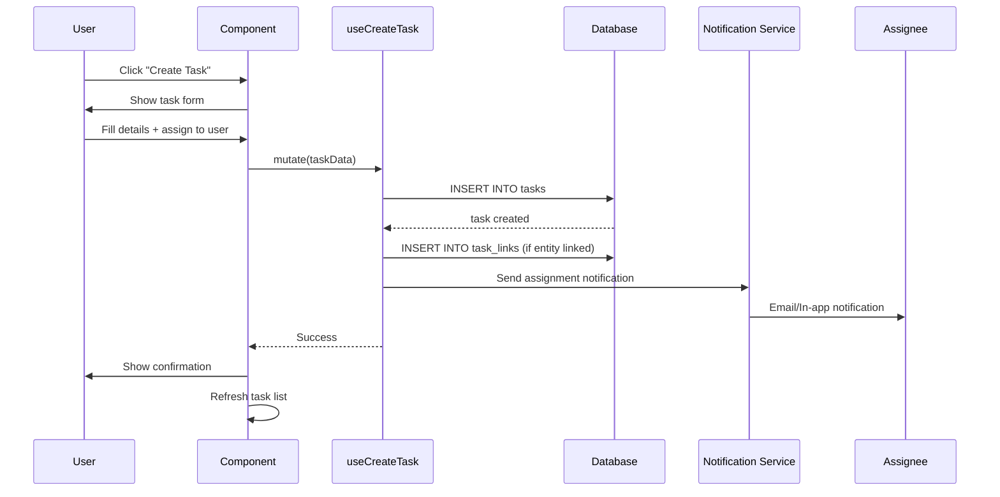
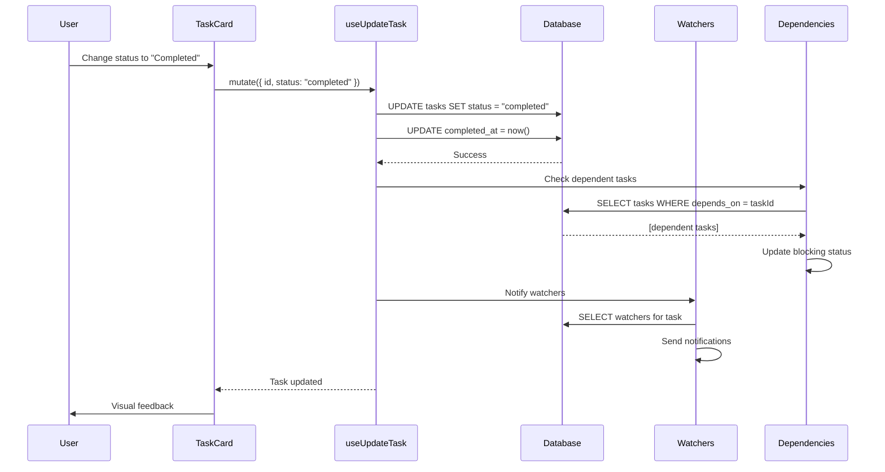
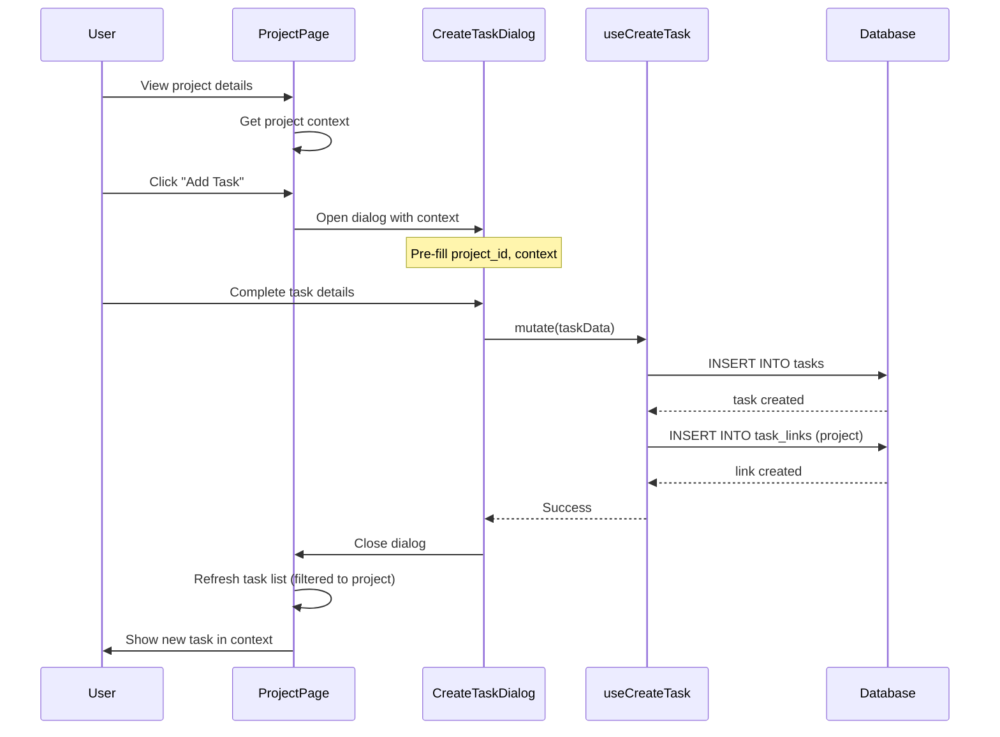
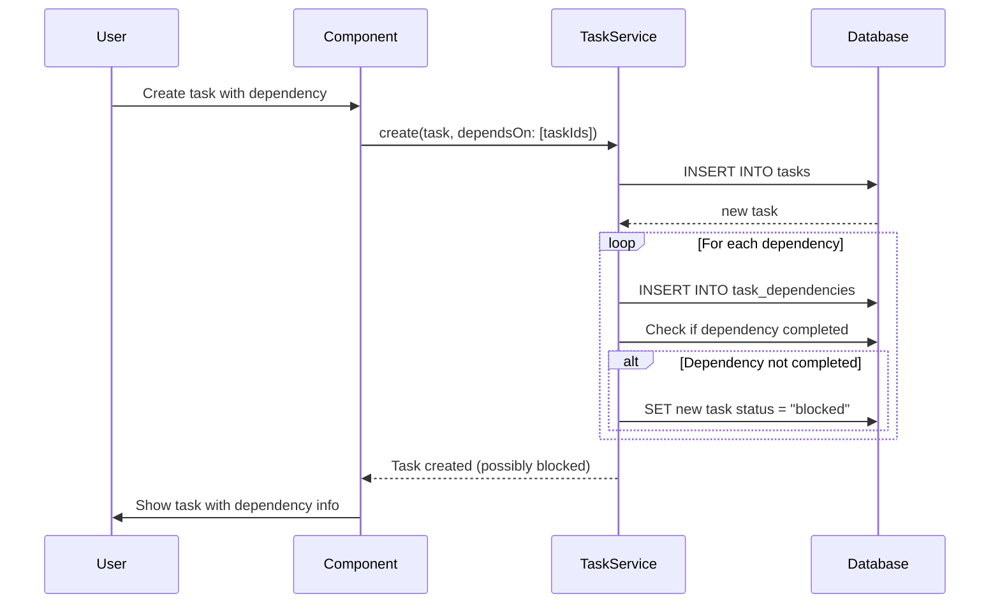

# Task Management

## 📝 Overview
Task Management capability provides comprehensive task creation, assignment, tracking, and notification functionality. Tasks can be linked to projects, companies, or other entities, with full support for status workflows, dependencies, and team collaboration.

## 🎯 Use Cases
- **Project Execution**: Break down projects into actionable tasks with assignees
- **Team Coordination**: Assign tasks across team members with due dates
- **Process Tracking**: Track multi-step workflows with task dependencies
- **Notification System**: Automatic notifications for assignments, updates, and deadlines

## 🚀 Quick Start

### Installation
This capability is part of the core platform and available by default.

### Basic Usage
```typescript
import { useTasks } from "@/modules/core/tasks/hooks/useTasks";
import { useCreateTask } from "@/modules/core/tasks/hooks/useCreateTask";

function TaskList() {
  const { data: tasks, isLoading } = useTasks({ status: 'pending' });
  const createTask = useCreateTask();
  
  const handleCreate = () => {
    createTask.mutate({
      title: "Review document",
      description: "Check proposal for accuracy",
      assigned_to: userId,
      due_date: "2025-02-01"
    });
  };
  
  return (
    <div>
      {tasks?.map(task => (
        <TaskCard key={task.id} task={task} />
      ))}
    </div>
  );
}
```

## 📊 Data Model

### Database Tables

**`tasks`**
- Core task information and metadata
- Fields: `id`, `title`, `description`, `status`, `priority`, `assigned_to`, `created_by`, `due_date`, `completed_at`, `tenant_id`
- Status: `pending`, `in_progress`, `review`, `completed`, `archived`
- Priority: `low`, `medium`, `high`, `urgent`

**`task_links`**
- Links tasks to entities (projects, companies, documents)
- Fields: `id`, `task_id`, `entity_type`, `entity_id`, `relationship_type`

**`task_dependencies`**
- Defines task dependencies and ordering
- Fields: `id`, `task_id`, `depends_on_task_id`, `dependency_type`

**`task_comments`**
- Discussion threads on tasks
- Fields: `id`, `task_id`, `user_id`, `content`, `created_at`

### Key Relationships
- `tasks` → `profiles` (assigned_to, created_by)
- `tasks` → `tenants` (tenant_id)
- `task_links` → `tasks` (task_id)
- `task_links` → `projects` (when entity_type='project')
- `task_dependencies` → `tasks` (task_id, depends_on_task_id)

## 🔌 API Reference

### React Hooks

**`useTasks(filters?)`**
- **Purpose**: Fetch and filter tasks
- **Returns**: `{ data: Task[], isLoading, error }`
- **Example**:
```typescript
const { data: myTasks } = useTasks({ 
  assigned_to: userId, 
  status: 'pending' 
});
```

**`useCreateTask()`**
- **Purpose**: Create new tasks
- **Returns**: `{ mutate, isLoading }`
- **Example**:
```typescript
const createTask = useCreateTask();
createTask.mutate({
  title: "New task",
  assigned_to: userId,
  priority: "high"
});
```

**`useUpdateTask()`**
- **Purpose**: Update existing tasks
- **Returns**: `{ mutate, isLoading }`
- **Example**:
```typescript
const updateTask = useUpdateTask();
updateTask.mutate({
  id: taskId,
  status: "completed",
  completed_at: new Date()
});
```

**`useTaskComments(taskId)`**
- **Purpose**: Manage task discussion threads
- **Returns**: `{ comments, addComment, isLoading }`
- **Example**:
```typescript
const { comments, addComment } = useTaskComments(taskId);
await addComment("Task is blocked by approval");
```

### Services

**`TaskService.create()`**
- **Parameters**: `{ title, description, assigned_to, due_date, ... }`
- **Returns**: `Promise<Task>`

**`TaskService.linkToEntity()`**
- **Parameters**: `{ taskId, entityType, entityId, relationshipType }`
- **Returns**: `Promise<TaskLink>`

**`TaskService.getTasksForEntity()`**
- **Parameters**: `{ entityType, entityId }`
- **Returns**: `Promise<Task[]>`

## 🔄 Sequence Diagrams

### 1. Task Creation & Assignment Flow



### 2. Task Status Update Flow



### 3. Context-Aware Task Creation



### 4. Task Dependency Resolution



## 🔧 Configuration

### Environment Variables
No specific environment variables required.

### RLS Policies
```sql
-- Users can view tasks in their tenant
CREATE POLICY "Users view tenant tasks"
  ON tasks FOR SELECT
  USING (tenant_id = current_tenant_id());

-- Users can create tasks
CREATE POLICY "Users create tasks"
  ON tasks FOR INSERT
  WITH CHECK (
    tenant_id = current_tenant_id() 
    AND created_by = auth.uid()
  );

-- Users can update assigned tasks or own tasks
CREATE POLICY "Users update own or assigned tasks"
  ON tasks FOR UPDATE
  USING (
    tenant_id = current_tenant_id() 
    AND (assigned_to = auth.uid() OR created_by = auth.uid())
  );
```

## 💡 Examples

### Example 1: Project Task List
```typescript
const { data: projectTasks } = useTasks({ 
  entity_type: 'project',
  entity_id: projectId,
  status: ['pending', 'in_progress']
});

return (
  <TaskList tasks={projectTasks} />
);
```

### Example 2: Task with Dependencies
```typescript
const createTask = useCreateTask();

await createTask.mutateAsync({
  title: "Deploy application",
  depends_on: [testingTaskId, reviewTaskId],
  status: "blocked" // Automatically set due to dependencies
});
```

### Example 3: Bulk Task Creation
```typescript
const createTask = useCreateTask();

const tasks = [
  { title: "Setup database", priority: "high" },
  { title: "Create API endpoints", priority: "medium" },
  { title: "Build frontend", priority: "medium" }
];

for (const taskData of tasks) {
  await createTask.mutateAsync({
    ...taskData,
    project_id: projectId
  });
}
```

## 🔗 Dependencies

This capability requires:
- **User Authentication**: For task assignment and creation
- **Tenant Management**: Multi-tenant task isolation
- **Notification System**: Task assignment and update notifications

## 🏗️ Technical Implementation

### Frontend Files
- `src/modules/core/tasks/hooks/useTasks.tsx` - Task fetching
- `src/modules/core/tasks/hooks/useCreateTask.tsx` - Task creation
- `src/modules/core/tasks/hooks/useUpdateTask.tsx` - Task updates
- `src/modules/core/tasks/hooks/useTaskComments.tsx` - Comments
- `src/modules/core/tasks/components/TaskCard.tsx` - Task display
- `src/modules/core/tasks/components/TaskList.tsx` - Task list view
- `src/modules/core/tasks/components/CreateTaskDialog.tsx` - Task creation UI

### Backend Files
- `supabase/functions/tasks-notify/index.ts` - Task notifications

### Database Migrations
- `20240110_create_tasks.sql` - Tasks table
- `20240110_create_task_links.sql` - Entity linking
- `20240111_create_task_dependencies.sql` - Dependencies
- `20240112_create_task_comments.sql` - Comments

## 🔐 Security Considerations

1. **Tenant Isolation**: All tasks scoped to tenant_id with RLS
2. **Assignment Validation**: Only users within tenant can be assigned
3. **Update Permissions**: Only assigned user or creator can update
4. **Visibility Control**: Tasks only visible to tenant members

## 🐛 Troubleshooting

### Common Issues

**Issue**: "Cannot create task"
**Solution**: Verify user has authenticated and is part of a tenant.

**Issue**: "Task not showing in list"
**Solution**: Check filters applied. Verify task has correct tenant_id.

**Issue**: "Cannot update task status"
**Solution**: Ensure user is either assigned_to or created_by for the task.

**Issue**: "Notification not sent"
**Solution**: Check assigned user has valid email. Verify notification service is active.

---
*Part of the Lovable Platform • Last updated: 2025-01-23*
