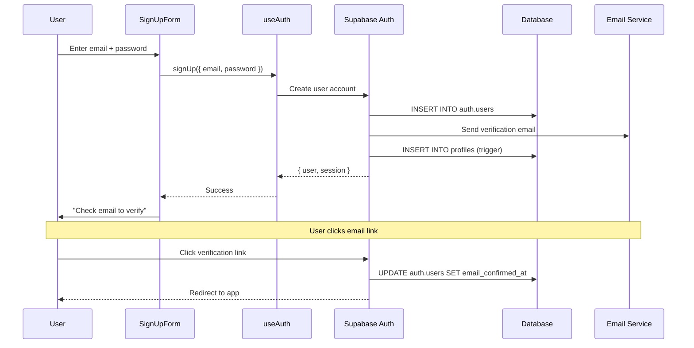
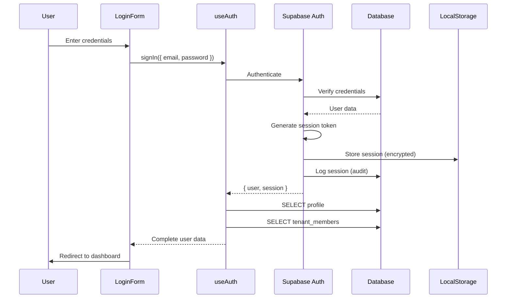
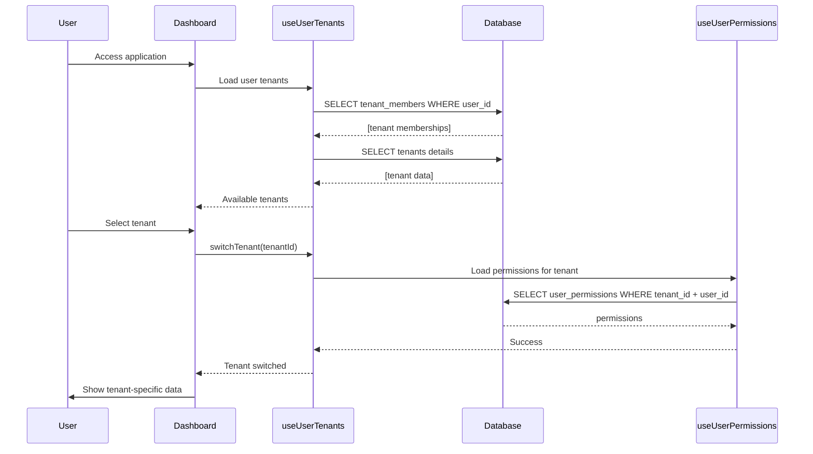
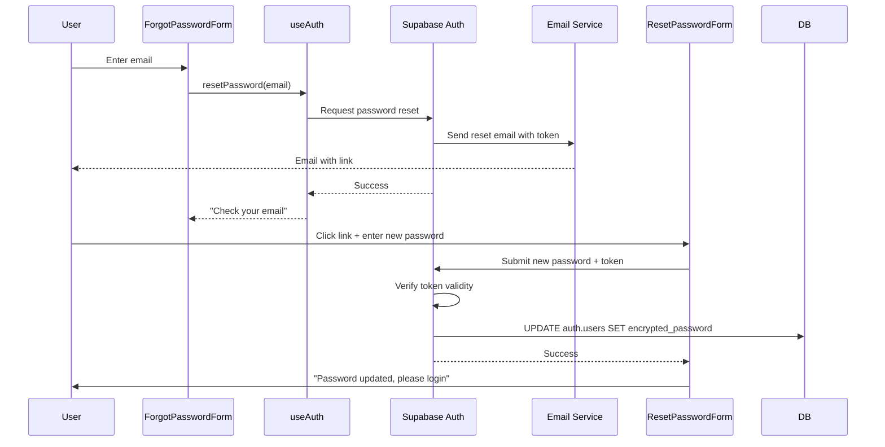

# User Authentication

## 📝 Overview
User Authentication provides secure user registration, login, session management, and role-based access control. Built on Supabase Auth with support for email/password, magic links, and social providers.

## 🎯 Use Cases
- **User Registration**: Secure signup with email verification
- **Login & Session Management**: Persistent sessions with auto-refresh
- **Password Management**: Secure password reset and change
- **Multi-Tenant Access**: Users can access multiple tenants with different roles
- **Social Login**: Google, GitHub, and other OAuth providers

## 🚀 Quick Start

### Installation
This capability is part of the core platform and available by default.

### Basic Usage
```typescript
import { useAuth } from "@/modules/core/user/hooks/useAuth";
import { useSession } from "@/modules/core/user/hooks/useSession";

function LoginForm() {
  const { signIn, signUp, isLoading } = useAuth();
  const { user } = useSession();
  
  const handleLogin = async (email: string, password: string) => {
    await signIn({ email, password });
  };
  
  if (user) {
    return <div>Welcome, {user.email}</div>;
  }
  
  return <form onSubmit={handleLogin}>...</form>;
}
```

## 📊 Data Model

### Database Tables

**`auth.users`** (Supabase managed)
- Core user authentication data
- Fields: `id`, `email`, `encrypted_password`, `email_confirmed_at`, `created_at`

**`profiles`**
- Extended user profile information
- Fields: `id` (FK to auth.users), `full_name`, `avatar_url`, `bio`, `preferences`, `created_at`, `updated_at`

**`tenant_members`**
- User memberships in tenants
- Fields: `id`, `tenant_id`, `user_id`, `role_id`, `invited_by`, `joined_at`

**`user_sessions`**
- Active user sessions (for audit)
- Fields: `id`, `user_id`, `session_token`, `ip_address`, `user_agent`, `last_activity`, `expires_at`

### Key Relationships
- `profiles.id` → `auth.users.id` (1:1)
- `tenant_members.user_id` → `auth.users.id` (many:1)
- `tenant_members.tenant_id` → `tenants.id` (many:1)
- `tenant_members.role_id` → `roles.id` (many:1)

## 🔌 API Reference

### React Hooks

**`useAuth()`**
- **Purpose**: Main authentication hook for login/signup/logout
- **Returns**: `{ user, signIn, signUp, signOut, resetPassword, isLoading }`
- **Example**:
```typescript
const { signIn, signOut } = useAuth();

await signIn({ email, password });
await signOut();
```

**`useSession()`**
- **Purpose**: Access current session and user data
- **Returns**: `{ user, session, isLoading }`
- **Example**:
```typescript
const { user, session } = useSession();
if (!user) return <Navigate to="/auth" />;
```

**`useProfile()`**
- **Purpose**: Get and update user profile
- **Returns**: `{ profile, updateProfile, isLoading }`
- **Example**:
```typescript
const { profile, updateProfile } = useProfile();
await updateProfile({ full_name: "John Doe" });
```

**`useUserTenants()`**
- **Purpose**: Get all tenants user has access to
- **Returns**: `{ tenants, switchTenant, currentTenant }`
- **Example**:
```typescript
const { tenants, switchTenant } = useUserTenants();
await switchTenant(tenantId);
```

### Services

**`AuthService.signUp()`**
- **Parameters**: `{ email: string, password: string, fullName?: string }`
- **Returns**: `Promise<{ user, session }>`

**`AuthService.signIn()`**
- **Parameters**: `{ email: string, password: string }`
- **Returns**: `Promise<{ user, session }>`

**`AuthService.signOut()`**
- **Returns**: `Promise<void>`

**`AuthService.resetPassword()`**
- **Parameters**: `{ email: string }`
- **Returns**: `Promise<void>`

## 🔄 Sequence Diagrams

### 1. User Registration Flow



### 2. Login with Session Management



### 3. Multi-Tenant Access Control



### 4. Password Reset Flow



## 🔧 Configuration

### Environment Variables
```bash
# Supabase Config (auto-configured in Lovable Cloud)
VITE_SUPABASE_URL=https://xxx.supabase.co
VITE_SUPABASE_ANON_KEY=eyJ...

# Auth Settings
VITE_AUTH_REDIRECT_URL=https://yourapp.com/auth/callback
```

### Supabase Auth Settings
Configure in Lovable Cloud → Authentication:
- Email verification: Required
- Password requirements: Min 8 characters
- Session timeout: 7 days
- Magic link expiry: 1 hour

### RLS Policies
```sql
-- Users can read their own profile
CREATE POLICY "Users read own profile"
  ON profiles FOR SELECT
  USING (auth.uid() = id);

-- Users can update their own profile
CREATE POLICY "Users update own profile"
  ON profiles FOR UPDATE
  USING (auth.uid() = id);

-- Users can view their tenant memberships
CREATE POLICY "Users view own memberships"
  ON tenant_members FOR SELECT
  USING (auth.uid() = user_id);
```

## 💡 Examples

### Example 1: Protected Route Component
```typescript
function ProtectedRoute({ children }: { children: React.ReactNode }) {
  const { user, isLoading } = useSession();
  
  if (isLoading) return <LoadingSpinner />;
  if (!user) return <Navigate to="/auth" />;
  
  return <>{children}</>;
}
```

### Example 2: Login with Error Handling
```typescript
const { signIn } = useAuth();
const [error, setError] = useState<string>();

const handleLogin = async (email: string, password: string) => {
  try {
    await signIn({ email, password });
  } catch (err: any) {
    if (err.message.includes('Invalid')) {
      setError('Invalid email or password');
    } else {
      setError('Login failed. Please try again.');
    }
  }
};
```

### Example 3: Tenant Switcher
```typescript
function TenantSwitcher() {
  const { tenants, currentTenant, switchTenant } = useUserTenants();
  
  return (
    <Select value={currentTenant?.id} onValueChange={switchTenant}>
      {tenants.map(tenant => (
        <SelectItem key={tenant.id} value={tenant.id}>
          {tenant.name}
        </SelectItem>
      ))}
    </Select>
  );
}
```

## 🔗 Dependencies

This capability requires:
- **Lovable Cloud**: Supabase authentication backend
- **Tenant Management**: For multi-tenant access
- **Permission System**: For role-based access control

## 🏗️ Technical Implementation

### Frontend Files
- `src/modules/core/user/hooks/useAuth.tsx` - Main auth hook
- `src/modules/core/user/hooks/useSession.tsx` - Session management
- `src/modules/core/user/hooks/useProfile.tsx` - Profile management
- `src/modules/core/user/hooks/useUserTenants.tsx` - Tenant switching
- `src/components/auth/LoginForm.tsx` - Login UI
- `src/components/auth/SignUpForm.tsx` - Registration UI
- `src/components/auth/ProtectedRoute.tsx` - Route protection

### Backend Files
- Supabase Auth handles all authentication backend
- `supabase/functions/auth-webhook/index.ts` - Auth event handling

### Database Migrations
- `20240101_create_profiles.sql` - User profiles
- `20240102_create_tenant_members.sql` - Tenant memberships
- `20240103_create_user_sessions.sql` - Session audit

## 🔐 Security Considerations

1. **Password Security**: Bcrypt hashing with salt, min 8 characters
2. **Session Management**: HttpOnly cookies, auto-refresh tokens
3. **Email Verification**: Required for account activation
4. **Rate Limiting**: Prevents brute force attacks (built-in)
5. **CSRF Protection**: Token-based protection (built-in)
6. **SQL Injection**: Parameterized queries only (Supabase)

## 🐛 Troubleshooting

### Common Issues

**Issue**: "Email not confirmed"
**Solution**: Resend verification email. Check spam folder. Verify SMTP settings.

**Issue**: "Session expired"
**Solution**: Auto-refresh should handle this. If persists, clear localStorage and re-login.

**Issue**: "Cannot access tenant"
**Solution**: Verify user has tenant_member record. Check role permissions.

**Issue**: "Password reset link expired"
**Solution**: Links expire after 1 hour. Request new reset link.

---
*Part of the Lovable Platform • Last updated: 2025-01-23*
