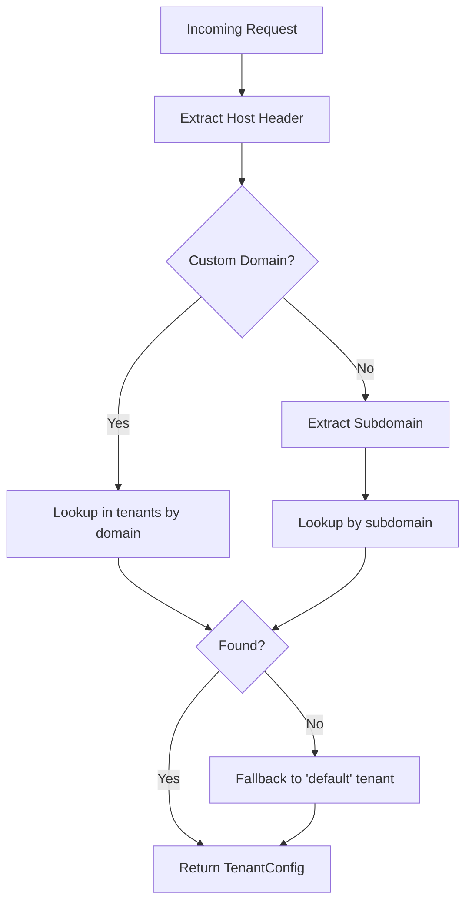
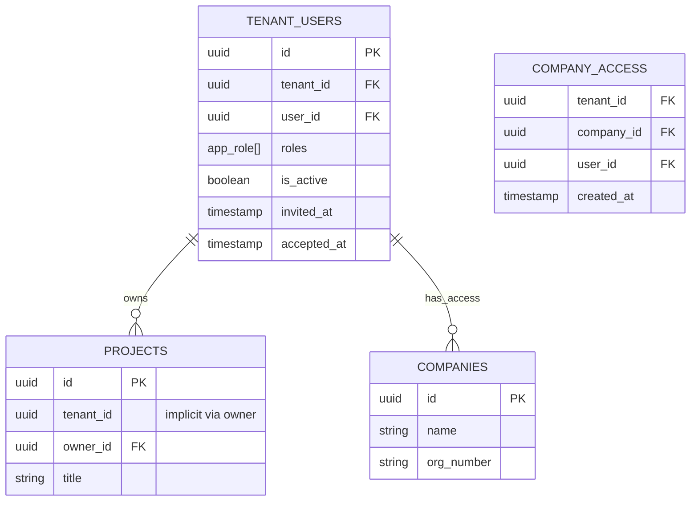

# Tenant-modell

## Multitenancy Arkitektur

Systemet bruker en **shared database, shared schema** tilnærming med Row-Level Security (RLS) for dataisolering.

### Tenant-konfigurasjon

```typescript
interface TenantConfig {
  id: string;
  tenant_id: string;
  name: string;
  subdomain: string;          // eks: "acme"
  domain?: string;             // eks: "acme.example.com"
  host?: string;               // legacy, fallback
  database_schema: string;     // alltid "public" per nå
  enabled_modules: string[];
  custom_config: {
    language: string;
    timezone: string;
  };
  branding: {
    primary_color: string;
    secondary_color: string;
    logo_url?: string;
  };
  features: {
    ai_enabled: boolean;
    integrations_enabled: boolean;
    custom_modules: string[];
  };
  limits: {
    max_users: number;
    max_projects: number;
    max_storage_mb: number;
  };
}
```

### Tenant Resolver

Tenant resolves fra incoming request:



**Eksempler**:
- `acme.lovable.app` → subdomain = "acme"
- `app.acmecorp.com` → domain = "app.acmecorp.com"
- `localhost:5173` → fallback til "default"

## Database Design

### Tenant Isolation



### RLS Policies

**tenant_users**:
```sql
ALTER TABLE tenant_users ENABLE ROW LEVEL SECURITY;

-- Brukere ser kun sin egen tenant-tilknytning
CREATE POLICY "Users can view own tenant membership"
ON tenant_users FOR SELECT
USING (auth.uid() = user_id);
```

**projects** (via owner):
```sql
-- Brukere ser kun prosjekter i sin tenant
CREATE POLICY "Users can view own tenant projects"
ON projects FOR SELECT
USING (
  EXISTS (
    SELECT 1 FROM tenant_users
    WHERE user_id = auth.uid()
    AND tenant_id = (
      SELECT tenant_id FROM tenant_users
      WHERE user_id = projects.owner_id
      LIMIT 1
    )
    AND is_active = true
  )
);
```

## Tenant Lifecycle

### 1. Opprettelse

```typescript
// Opprett ny tenant (platform admin)
const tenant: TenantConfig = {
  tenant_id: "customer-001",
  name: "Customer Corp",
  subdomain: "customer",
  domain: "app.customer.com",
  enabled_modules: ["company", "project", "tasks"],
  branding: {
    primary_color: "#2563eb",
    secondary_color: "#7c3aed",
  },
  limits: {
    max_users: 50,
    max_projects: 20,
    max_storage_mb: 5000,
  },
};
```

### 2. Brukerhåndtering

```typescript
// Inviter bruker til tenant
await inviteUserToTenant({
  tenant_id: "customer-001",
  email: "user@customer.com",
  roles: ["tenant_admin"],
  invited_by: currentUserId,
});

// Aksepter invitasjon
await acceptTenantInvitation({
  tenant_id: "customer-001",
  user_id: newUserId,
});
```

### 3. Deaktivering

```typescript
// Deaktiver tenant (soft delete)
await updateTenant("customer-001", {
  is_active: false,
});

// Alle queries vil feile for denne tenant
```

## Domener og Routing

### Custom Domain Oppsett

1. **Konfigurer tenant**:
```json
{
  "tenant_id": "acme-001",
  "domain": "app.acme.com",
  "subdomain": "acme"
}
```

2. **DNS-oppsett hos kunde**:
```
Type: A
Name: app
Value: 185.158.133.1
```

3. **SSL/TLS**:
- Lovable håndterer automatisk via Let's Encrypt
- Propagering kan ta 24-48 timer

### Subdomain Oppsett

1. **Konfigurer tenant**:
```json
{
  "tenant_id": "techstart-001",
  "subdomain": "techstart"
}
```

2. **Tilgjengelig på**:
- `techstart.lovable.app` (automatisk)

## Module Activation

Hver tenant kan aktivere/deaktivere moduler:

```typescript
const tenant: TenantConfig = {
  enabled_modules: [
    "company",      // Alltid påkrevd
    "project",      // Alltid påkrevd
    "tasks",
    "opportunity",
    "ai",           // Krever feature flag
    "integrations", // Krever feature flag
  ],
  features: {
    ai_enabled: true,
    integrations_enabled: true,
    custom_modules: ["custom_workflow"],
  },
};
```

**Runtime-sjekk**:
```typescript
if (!ctx.tenant.features.ai_enabled) {
  throw new Error("AI features not enabled for this tenant");
}
```

## Data Export/Import

### Export (GDPR compliance)

```typescript
// Export all tenant data
const exportData = await exportTenantData(tenantId);

// Struktur
{
  "tenant": { ...tenantConfig },
  "users": [...],
  "companies": [...],
  "projects": [...],
  "tasks": [...],
  "documents": [...],
  "metadata": {
    "exported_at": "2025-01-23T12:00:00Z",
    "version": "1.0"
  }
}
```

### Import (migrering)

```typescript
// Import fra annen tenant eller ekstern kilde
await importTenantData(newTenantId, exportData, {
  mapping: {
    user_ids: { ... },
    company_ids: { ... },
  },
});
```

## Tenant Analytics

Per-tenant metrics:

```typescript
interface TenantMetrics {
  tenant_id: string;
  period: { from: string; to: string };
  metrics: {
    active_users: number;
    total_projects: number;
    total_companies: number;
    storage_used_mb: number;
    api_calls: number;
    integration_calls: {
      adapter_id: string;
      count: number;
    }[];
  };
}
```

## Tenant Limits

Enforcement av limits:

```typescript
// Check før opprettelse
async function createProject(ctx: RequestContext, data: ProjectInput) {
  const currentCount = await countProjects(ctx.tenant_id);
  
  if (currentCount >= ctx.tenant.limits.max_projects) {
    throw new TenantLimitError(
      `Project limit reached (${ctx.tenant.limits.max_projects})`
    );
  }
  
  // ... create project
}
```

## Database Naming Conventions

All database tables must follow strict naming conventions to ensure clarity and prevent conflicts. See [Database Naming Conventions](./database-naming-conventions.md) for the complete guide.

**Quick Rules:**
- **Platform tables**: No prefix (e.g., `tenants`, `applications`)
- **Core shared tables**: No prefix (e.g., `companies`, `projects`)
- **App domain tables**: `{app_key}_` prefix (e.g., `jul25_families`, `jul25_tasks`)
- **All app tables**: MUST have `tenant_id` column and RLS policies

Use `SELECT * FROM validate_table_naming()` to check compliance.

## Best Practices

### 1. Alltid valider tenant context
```typescript
// ❌ FEIL
const projects = await supabase.from("projects").select();

// ✅ RIKTIG
const projects = await supabase
  .from("projects")
  .select()
  .eq("owner_id", ctx.userId); // RLS håndterer tenant-filter
```

### 2. Bruk service layer
```typescript
// ❌ FEIL - direkte DB-kall i component
const { data } = await supabase.from("projects").select();

// ✅ RIKTIG - via service
const projects = await ProjectService.getUserProjects(ctx, userId);
```

### 3. Test tenant-isolering
```typescript
// Sjekk at tenant A ikke kan se tenant B sine data
test("tenant isolation", async () => {
  const ctxA = buildContext({ tenant_id: "tenant-a" });
  const ctxB = buildContext({ tenant_id: "tenant-b" });
  
  const projectA = await ProjectService.create(ctxA, { ... });
  const projectsB = await ProjectService.list(ctxB);
  
  expect(projectsB).not.toContainEqual(
    expect.objectContaining({ id: projectA.id })
  );
});
```

## Fremtidige forbedringer

- [ ] Per-tenant database schemas (fysisk isolering)
- [ ] Tenant-spesifikke backups
- [ ] Self-service tenant provisioning
- [ ] Tenant-til-tenant datamigrering
- [ ] Granular resource quotas
